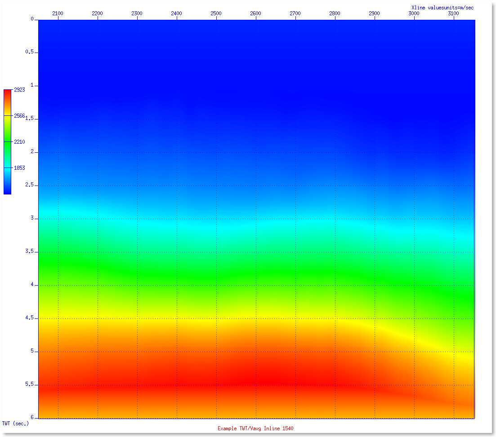
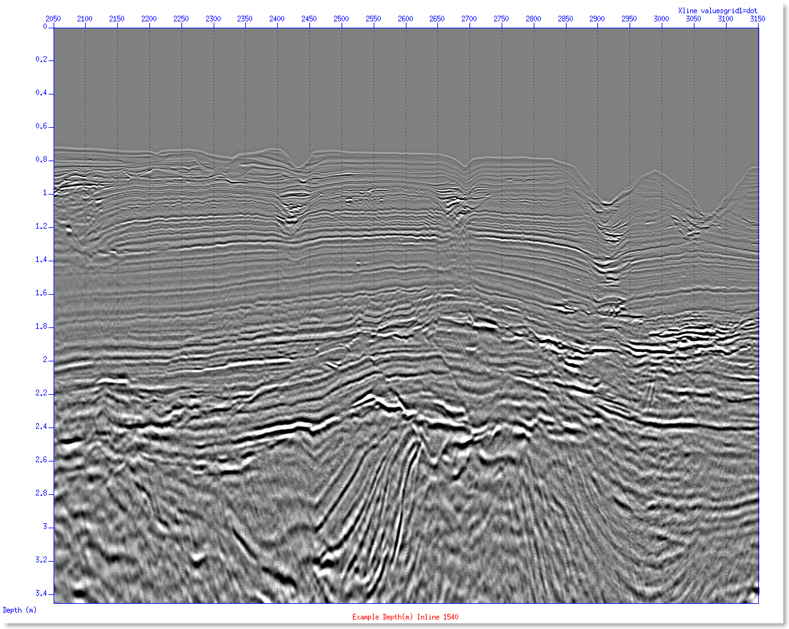

# Example T/D Velocity Model Update Procedure

### Bash script listing:

```
AVG_VELOCITY="Cb_Ph3_TWT_Vavg_062013_32b.su"
Example_WMP_FILE="ALL_Example_Campanian_WMPs_and_Checkshots_COMBINED_06-12-2016.dat"

extract_delta_v < ${AVG_VELOCITY} pfile=${Example_WMP_FILE} verbose=1 >\
ALL_Example_Campanian_WMPs_and_Checkshots_COMBINED.deltav.lis
awk '{if(NR>1){print $2, $3, $4, $10}}' ALL_Example_Campanian_WMPs_and_Checkshots_COMBINED.deltav.lis |\
sort -n | uniq > test.new1.dat

sum_data_t < test.new1.dat verbose=1 dt=1 | wc -l

# ************************************************ #

echo "Performing 4D Rbf Interpolation"
python test2.py test.new1.dat > bub

awk '{print $2, $3, $1, $4}' bub > bub1
echo "Appling the Delta-V corrections to background average velocities"
apply_delta_v.new < ${AVG_VELOCITY} pfile=bub1 nx=213 ny=445 nt=100 verbose=1 > test.su

# ************************************************ #

echo "Extracting the Residual Delta-V values from the corrected average velocity grid"
extract_delta_v < test.su pfile=${Example_WMP_FILE} verbose=1 > output.deltav.lis
cat output.deltav.lis
echo
minmax output.deltav.lis
echo

sudepthconvert.v1 < ./SEGY_TWT/input1.trint.su vfile=test.su verbose=1 >\
output.su && segyhdrs < output.su && segywrite < output.su tape=test.depth.sgy endian=0
```

Set parameters for files containing Example average velocities as a function of TWT (SU format) and ASCII listing of
well-marker picks (exported from interpretation application).  Setup bash environment variables and path to include programs and Seismic Unix.


```python
%%%bash
source ${HOME}/.bashrc
cd ${HOME}/Example.new
AVG_VELOCITY="Cb_Ph3_TWT_Vavg_062013_32b.su"
Example_WMP_FILE="ALL_Example_Campanian_WMPs_and_Checkshots_COMBINED_06-12-2016.dat"
```

Here is an example image of the TWT/Average-Velocity SU file - Inline 1540.

```
suwind < Cb_Ph3_TWT_Vavg_062013_32b.su key=gelev min=1540 max=1540 |\
suximage perc=100 cmap=hsv2 legend=1 title="Example TWT/Vavg Inline 1540" label1="TWT (sec.)" label2="Xline values"\
units="m/sec" grid1=dot grid2=dot f2=2050 d2=1 &
```

Move the mouse inside the image window and type "q" to terminate the display.  Here is a screen-dump of the example image:


```python
from IPython.display import Image
Image(filename='Example_inline_1540_twt_vavg.png')
```





The contents and format of the ASCII well-marker picks file are listed below (first 20 and last 20 lines).  The columns are well name, x location, y location, two-way time in ms., and depth in meters (tvdss).


```python
%%%bash
cat ALL_Example_Campanian_WMPs_and_Checkshots_COMBINED_06-12-2016.dat | head -20
echo "..."
cat ALL_Example_Campanian_WMPs_and_Checkshots_COMBINED_06-12-2016.dat | tail -20
```

    C_01            520545.64    160669.56  3009.26  2889.09
    C_01            520601.81    160671.51  2736.96  2386.06
    C_01            520602.26    160671.69  2724.05  2364.66
    C_01            520602.68    160671.93  2703.29  2336.92
    C_01            520603.46    160672.26  2663.08  2278.28
    C_01            520604.13    160672.23  2620.97  2231.31
    C_01            520604.64    160672.05  2587.52  2191.10
    C_01            520604.94    160671.86  2561.42  2160.09
    C_01            520605.46    160671.54  2489.58  2078.41
    C_02            519524.20    159750.76  2781.00  2406.36
    C_02            519524.48    159749.76  2752.64  2371.31
    C_02            519524.63    159748.63  2712.21  2322.94
    C_02            519524.71    159748.06  2689.73  2296.05
    C_02            519524.80    159747.62  2670.07  2272.53
    C_02            519524.89    159747.00  2641.79  2238.70
    C_02ST1         519526.55    159746.66  2641.83  2236.99
    C_02ST1         519531.24    159745.58  2672.62  2272.51
    C_02ST1         519535.61    159743.56  2689.55  2293.78
    C_02ST1         519542.25    159739.79  2711.65  2322.59
    C_02ST1         519553.84    159733.02  2749.83  2372.56
    ...
    C_40            520613.20    160402.52  2525.69  2109.75
    C_40            520617.75    160421.59  2495.11  2078.00
    C_41            518722.24    159085.26  2659.66  2276.62
    C_41            518739.66    159118.05  2685.99  2300.10
    C_41            518787.17    159220.54  2743.03  2350.98
    C_41            518793.68    159237.46  2749.43  2356.69
    C_41            518843.58    159379.97  2784.09  2388.57
    C_42            521942.01    161723.09  2513.29  2163.41
    C_42            521957.33    161732.91  2524.89  2177.49
    C_42            522041.99    161782.46  2582.96  2247.96
    C_42            522121.33    161827.24  2636.81  2313.31
    C_43            520299.35    160160.11  2505.74  2112.29
    C_43            520327.31    160195.49  2530.74  2135.80
    C_43            520347.10    160223.57  2547.96  2151.99
    C_43            520364.24    160250.59  2563.01  2166.14
    C_43            520461.15    160583.39  2646.33  2255.91
    C_44            519720.72    161636.21  2541.67  2126.62
    C_44            519756.62    161655.96  2567.45  2154.62
    C_44            519933.35    161753.54  2641.33  2234.41
    C_44            520358.95    161926.15  2712.81  2330.23


Here is a listing of the "extract_delta_v" SU program, which is written in the C language:


```python
cat extract_delta_v.c
```

    #include <stdio.h>
    #include "par.h"
    #include "su.h"
    #include "cwp.h"
    #include "segy.h"
    
    #define nint(x)  ((x) < 0 ? ceil ( (x) - 0.5 ) : floor ( (x) + 0.5 ))
    #define min(a,b) ((a) <= (b) ? (a) : (b))
    #define max(a,b) ((a) >= (b) ? (a) : (b))
    
    char *sdoc[] = {NULL};
    /* Joseph J. Oravetz - 2015 */
    
    segy tr;
    
    int main (int argc, char **argv) {
    
       char well[40], temp[256];
       int imin, ntr, ns, kount, index;
       float factor1, seismic_depth;
       float dt, scale_factor, seismic_vavg, delta_v, delta_z;
       float *x, *y, **data;
       double min_dist, dist, toler;
       double delrt, factor, x_loc, y_loc, twt, depth, average_velocity;
       FILE *fpp;
       cwp_String pfile;
       short verbose;
       register int i, j;
    
       initargs(argc, argv);
    
       if (!getparshort("verbose" , &verbose)) verbose = 0;
       if (!getparstring("pfile",&pfile)) pfile = "tops.lis";
       if (!getpardouble("toler",&toler)) toler = 12.50;
      
       fpp = efopen (pfile, "r");
    
       kount = 0;
       while (NULL != fgets ( temp, sizeof(temp), fpp )) {
          ++kount;
          (void) sscanf ( ((&(temp[0]))), "%s%lf%lf%lf%lf", well, &x_loc, &y_loc, &twt, &depth );
       }
    
       ntr = gettra (&tr, 0);
       ns  = tr.ns;
       dt  = tr.dt * 0.001;
       scale_factor = tr.scalco;
       delrt = tr.delrt;
       imin = nint ( delrt / dt );
       if (scale_factor < 0.0 ) scale_factor *= -1.0;
       if (scale_factor == 0.0 ) scale_factor = 1.0;
    
       if ( verbose ) {
          fprintf ( stderr, "\n" );
          fprintf ( stderr, "Number of traces = %d, number of samples per trace = %d\n", ntr, ns );
          fprintf ( stderr, "Time sample rate (milliseconds) = %f\n", dt );
          fprintf ( stderr, "Coordinate scale factor = %f\n", scale_factor );
          fprintf ( stderr, "TOPS file name = %s, number of input samples = %d\n", pfile, kount);
          fprintf ( stderr, "Minimum distance tolerance = %8.2f meters\n", toler );
          fprintf ( stderr, "Delrt = %f, imin = %d\n", delrt, imin );
          fprintf ( stderr, "\n" );
       }
    
       x    = ealloc1float ( ntr );
       y    = ealloc1float ( ntr );
       data = ealloc2float ( ns, ntr );
    
       factor = 2000.0;
       factor1 = 0.0005;
    
       int nsm1;
       
       nsm1 = ns - 1;
    
       rewind (stdin);
       for ( i = 0; i < ntr; ++i ) {
          gettr (&tr);
          x[i] = tr.sx / scale_factor;
          y[i] = tr.sy / scale_factor;
          for ( j = 0; j < ns; ++j ) data[i][j] = tr.data[j];
       }
    
       rewind ( fpp );
       printf ( "well x_loc y_loc twt well_depth seismic_depth seismic_vavg average_velocity delta_z delta_v\n" );
       for ( i = 0; i < kount; ++i ) {
          fgets ( temp, sizeof(temp), fpp );
          (void) sscanf ( ((&(temp[0]))), "%s%lf%lf%lf%lf", well, &x_loc, &y_loc, &twt, &depth );
          average_velocity = ( depth / twt ) * factor;
    
          min_dist = DBL_MAX;
          index = -1;
          for ( j = 0; j < ntr; ++j ) {
             dist = sqrt ( pow ( x_loc - x[j], 2.0 ) + pow ( y_loc - y[j], 2.0 ) );
             if ( dist < min_dist && dist <= toler ) {
                min_dist = dist;
                index = j;
             }
          }
    
          if ( index >= 0 ) {
             if ( verbose ) fprintf ( stderr, "index = %d, x_loc = %f, x_seismic = %f, y_loc = %f, y_seismic = %f, min_dist = %f\n",\
              index, x_loc, x[index], y_loc, y[index], min_dist ); 
             j = min ( max ( nint ( twt / dt ) - imin, 0 ), nsm1 );
             if ( verbose ) fprintf ( stderr, "sample = %d\n", j );
             seismic_vavg = data[index][j];
             delta_v = average_velocity - seismic_vavg;
             seismic_depth = seismic_vavg * twt * factor1;
             delta_z = depth - seismic_depth;
             printf ( "%-16s %10.2f %10.2f %8.2f %8.2f %8.2f %8.2f %8.2f %12.6f %12.6f\n",\
              well, x_loc, y_loc, twt, depth, seismic_depth, seismic_vavg, average_velocity, delta_z, delta_v );
          }
    
          if ( verbose && ( index >= 0 ) ) {
             fprintf ( stderr, "num = %5d, Well = %-10s x_loc = %10.2f, y_loc = %10.2f, twt = %8.2f, depth = %8.2f\n",\
             i, well, x_loc, y_loc, twt, depth );
             fprintf ( stderr, "min_dist = %8.2f, index = %5d, seismic velocity = %8.2f, well average velocity = %8.2f,\
             delta_z = %10.4f meters, delta_v = %10.4f meters per second\n", min_dist, index, seismic_vavg, average_velocity, delta_z, delta_v );
          }
       }
    
       efclose ( fpp );
    
       free1float (x);
       free1float (y);
       free2float (data);
    
       return EXIT_SUCCESS;
    }


Here is a listing of the Makefile to compile the programs:


```python
cat Makefile
```

    # Makefile for ...su/main
    
    include $(CWPROOT)/src/Makefile.config
    
    D = $L/libcwp.a $L/libpar.a $L/libsu.a $L/librecip.a
    LFLAGS= -I${HOME}/include -L$L -lsu -lpar -lcwp -lrecip -lm -L${HOME}/lib64 -lgmt -lpsl -lnetcdf 
    
    PROGS =			  \
    	$B/joebob-vzerok  \
    	$B/joebob-window-vzerok \
    	$B/horizon-single-vzerok \
    	$B/joebob-vzerok-triple \
    	$B/joebob-vzerok-double \
    	$B/horizon-joebob-vzerok-triple \
    	$B/joebob-vzerok-poly-hybrid \
    	$B/joebob-vzerok-vavg-vzero \
    	$B/insert-campanian-surfaces \
    	$B/joebob-vzerok-vavg \
    	$B/inverse-horizon-vzerok \
    	$B/suvzerok_with_water_seis_vavg_horizon \
    	$B/supoly_with_water_seis_vavg_horizon \
    	$B/sutest.vzerok.simulate \
    	$B/sutest.vzerok.checkshots.simulate \
    	$B/match.wmp.xy.to.deltav \
    	$B/solveit \
    	$B/extract_delta_v \
    	$B/add_delta_v \
    	$B/apply_delta_v \
    	$B/apply_delta_v.new \
    	$B/apply_deltav_v1 \
    	$B/apply_deltav_revised \
    	$B/apply_delta_v_check \
    	$B/fix_xy_geometry_su_trace_headers \
    	$B/intersect_checkshot_with_grid \
    	$B/supoly \
    	$B/sum_data \
    	$B/sum_data_t \
    	$B/sum_decimate_deltat \
    	$B/update.average.velocities \
    	$B/sudepthconvert.v3 \
    	$B/sudepthconvert.test \
    	$B/sudepthconvert.simple \
    	$B/apply_average_velocity \
    	$B/suextract.traverse.path \
    	$B/supoly.scale.adjust.velocities \
    	$B/supoly.scale.adjust.velocities.v1 \
    	$B/supoly.scale.adjust.velocities.GRIDS \
    	$B/make.sure.average.vels.increase \
    	$B/final_corrections \
    	$B/vertical_final_corrections \
    	$B/vertical_final_corrections_PARALLEL \
    	$B/horizon-vzerok 
    
    INSTALL	:	$(PROGS)
    	touch $@
    
    
    $(PROGS):	$(CTARGET) $D 
    	-$(CC) -fopenmp $(CFLAGS) $(@F).c $(LFLAGS) -o $@
    	@chmod 755 $@
    	@echo $(@F) installed in $B
    
    remake	:
    	-touch *.c 
    	-rm -f $(PROGS)
    	$(MAKE) 
    	
    clean:
    	rm -f a.out junk* JUNK* core


Execute the command:


```python
%%%bash
AVG_VELOCITY="Cb_Ph3_TWT_Vavg_062013_32b.su"
Example_WMP_FILE="ALL_Example_Campanian_WMPs_and_Checkshots_COMBINED_06-12-2016.dat"
extract_delta_v < ${AVG_VELOCITY} pfile=${Example_WMP_FILE} verbose=1 > ALL_Example_Campanian_WMPs_and_Checkshots_COMBINED.deltav.lis 
awk '{if(NR>1){print $2, $3, $4, $10}}' ALL_Example_Campanian_WMPs_and_Checkshots_COMBINED.deltav.lis | sort -n | uniq > test.new1.dat
```

    
    Number of traces = 992001, number of samples per trace = 3001
    Time sample rate (milliseconds) = 2.000000
    Coordinate scale factor = 1.000000
    TOPS file name = ALL_Example_Campanian_WMPs_and_Checkshots_COMBINED_06-12-2016.dat, number of input samples = 380
    Minimum distance tolerance =    12.50 meters
    Delrt = 0.000000, imin = 0
    
    index = 569765, x_loc = 520545.640000, x_seismic = 520544.000000, y_loc = 160669.560000, y_seismic = 160673.000000, min_dist = 3.810932
    sample = 1505
    num =     0, Well = C_01       x_loc =  520545.64, y_loc =  160669.56, twt =  3009.26, depth =  2889.09
    min_dist =     3.81, index = 569765, seismic velocity =  1852.94, well average velocity =  1920.13,         delta_z =   101.0983 meters, delta_v =    67.1915 meters per second
    index = 574171, x_loc = 520601.810000, x_seismic = 520600.000000, y_loc = 160671.510000, y_seismic = 160674.000000, min_dist = 3.078344
    sample = 1368
    num =     1, Well = C_01       x_loc =  520601.81, y_loc =  160671.51, twt =  2736.96, depth =  2386.06
    min_dist =     3.08, index = 574171, seismic velocity =  1747.57, well average velocity =  1743.58,         delta_z =    -5.4581 meters, delta_v =    -3.9884 meters per second
    index = 574171, x_loc = 520602.260000, x_seismic = 520600.000000, y_loc = 160671.690000, y_seismic = 160674.000000, min_dist = 3.231671
    sample = 1362
    num =     2, Well = C_01       x_loc =  520602.26, y_loc =  160671.69, twt =  2724.05, depth =  2364.66
    min_dist =     3.23, index = 574171, seismic velocity =  1743.71, well average velocity =  1736.14,         delta_z =   -10.3222 meters, delta_v =    -7.5785 meters per second
    index = 574171, x_loc = 520602.680000, x_seismic = 520600.000000, y_loc = 160671.930000, y_seismic = 160674.000000, min_dist = 3.386340
    sample = 1352
    num =     3, Well = C_01       x_loc =  520602.68, y_loc =  160671.93, twt =  2703.29, depth =  2336.92
    min_dist =     3.39, index = 574171, seismic velocity =  1737.52, well average velocity =  1728.95,         delta_z =   -11.5959 meters, delta_v =    -8.5791 meters per second
    index = 574171, x_loc = 520603.460000, x_seismic = 520600.000000, y_loc = 160672.260000, y_seismic = 160674.000000, min_dist = 3.872880
    sample = 1332
    num =     4, Well = C_01       x_loc =  520603.46, y_loc =  160672.26, twt =  2663.08, depth =  2278.28
    min_dist =     3.87, index = 574171, seismic velocity =  1725.94, well average velocity =  1711.01,         delta_z =   -19.8748 meters, delta_v =   -14.9261 meters per second
    index = 574171, x_loc = 520604.130000, x_seismic = 520600.000000, y_loc = 160672.230000, y_seismic = 160674.000000, min_dist = 4.493306
    sample = 1310
    num =     5, Well = C_01       x_loc =  520604.13, y_loc =  160672.23, twt =  2620.97, depth =  2231.31
    min_dist =     4.49, index = 574171, seismic velocity =  1714.18, well average velocity =  1702.66,         delta_z =   -15.0955 meters, delta_v =   -11.5189 meters per second
    index = 574171, x_loc = 520604.640000, x_seismic = 520600.000000, y_loc = 160672.050000, y_seismic = 160674.000000, min_dist = 5.033100
    sample = 1294
    num =     6, Well = C_01       x_loc =  520604.64, y_loc =  160672.05, twt =  2587.52, depth =  2191.10
    min_dist =     5.03, index = 574171, seismic velocity =  1706.16, well average velocity =  1693.59,         delta_z =   -16.2677 meters, delta_v =   -12.5739 meters per second
    index = 574171, x_loc = 520604.940000, x_seismic = 520600.000000, y_loc = 160671.860000, y_seismic = 160674.000000, min_dist = 5.383605
    sample = 1281
    num =     7, Well = C_01       x_loc =  520604.94, y_loc =  160671.86, twt =  2561.42, depth =  2160.09
    min_dist =     5.38, index = 574171, seismic velocity =  1699.98, well average velocity =  1686.63,         delta_z =   -17.0916 meters, delta_v =   -13.3453 meters per second
    index = 574171, x_loc = 520605.460000, x_seismic = 520600.000000, y_loc = 160671.540000, y_seismic = 160674.000000, min_dist = 5.988589
    sample = 1245
    num =     8, Well = C_01       x_loc =  520605.46, y_loc =  160671.54, twt =  2489.58, depth =  2078.41
    min_dist =     5.99, index = 574171, seismic velocity =  1684.42, well average velocity =  1669.69,         delta_z =   -18.3390 meters, delta_v =   -14.7325 meters per second
    index = 522321, x_loc = 519524.200000, x_seismic = 519524.000000, y_loc = 159750.760000, y_seismic = 159754.000000, min_dist = 3.246167
    sample = 1391
    num =     9, Well = C_02       x_loc =  519524.20, y_loc =  159750.76, twt =  2781.00, depth =  2406.36
    min_dist =     3.25, index = 522321, seismic velocity =  1750.17, well average velocity =  1730.57,         delta_z =   -27.2491 meters, delta_v =   -19.5965 meters per second
    index = 522321, x_loc = 519524.480000, x_seismic = 519524.000000, y_loc = 159749.760000, y_seismic = 159754.000000, min_dist = 4.267083
    sample = 1376
    num =    10, Well = C_02       x_loc =  519524.48, y_loc =  159749.76, twt =  2752.64, depth =  2371.31
    min_dist =     4.27, index = 522321, seismic velocity =  1741.79, well average velocity =  1722.94,         delta_z =   -25.9510 meters, delta_v =   -18.8553 meters per second
    index = 522321, x_loc = 519524.630000, x_seismic = 519524.000000, y_loc = 159748.630000, y_seismic = 159754.000000, min_dist = 5.406829
    sample = 1356
    num =    11, Well = C_02       x_loc =  519524.63, y_loc =  159748.63, twt =  2712.21, depth =  2322.94
    min_dist =     5.41, index = 522321, seismic velocity =  1731.13, well average velocity =  1712.95,         delta_z =   -24.6491 meters, delta_v =   -18.1763 meters per second
    index = 522321, x_loc = 519524.710000, x_seismic = 519524.000000, y_loc = 159748.060000, y_seismic = 159754.000000, min_dist = 5.982282
    sample = 1345
    num =    12, Well = C_02       x_loc =  519524.71, y_loc =  159748.06, twt =  2689.73, depth =  2296.05
    min_dist =     5.98, index = 522321, seismic velocity =  1725.46, well average velocity =  1707.27,         delta_z =   -24.4671 meters, delta_v =   -18.1929 meters per second
    index = 522321, x_loc = 519524.800000, x_seismic = 519524.000000, y_loc = 159747.620000, y_seismic = 159754.000000, min_dist = 6.429961
    sample = 1335
    num =    13, Well = C_02       x_loc =  519524.80, y_loc =  159747.62, twt =  2670.07, depth =  2272.53
    min_dist =     6.43, index = 522321, seismic velocity =  1720.43, well average velocity =  1702.23,         delta_z =   -24.3033 meters, delta_v =   -18.2042 meters per second
    index = 522321, x_loc = 519524.890000, x_seismic = 519524.000000, y_loc = 159747.000000, y_seismic = 159754.000000, min_dist = 7.056352
    sample = 1321
    num =    14, Well = C_02       x_loc =  519524.89, y_loc =  159747.00, twt =  2641.79, depth =  2238.70
    min_dist =     7.06, index = 522321, seismic velocity =  1713.55, well average velocity =  1694.84,         delta_z =   -24.7253 meters, delta_v =   -18.7185 meters per second
    index = 522321, x_loc = 519526.550000, x_seismic = 519524.000000, y_loc = 159746.660000, y_seismic = 159754.000000, min_dist = 7.770335
    sample = 1321
    num =    15, Well = C_02ST1    x_loc =  519526.55, y_loc =  159746.66, twt =  2641.83, depth =  2236.99
    min_dist =     7.77, index = 522321, seismic velocity =  1713.55, well average velocity =  1693.52,         delta_z =   -26.4695 meters, delta_v =   -20.0387 meters per second
    index = 523422, x_loc = 519531.240000, x_seismic = 519536.000000, y_loc = 159745.580000, y_seismic = 159749.000000, min_dist = 5.861229
    sample = 1336
    num =    16, Well = C_02ST1    x_loc =  519531.24, y_loc =  159745.58, twt =  2672.62, depth =  2272.51
    min_dist =     5.86, index = 523422, seismic velocity =  1720.93, well average velocity =  1700.59,         delta_z =   -27.1834 meters, delta_v =   -20.3420 meters per second
    index = 523422, x_loc = 519535.610000, x_seismic = 519536.000000, y_loc = 159743.560000, y_seismic = 159749.000000, min_dist = 5.453962
    sample = 1345
    num =    17, Well = C_02ST1    x_loc =  519535.61, y_loc =  159743.56, twt =  2689.55, depth =  2293.78
    min_dist =     5.45, index = 523422, seismic velocity =  1725.46, well average velocity =  1705.70,         delta_z =   -26.5818 meters, delta_v =   -19.7666 meters per second
    index = 524523, x_loc = 519542.250000, x_seismic = 519547.000000, y_loc = 159739.790000, y_seismic = 159744.000000, min_dist = 6.347173
    sample = 1356
    num =    18, Well = C_02ST1    x_loc =  519542.25, y_loc =  159739.79, twt =  2711.65, depth =  2322.59
    min_dist =     6.35, index = 524523, seismic velocity =  1732.00, well average velocity =  1713.05,         delta_z =   -25.6942 meters, delta_v =   -18.9509 meters per second
    index = 525623, x_loc = 519553.840000, x_seismic = 519553.000000, y_loc = 159733.020000, y_seismic = 159727.000000, min_dist = 6.078322
    sample = 1375
    num =    19, Well = C_02ST1    x_loc =  519553.84, y_loc =  159733.02, twt =  2749.83, depth =  2372.56
    min_dist =     6.08, index = 525623, seismic velocity =  1742.05, well average velocity =  1725.60,         delta_z =   -22.6041 meters, delta_v =   -16.4402 meters per second
    index = 651332, x_loc = 521869.370000, x_seismic = 521872.000000, y_loc = 161341.390000, y_seismic = 161337.000000, min_dist = 5.117519
    sample = 1407
    num =    20, Well = C_03       x_loc =  521869.37, y_loc =  161341.39, twt =  2814.79, depth =  2555.30
    min_dist =     5.12, index = 651332, seismic velocity =  1807.78, well average velocity =  1815.62,         delta_z =    11.0415 meters, delta_v =     7.8455 meters per second
    index = 651332, x_loc = 521869.570000, x_seismic = 521872.000000, y_loc = 161341.290000, y_seismic = 161337.000000, min_dist = 4.930416
    sample = 1405
    num =    21, Well = C_03       x_loc =  521869.57, y_loc =  161341.29, twt =  2809.30, depth =  2543.53
    min_dist =     4.93, index = 651332, seismic velocity =  1806.25, well average velocity =  1810.79,         delta_z =     6.3845 meters, delta_v =     4.5453 meters per second
    index = 651332, x_loc = 521870.620000, x_seismic = 521872.000000, y_loc = 161340.820000, y_seismic = 161337.000000, min_dist = 4.061625
    sample = 1385
    num =    22, Well = C_03       x_loc =  521870.62, y_loc =  161340.82, twt =  2769.51, depth =  2477.88
    min_dist =     4.06, index = 651332, seismic velocity =  1791.52, well average velocity =  1789.40,         delta_z =    -2.9330 meters, delta_v =    -2.1180 meters per second
    index = 651332, x_loc = 521871.160000, x_seismic = 521872.000000, y_loc = 161340.400000, y_seismic = 161337.000000, min_dist = 3.502228
    sample = 1372
    num =    23, Well = C_03       x_loc =  521871.16, y_loc =  161340.40, twt =  2743.95, depth =  2439.23
    min_dist =     3.50, index = 651332, seismic velocity =  1782.53, well average velocity =  1777.90,         delta_z =    -6.3625 meters, delta_v =    -4.6374 meters per second
    index = 651332, x_loc = 521871.320000, x_seismic = 521872.000000, y_loc = 161340.230000, y_seismic = 161337.000000, min_dist = 3.300803
    sample = 1368
    num =    24, Well = C_03       x_loc =  521871.32, y_loc =  161340.23, twt =  2735.80, depth =  2425.90
    min_dist =     3.30, index = 651332, seismic velocity =  1779.87, well average velocity =  1773.45,         delta_z =    -8.7782 meters, delta_v =    -6.4171 meters per second
    index = 651332, x_loc = 521872.000000, x_seismic = 521872.000000, y_loc = 161339.210000, y_seismic = 161337.000000, min_dist = 2.210000
    sample = 1343
    num =    25, Well = C_03       x_loc =  521872.00, y_loc =  161339.21, twt =  2686.26, depth =  2358.74
    min_dist =     2.21, index = 651332, seismic velocity =  1764.18, well average velocity =  1756.15,         delta_z =   -10.7847 meters, delta_v =    -8.0294 meters per second
    index = 651332, x_loc = 521872.420000, x_seismic = 521872.000000, y_loc = 161338.490000, y_seismic = 161337.000000, min_dist = 1.548063
    sample = 1321
    num =    26, Well = C_03       x_loc =  521872.42, y_loc =  161338.49, twt =  2641.30, depth =  2304.34
    min_dist =     1.55, index = 651332, seismic velocity =  1751.65, well average velocity =  1744.85,         delta_z =    -8.9727 meters, delta_v =    -6.7942 meters per second
    index = 651332, x_loc = 521872.710000, x_seismic = 521872.000000, y_loc = 161337.880000, y_seismic = 161337.000000, min_dist = 1.130708
    sample = 1294
    num =    27, Well = C_03       x_loc =  521872.71, y_loc =  161337.88, twt =  2588.03, depth =  2239.89
    min_dist =     1.13, index = 651332, seismic velocity =  1737.52, well average velocity =  1730.96,         delta_z =    -8.4860 meters, delta_v =    -6.5578 meters per second
    index = 651332, x_loc = 521872.920000, x_seismic = 521872.000000, y_loc = 161337.740000, y_seismic = 161337.000000, min_dist = 1.180678
    sample = 1277
    num =    28, Well = C_03       x_loc =  521872.92, y_loc =  161337.74, twt =  2554.07, depth =  2198.80
    min_dist =     1.18, index = 651332, seismic velocity =  1729.13, well average velocity =  1721.80,         delta_z =    -9.3621 meters, delta_v =    -7.3311 meters per second
    index = 651332, x_loc = 521873.120000, x_seismic = 521872.000000, y_loc = 161337.790000, y_seismic = 161337.000000, min_dist = 1.370584
    sample = 1264
    num =    29, Well = C_03       x_loc =  521873.12, y_loc =  161337.79, twt =  2527.62, depth =  2167.03
    min_dist =     1.37, index = 651332, seismic velocity =  1722.90, well average velocity =  1714.68,         delta_z =   -10.3926 meters, delta_v =    -8.2232 meters per second
    index = 467174, x_loc = 518449.260000, x_seismic = 518447.000000, y_loc = 158917.090000, y_seismic = 158918.000000, min_dist = 2.436329
    sample = 1420
    num =    30, Well = C_04       x_loc =  518449.26, y_loc =  158917.09, twt =  2839.47, depth =  2486.03
    min_dist =     2.44, index = 467174, seismic velocity =  1762.55, well average velocity =  1751.05,         delta_z =   -16.3247 meters, delta_v =   -11.4983 meters per second
    index = 467174, x_loc = 518449.860000, x_seismic = 518447.000000, y_loc = 158916.560000, y_seismic = 158918.000000, min_dist = 3.202062
    sample = 1404
    num =    31, Well = C_04       x_loc =  518449.86, y_loc =  158916.56, twt =  2808.56, depth =  2436.41
    min_dist =     3.20, index = 467174, seismic velocity =  1753.76, well average velocity =  1734.99,         delta_z =   -26.3642 meters, delta_v =   -18.7741 meters per second
    index = 467174, x_loc = 518450.330000, x_seismic = 518447.000000, y_loc = 158916.260000, y_seismic = 158918.000000, min_dist = 3.757193
    sample = 1392
    num =    32, Well = C_04       x_loc =  518450.33, y_loc =  158916.26, twt =  2783.61, depth =  2399.39
    min_dist =     3.76, index = 467174, seismic velocity =  1747.40, well average velocity =  1723.94,         delta_z =   -32.6464 meters, delta_v =   -23.4560 meters per second
    index = 467174, x_loc = 518450.770000, x_seismic = 518447.000000, y_loc = 158916.040000, y_seismic = 158918.000000, min_dist = 4.249059
    sample = 1374
    num =    33, Well = C_04       x_loc =  518450.77, y_loc =  158916.04, twt =  2747.88, depth =  2359.34
    min_dist =     4.25, index = 467174, seismic velocity =  1738.16, well average velocity =  1717.21,         delta_z =   -28.7833 meters, delta_v =   -20.9494 meters per second
    index = 467174, x_loc = 518450.920000, x_seismic = 518447.000000, y_loc = 158915.950000, y_seismic = 158918.000000, min_dist = 4.423675
    sample = 1366
    num =    34, Well = C_04       x_loc =  518450.92, y_loc =  158915.95, twt =  2732.03, depth =  2341.58
    min_dist =     4.42, index = 467174, seismic velocity =  1734.14, well average velocity =  1714.17,         delta_z =   -27.2825 meters, delta_v =   -19.9723 meters per second
    index = 467174, x_loc = 518451.220000, x_seismic = 518447.000000, y_loc = 158915.740000, y_seismic = 158918.000000, min_dist = 4.787066
    sample = 1346
    num =    35, Well = C_04       x_loc =  518451.22, y_loc =  158915.74, twt =  2692.25, depth =  2297.00
    min_dist =     4.79, index = 467174, seismic velocity =  1724.30, well average velocity =  1706.38,         delta_z =   -24.1169 meters, delta_v =   -17.9157 meters per second
    index = 467174, x_loc = 518451.490000, x_seismic = 518447.000000, y_loc = 158915.670000, y_seismic = 158918.000000, min_dist = 5.058557
    sample = 1347
    num =    36, Well = C_04ST1    x_loc =  518451.49, y_loc =  158915.67, twt =  2693.54, depth =  2297.02
    min_dist =     5.06, index = 467174, seismic velocity =  1724.78, well average velocity =  1705.58,         delta_z =   -25.8638 meters, delta_v =   -19.2042 meters per second
    index = 468275, x_loc = 518455.880000, x_seismic = 518458.000000, y_loc = 158915.180000, y_seismic = 158912.000000, min_dist = 3.821884
    sample = 1367
    num =    37, Well = C_04ST1    x_loc =  518455.88, y_loc =  158915.18, twt =  2734.89, depth =  2345.04
    min_dist =     3.82, index = 468275, seismic velocity =  1734.64, well average velocity =  1714.91,         delta_z =   -26.9851 meters, delta_v =   -19.7340 meters per second
    index = 468275, x_loc = 518458.860000, x_seismic = 518458.000000, y_loc = 158915.370000, y_seismic = 158912.000000, min_dist = 3.478002
    sample = 1374
    num =    38, Well = C_04ST1    x_loc =  518458.86, y_loc =  158915.37, twt =  2747.95, depth =  2360.21
    min_dist =     3.48, index = 468275, seismic velocity =  1738.16, well average velocity =  1717.80,         delta_z =   -27.9741 meters, delta_v =   -20.3600 meters per second
    index = 469377, x_loc = 518470.500000, x_seismic = 518475.000000, y_loc = 158916.040000, y_seismic = 158919.000000, min_dist = 5.386242
    sample = 1393
    num =    39, Well = C_04ST1    x_loc =  518470.50, y_loc =  158916.04, twt =  2785.77, depth =  2401.56
    min_dist =     5.39, index = 469377, seismic velocity =  1748.54, well average velocity =  1724.16,         delta_z =   -33.9554 meters, delta_v =   -24.3777 meters per second
    index = 465412, x_loc = 520743.220000, x_seismic = 520741.000000, y_loc = 163915.390000, y_seismic = 163916.000000, min_dist = 2.302281
    sample = 1328
    num =    40, Well = C_05       x_loc =  520743.22, y_loc =  163915.39, twt =  2656.31, depth =  2261.59
    min_dist =     2.30, index = 465412, seismic velocity =  1712.40, well average velocity =  1702.81,         delta_z =   -12.7479 meters, delta_v =    -9.5980 meters per second
    index = 465412, x_loc = 520743.440000, x_seismic = 520741.000000, y_loc = 163915.390000, y_seismic = 163916.000000, min_dist = 2.515094
    sample = 1330
    num =    41, Well = C_05       x_loc =  520743.44, y_loc =  163915.39, twt =  2660.88, depth =  2267.00
    min_dist =     2.52, index = 465412, seismic velocity =  1713.44, well average velocity =  1703.95,         delta_z =   -12.6338 meters, delta_v =    -9.4958 meters per second
    index = 465412, x_loc = 520746.110000, x_seismic = 520741.000000, y_loc = 163914.890000, y_seismic = 163916.000000, min_dist = 5.229168
    sample = 1355
    num =    42, Well = C_05       x_loc =  520746.11, y_loc =  163914.89, twt =  2710.62, depth =  2325.92
    min_dist =     5.23, index = 465412, seismic velocity =  1726.28, well average velocity =  1716.15,         delta_z =   -13.7258 meters, delta_v =   -10.1273 meters per second
    index = 466513, x_loc = 520748.750000, x_seismic = 520752.000000, y_loc = 163914.340000, y_seismic = 163911.000000, min_dist = 4.660268
    sample = 1377
    num =    43, Well = C_05       x_loc =  520748.75, y_loc =  163914.34, twt =  2753.32, depth =  2376.49
    min_dist =     4.66, index = 466513, seismic velocity =  1737.44, well average velocity =  1726.27,         delta_z =   -15.3782 meters, delta_v =   -11.1706 meters per second
    index = 466513, x_loc = 520750.790000, x_seismic = 520752.000000, y_loc = 163913.920000, y_seismic = 163911.000000, min_dist = 3.160775
    sample = 1392
    num =    44, Well = C_05       x_loc =  520750.79, y_loc =  163913.92, twt =  2783.60, depth =  2412.37
    min_dist =     3.16, index = 466513, seismic velocity =  1745.09, well average velocity =  1733.27,         delta_z =   -16.4464 meters, delta_v =   -11.8166 meters per second
    index = 466513, x_loc = 520752.520000, x_seismic = 520752.000000, y_loc = 163913.560000, y_seismic = 163911.000000, min_dist = 2.612279
    sample = 1404
    num =    45, Well = C_05       x_loc =  520752.52, y_loc =  163913.56, twt =  2808.63, depth =  2443.21
    min_dist =     2.61, index = 466513, seismic velocity =  1751.32, well average velocity =  1739.79,         delta_z =   -16.2014 meters, delta_v =   -11.5367 meters per second
    index = 466513, x_loc = 520753.870000, x_seismic = 520752.000000, y_loc = 163913.350000, y_seismic = 163911.000000, min_dist = 3.003232
    sample = 1412
    num =    46, Well = C_05       x_loc =  520753.87, y_loc =  163913.35, twt =  2823.81, depth =  2468.14
    min_dist =     3.00, index = 466513, seismic velocity =  1755.59, well average velocity =  1748.09,         delta_z =   -10.5822 meters, delta_v =    -7.4949 meters per second
    index = 466513, x_loc = 520755.450000, x_seismic = 520752.000000, y_loc = 163913.110000, y_seismic = 163911.000000, min_dist = 4.044082
    sample = 1421
    num =    47, Well = C_05       x_loc =  520755.45, y_loc =  163913.11, twt =  2841.02, depth =  2496.38
    min_dist =     4.04, index = 466513, seismic velocity =  1760.50, well average velocity =  1757.38,         delta_z =    -4.4308 meters, delta_v =    -3.1190 meters per second
    index = 466513, x_loc = 520757.170000, x_seismic = 520752.000000, y_loc = 163912.590000, y_seismic = 163911.000000, min_dist = 5.408974
    sample = 1431
    num =    48, Well = C_05       x_loc =  520757.17, y_loc =  163912.59, twt =  2861.65, depth =  2530.23
    min_dist =     5.41, index = 466513, seismic velocity =  1766.13, well average velocity =  1768.37,         delta_z =     3.2007 meters, delta_v =     2.2371 meters per second
    index = 466513, x_loc = 520758.900000, x_seismic = 520752.000000, y_loc = 163911.610000, y_seismic = 163911.000000, min_dist = 6.926911
    sample = 1444
    num =    49, Well = C_05       x_loc =  520758.90, y_loc =  163911.61, twt =  2887.31, depth =  2569.50
    min_dist =     6.93, index = 466513, seismic velocity =  1773.78, well average velocity =  1779.86,         delta_z =     8.7793 meters, delta_v =     6.0814 meters per second
    index = 688215, x_loc = 519360.310000, x_seismic = 519356.000000, y_loc = 154909.030000, y_seismic = 154912.000000, min_dist = 5.234214
    sample = 1319
    num =    50, Well = C_06       x_loc =  519360.31, y_loc =  154909.03, twt =  2637.47, depth =  2369.97
    min_dist =     5.23, index = 688215, seismic velocity =  1818.18, well average velocity =  1797.15,         delta_z =   -27.7219 meters, delta_v =   -21.0214 meters per second
    index = 688215, x_loc = 519361.180000, x_seismic = 519356.000000, y_loc = 154907.710000, y_seismic = 154912.000000, min_dist = 6.725809
    sample = 1347
    num =    51, Well = C_06       x_loc =  519361.18, y_loc =  154907.71, twt =  2694.41, depth =  2461.66
    min_dist =     6.73, index = 688215, seismic velocity =  1836.65, well average velocity =  1827.23,         delta_z =   -12.6855 meters, delta_v =    -9.4160 meters per second
    index = 689316, x_loc = 519361.510000, x_seismic = 519368.000000, y_loc = 154906.740000, y_seismic = 154907.000000, min_dist = 6.495206
    sample = 1365
    num =    52, Well = C_06       x_loc =  519361.51, y_loc =  154906.74, twt =  2730.25, depth =  2519.38
    min_dist =     6.50, index = 689316, seismic velocity =  1849.49, well average velocity =  1845.53,         delta_z =    -5.4083 meters, delta_v =    -3.9617 meters per second
    index = 689316, x_loc = 519361.690000, x_seismic = 519368.000000, y_loc = 154905.400000, y_seismic = 154907.000000, min_dist = 6.509693
    sample = 1388
    num =    53, Well = C_06       x_loc =  519361.69, y_loc =  154905.40, twt =  2776.82, depth =  2594.38
    min_dist =     6.51, index = 689316, seismic velocity =  1863.84, well average velocity =  1868.60,         delta_z =     6.6105 meters, delta_v =     4.7612 meters per second
    index = 689316, x_loc = 519361.740000, x_seismic = 519368.000000, y_loc = 154904.630000, y_seismic = 154907.000000, min_dist = 6.693616
    sample = 1402
    num =    54, Well = C_06       x_loc =  519361.74, y_loc =  154904.63, twt =  2803.38, depth =  2637.15
    min_dist =     6.69, index = 689316, seismic velocity =  1872.63, well average velocity =  1881.41,         delta_z =    12.2989 meters, delta_v =     8.7745 meters per second
    index = 689316, x_loc = 519362.030000, x_seismic = 519368.000000, y_loc = 154903.480000, y_seismic = 154907.000000, min_dist = 6.930462
    sample = 1431
    num =    55, Well = C_06       x_loc =  519362.03, y_loc =  154903.48, twt =  2861.36, depth =  2701.38
    min_dist =     6.93, index = 689316, seismic velocity =  1891.29, well average velocity =  1888.18,         delta_z =    -4.4552 meters, delta_v =    -3.1139 meters per second
    index = 689316, x_loc = 519362.100000, x_seismic = 519368.000000, y_loc = 154902.600000, y_seismic = 154907.000000, min_dist = 7.360027
    sample = 1442
    num =    56, Well = C_06       x_loc =  519362.10, y_loc =  154902.60, twt =  2883.67, depth =  2751.03
    min_dist =     7.36, index = 689316, seismic velocity =  1898.52, well average velocity =  1908.01,         delta_z =    13.6745 meters, delta_v =     9.4843 meters per second
    index = 478332, x_loc = 519340.490000, x_seismic = 519339.000000, y_loc = 160545.550000, y_seismic = 160543.000000, min_dist = 2.953405
    sample = 1347
    num =    57, Well = C_07       x_loc =  519340.49, y_loc =  160545.55, twt =  2693.73, depth =  2293.95
    min_dist =     2.95, index = 478332, seismic velocity =  1706.78, well average velocity =  1703.18,         delta_z =    -4.8486 meters, delta_v =    -3.5998 meters per second
    index = 480532, x_loc = 519346.930000, x_seismic = 519352.000000, y_loc = 160513.010000, y_seismic = 160510.000000, min_dist = 5.896185
    sample = 1333
    num =    58, Well = C_07       x_loc =  519346.93, y_loc =  160513.01, twt =  2665.91, depth =  2255.73
    min_dist =     5.90, index = 480532, seismic velocity =  1700.80, well average velocity =  1692.28,         delta_z =   -11.3625 meters, delta_v =    -8.5243 meters per second
    index = 481632, x_loc = 519351.510000, x_seismic = 519358.000000, y_loc = 160489.710000, y_seismic = 160493.000000, min_dist = 7.276277
    sample = 1321
    num =    59, Well = C_07       x_loc =  519351.51, y_loc =  160489.71, twt =  2642.72, depth =  2228.54
    min_dist =     7.28, index = 481632, seismic velocity =  1695.38, well average velocity =  1686.55,         delta_z =   -11.6636 meters, delta_v =    -8.8270 meters per second
    index = 483831, x_loc = 519360.540000, x_seismic = 519365.000000, y_loc = 160445.420000, y_seismic = 160449.000000, min_dist = 5.719091
    sample = 1298
    num =    60, Well = C_07       x_loc =  519360.54, y_loc =  160445.42, twt =  2596.62, depth =  2178.18
    min_dist =     5.72, index = 483831, seismic velocity =  1686.37, well average velocity =  1677.70,         delta_z =   -11.2519 meters, delta_v =    -8.6664 meters per second
    index = 486030, x_loc = 519368.790000, x_seismic = 519371.000000, y_loc = 160406.600000, y_seismic = 160404.000000, min_dist = 3.412345
    sample = 1277
    num =    61, Well = C_07       x_loc =  519368.79, y_loc =  160406.60, twt =  2554.18, depth =  2132.21
    min_dist =     3.41, index = 486030, seismic velocity =  1678.81, well average velocity =  1669.58,         delta_z =   -11.7856 meters, delta_v =    -9.2285 meters per second
    index = 469512, x_loc = 519182.790000, x_seismic = 519186.000000, y_loc = 160448.600000, y_seismic = 160449.000000, min_dist = 3.234826
    sample = 1360
    num =    62, Well = C_07ST1    x_loc =  519182.79, y_loc =  160448.60, twt =  2720.37, depth =  2310.83
    min_dist =     3.23, index = 469512, seismic velocity =  1712.46, well average velocity =  1698.91,         delta_z =   -18.4337 meters, delta_v =   -13.5523 meters per second
    index = 470612, x_loc = 519194.430000, x_seismic = 519192.000000, y_loc = 160430.750000, y_seismic = 160432.000000, min_dist = 2.732654
    sample = 1349
    num =    63, Well = C_07ST1    x_loc =  519194.43, y_loc =  160430.75, twt =  2698.77, depth =  2285.03
    min_dist =     2.73, index = 470612, seismic velocity =  1706.91, well average velocity =  1693.39,         delta_z =   -18.2481 meters, delta_v =   -13.5232 meters per second
    index = 472813, x_loc = 519211.030000, x_seismic = 519209.000000, y_loc = 160405.770000, y_seismic = 160411.000000, min_dist = 5.610152
    sample = 1334
    num =    64, Well = C_07ST1    x_loc =  519211.03, y_loc =  160405.77, twt =  2667.89, depth =  2248.16
    min_dist =     5.61, index = 472813, seismic velocity =  1700.30, well average velocity =  1685.35,         delta_z =   -19.9508 meters, delta_v =   -14.9563 meters per second
    index = 475014, x_loc = 519226.180000, x_seismic = 519226.000000, y_loc = 160383.640000, y_seismic = 160389.000000, min_dist = 5.363022
    sample = 1320
    num =    65, Well = C_07ST1    x_loc =  519226.18, y_loc =  160383.64, twt =  2639.89, depth =  2215.13
    min_dist =     5.36, index = 475014, seismic velocity =  1694.52, well average velocity =  1678.20,         delta_z =   -21.5431 meters, delta_v =   -16.3211 meters per second
    index = 479416, x_loc = 519256.230000, x_seismic = 519261.000000, y_loc = 160341.220000, y_seismic = 160345.000000, min_dist = 6.086156
    sample = 1284
    num =    66, Well = C_07ST1    x_loc =  519256.23, y_loc =  160341.22, twt =  2568.39, depth =  2150.19
    min_dist =     6.09, index = 479416, seismic velocity =  1680.52, well average velocity =  1674.35,         delta_z =    -7.9279 meters, delta_v =    -6.1735 meters per second
    index = 493830, x_loc = 519944.840000, x_seismic = 519940.000000, y_loc = 161424.560000, y_seismic = 161421.000000, min_dist = 6.008261
    sample = 1273
    num =    67, Well = C_08       x_loc =  519944.84, y_loc =  161424.56, twt =  2545.68, depth =  2122.19
    min_dist =     6.01, index = 493830, seismic velocity =  1680.40, well average velocity =  1667.29,         delta_z =   -16.6921 meters, delta_v =   -13.1139 meters per second
    index = 494932, x_loc = 519958.700000, x_seismic = 519957.000000, y_loc = 161423.990000, y_seismic = 161428.000000, min_dist = 4.355468
    sample = 1297
    num =    68, Well = C_08       x_loc =  519958.70, y_loc =  161423.99, twt =  2594.91, depth =  2177.51
    min_dist =     4.36, index = 494932, seismic velocity =  1691.35, well average velocity =  1678.29,         delta_z =   -16.9436 meters, delta_v =   -13.0590 meters per second
    index = 496033, x_loc = 519965.310000, x_seismic = 519968.000000, y_loc = 161423.220000, y_seismic = 161422.000000, min_dist = 2.953726
    sample = 1310
    num =    69, Well = C_08       x_loc =  519965.31, y_loc =  161423.22, twt =  2620.36, depth =  2209.83
    min_dist =     2.95, index = 496033, seismic velocity =  1698.04, well average velocity =  1686.66,         delta_z =   -14.9061 meters, delta_v =   -11.3771 meters per second
    index = 496033, x_loc = 519972.110000, x_seismic = 519968.000000, y_loc = 161421.870000, y_seismic = 161422.000000, min_dist = 4.112055
    sample = 1327
    num =    70, Well = C_08       x_loc =  519972.11, y_loc =  161421.87, twt =  2653.36, depth =  2251.75
    min_dist =     4.11, index = 496033, seismic velocity =  1706.76, well average velocity =  1697.28,         delta_z =   -12.5779 meters, delta_v =    -9.4806 meters per second
    index = 497134, x_loc = 519975.270000, x_seismic = 519980.000000, y_loc = 161421.080000, y_seismic = 161417.000000, min_dist = 6.246543
    sample = 1337
    num =    71, Well = C_08       x_loc =  519975.27, y_loc =  161421.08, twt =  2673.35, depth =  2277.13
    min_dist =     6.25, index = 497134, seismic velocity =  1712.16, well average velocity =  1703.58,         delta_z =   -11.4655 meters, delta_v =    -8.5775 meters per second
    index = 497134, x_loc = 519978.370000, x_seismic = 519980.000000, y_loc = 161420.380000, y_seismic = 161417.000000, min_dist = 3.752506
    sample = 1353
    num =    72, Well = C_08       x_loc =  519978.37, y_loc =  161420.38, twt =  2706.48, depth =  2313.04
    min_dist =     3.75, index = 497134, seismic velocity =  1721.22, well average velocity =  1709.26,         delta_z =   -16.1780 meters, delta_v =   -11.9550 meters per second
    index = 497134, x_loc = 519980.850000, x_seismic = 519980.000000, y_loc = 161419.870000, y_seismic = 161417.000000, min_dist = 2.993226
    sample = 1369
    num =    73, Well = C_08       x_loc =  519980.85, y_loc =  161419.87, twt =  2738.08, depth =  2364.54
    min_dist =     2.99, index = 497134, seismic velocity =  1730.98, well average velocity =  1727.15,         delta_z =    -5.2415 meters, delta_v =    -3.8286 meters per second
    index = 497134, x_loc = 519982.370000, x_seismic = 519980.000000, y_loc = 161419.600000, y_seismic = 161417.000000, min_dist = 3.518082
    sample = 1377
    num =    74, Well = C_08       x_loc =  519982.37, y_loc =  161419.60, twt =  2754.74, depth =  2400.88
    min_dist =     3.52, index = 497134, seismic velocity =  1736.20, well average velocity =  1743.09,         delta_z =     9.4967 meters, delta_v =     6.8949 meters per second
    index = 497134, x_loc = 519983.750000, x_seismic = 519980.000000, y_loc = 161419.360000, y_seismic = 161417.000000, min_dist = 4.430813
    sample = 1388
    num =    75, Well = C_08       x_loc =  519983.75, y_loc =  161419.36, twt =  2775.34, depth =  2433.07
    min_dist =     4.43, index = 497134, seismic velocity =  1743.73, well average velocity =  1753.35,         delta_z =    13.3517 meters, delta_v =     9.6218 meters per second
    index = 498235, x_loc = 519987.860000, x_seismic = 519991.000000, y_loc = 161419.080000, y_seismic = 161412.000000, min_dist = 7.745063
    sample = 1426
    num =    76, Well = C_08       x_loc =  519987.86, y_loc =  161419.08, twt =  2852.25, depth =  2522.82
    min_dist =     7.75, index = 498235, seismic velocity =  1773.28, well average velocity =  1769.00,         delta_z =    -6.1041 meters, delta_v =    -4.2802 meters per second
    index = 493830, x_loc = 519944.700000, x_seismic = 519940.000000, y_loc = 161424.570000, y_seismic = 161421.000000, min_dist = 5.902110
    sample = 1273
    num =    77, Well = C_08ST1    x_loc =  519944.70, y_loc =  161424.57, twt =  2545.25, depth =  2121.70
    min_dist =     5.90, index = 493830, seismic velocity =  1680.40, well average velocity =  1667.18,         delta_z =   -16.8208 meters, delta_v =   -13.2173 meters per second
    index = 496033, x_loc = 519972.110000, x_seismic = 519968.000000, y_loc = 161421.870000, y_seismic = 161422.000000, min_dist = 4.112055
    sample = 1328
    num =    78, Well = C_08ST1    x_loc =  519972.11, y_loc =  161421.87, twt =  2655.15, depth =  2251.75
    min_dist =     4.11, index = 496033, seismic velocity =  1707.29, well average velocity =  1696.14,         delta_z =   -14.8101 meters, delta_v =   -11.1556 meters per second
    index = 497134, x_loc = 519975.560000, x_seismic = 519980.000000, y_loc = 161420.690000, y_seismic = 161417.000000, min_dist = 5.773188
    sample = 1338
    num =    79, Well = C_08ST1    x_loc =  519975.56, y_loc =  161420.69, twt =  2675.78, depth =  2277.17
    min_dist =     5.77, index = 497134, seismic velocity =  1712.70, well average velocity =  1702.06,         delta_z =   -14.2409 meters, delta_v =   -10.6441 meters per second
    index = 497134, x_loc = 519980.410000, x_seismic = 519980.000000, y_loc = 161418.320000, y_seismic = 161417.000000, min_dist = 1.382208
    sample = 1352
    num =    80, Well = C_08ST1    x_loc =  519980.41, y_loc =  161418.32, twt =  2703.35, depth =  2312.73
    min_dist =     1.38, index = 497134, seismic velocity =  1720.63, well average velocity =  1711.01,         delta_z =   -13.0034 meters, delta_v =    -9.6201 meters per second
    index = 498235, x_loc = 519987.650000, x_seismic = 519991.000000, y_loc = 161415.660000, y_seismic = 161412.000000, min_dist = 4.961663
    sample = 1369
    num =    81, Well = C_08ST1    x_loc =  519987.65, y_loc =  161415.66, twt =  2737.83, depth =  2363.71
    min_dist =     4.96, index = 498235, seismic velocity =  1731.60, well average velocity =  1726.70,         delta_z =    -6.7009 meters, delta_v =    -4.8950 meters per second
    index = 389456, x_loc = 520031.470000, x_seismic = 520027.000000, y_loc = 164421.580000, y_seismic = 164427.000000, min_dist = 7.025475
    sample = 1524
    num =    82, Well = C_09i      x_loc =  520031.47, y_loc =  164421.58, twt =  3047.81, depth =  2686.40
    min_dist =     7.03, index = 389456, seismic velocity =  1791.10, well average velocity =  1762.84,         delta_z =   -43.0636 meters, delta_v =   -28.2586 meters per second
    index = 391657, x_loc = 520043.620000, x_seismic = 520045.000000, y_loc = 164402.670000, y_seismic = 164405.000000, min_dist = 2.708007
    sample = 1507
    num =    83, Well = C_09i      x_loc =  520043.62, y_loc =  164402.67, twt =  3014.36, depth =  2650.48
    min_dist =     2.71, index = 391657, seismic velocity =  1781.47, well average velocity =  1758.57,         delta_z =   -34.5178 meters, delta_v =   -22.9022 meters per second
    index = 393858, x_loc = 520058.900000, x_seismic = 520062.000000, y_loc = 164380.120000, y_seismic = 164383.000000, min_dist = 4.231359
    sample = 1486
    num =    84, Well = C_09i      x_loc =  520058.90, y_loc =  164380.12, twt =  2972.72, depth =  2605.78
    min_dist =     4.23, index = 393858, seismic velocity =  1769.87, well average velocity =  1753.13,         delta_z =   -24.8787 meters, delta_v =   -16.7379 meters per second
    index = 394958, x_loc = 520067.480000, x_seismic = 520068.000000, y_loc = 164368.150000, y_seismic = 164367.000000, min_dist = 1.262101
    sample = 1475
    num =    85, Well = C_09i      x_loc =  520067.48, y_loc =  164368.15, twt =  2949.63, depth =  2580.99
    min_dist =     1.26, index = 394958, seismic velocity =  1764.47, well average velocity =  1750.04,         delta_z =   -21.2749 meters, delta_v =   -14.4254 meters per second
    index = 396058, x_loc = 520080.250000, x_seismic = 520074.000000, y_loc = 164350.870000, y_seismic = 164350.000000, min_dist = 6.310261
    sample = 1458
    num =    86, Well = C_09i      x_loc =  520080.25, y_loc =  164350.87, twt =  2915.37, depth =  2543.88
    min_dist =     6.31, index = 396058, seismic velocity =  1755.22, well average velocity =  1745.15,         delta_z =   -14.6803 meters, delta_v =   -10.0709 meters per second
    index = 398259, x_loc = 520098.110000, x_seismic = 520092.000000, y_loc = 164327.910000, y_seismic = 164328.000000, min_dist = 6.110663
    sample = 1434
    num =    87, Well = C_09i      x_loc =  520098.11, y_loc =  164327.91, twt =  2867.95, depth =  2492.16
    min_dist =     6.11, index = 398259, seismic velocity =  1743.47, well average velocity =  1737.94,         delta_z =    -7.9381 meters, delta_v =    -5.5356 meters per second
    index = 401561, x_loc = 520117.780000, x_seismic = 520120.000000, y_loc = 164303.130000, y_seismic = 164301.000000, min_dist = 3.076573
    sample = 1409
    num =    88, Well = C_09i      x_loc =  520117.78, y_loc =  164303.13, twt =  2818.70, depth =  2436.11
    min_dist =     3.08, index = 401561, seismic velocity =  1732.25, well average velocity =  1728.53,         delta_z =    -5.2394 meters, delta_v =    -3.7175 meters per second
    index = 401561, x_loc = 520122.540000, x_seismic = 520120.000000, y_loc = 164297.040000, y_seismic = 164301.000000, min_dist = 4.704593
    sample = 1404
    num =    89, Well = C_09i      x_loc =  520122.54, y_loc =  164297.04, twt =  2807.53, depth =  2422.99
    min_dist =     4.70, index = 401561, seismic velocity =  1729.72, well average velocity =  1726.07,         delta_z =    -5.1247 meters, delta_v =    -3.6507 meters per second
    index = 353107, x_loc = 519570.350000, x_seismic = 519569.000000, y_loc = 164422.010000, y_seismic = 164420.000000, min_dist = 2.421281
    sample = 1581
    num =    90, Well = C_09iST1   x_loc =  519570.35, y_loc =  164422.01, twt =  3162.24, depth =  2793.61
    min_dist =     2.42, index = 353107, seismic velocity =  1811.41, well average velocity =  1766.86,         delta_z =   -70.4471 meters, delta_v =   -44.5551 meters per second
    index = 354208, x_loc = 519583.780000, x_seismic = 519580.000000, y_loc = 164413.970000, y_seismic = 164414.000000, min_dist = 3.780119
    sample = 1573
    num =    91, Well = C_09iST1   x_loc =  519583.78, y_loc =  164413.97, twt =  3146.36, depth =  2775.14
    min_dist =     3.78, index = 354208, seismic velocity =  1806.09, well average velocity =  1764.03,         delta_z =   -66.1647 meters, delta_v =   -42.0579 meters per second
    index = 360814, x_loc = 519644.540000, x_seismic = 519648.000000, y_loc = 164379.110000, y_seismic = 164383.000000, min_dist = 5.206121
    sample = 1538
    num =    92, Well = C_09iST1   x_loc =  519644.54, y_loc =  164379.11, twt =  3076.22, depth =  2693.56
    min_dist =     5.21, index = 360814, seismic velocity =  1786.22, well average velocity =  1751.21,         delta_z =   -53.8360 meters, delta_v =   -35.0013 meters per second
    index = 363015, x_loc = 519671.980000, x_seismic = 519666.000000, y_loc = 164363.870000, y_seismic = 164361.000000, min_dist = 6.633046
    sample = 1522
    num =    93, Well = C_09iST1   x_loc =  519671.98, y_loc =  164363.87, twt =  3044.88, depth =  2657.10
    min_dist =     6.63, index = 363015, seismic velocity =  1776.93, well average velocity =  1745.29,         delta_z =   -48.1622 meters, delta_v =   -31.6347 meters per second
    index = 365217, x_loc = 519688.230000, x_seismic = 519688.000000, y_loc = 164355.070000, y_seismic = 164350.000000, min_dist = 5.075214
    sample = 1513
    num =    94, Well = C_09iST1   x_loc =  519688.23, y_loc =  164355.07, twt =  3026.71, depth =  2635.96
    min_dist =     5.08, index = 365217, seismic velocity =  1772.63, well average velocity =  1741.80,         delta_z =   -46.6521 meters, delta_v =   -30.8268 meters per second
    index = 367419, x_loc = 519716.060000, x_seismic = 519711.000000, y_loc = 164340.280000, y_seismic = 164340.000000, min_dist = 5.067741
    sample = 1498
    num =    95, Well = C_09iST1   x_loc =  519716.06, y_loc =  164340.28, twt =  2996.18, depth =  2600.45
    min_dist =     5.07, index = 367419, seismic velocity =  1764.99, well average velocity =  1735.84,         delta_z =   -43.6708 meters, delta_v =   -29.1510 meters per second
    index = 371823, x_loc = 519753.330000, x_seismic = 519756.000000, y_loc = 164321.020000, y_seismic = 164319.000000, min_dist = 3.348029
    sample = 1476
    num =    96, Well = C_09iST1   x_loc =  519753.33, y_loc =  164321.02, twt =  2951.95, depth =  2553.68
    min_dist =     3.35, index = 371823, seismic velocity =  1755.02, well average velocity =  1730.16,         delta_z =   -36.6828 meters, delta_v =   -24.8531 meters per second
    index = 375126, x_loc = 519792.640000, x_seismic = 519790.000000, y_loc = 164301.050000, y_seismic = 164303.000000, min_dist = 3.282088
    sample = 1453
    num =    97, Well = C_09iST1   x_loc =  519792.64, y_loc =  164301.05, twt =  2905.36, depth =  2505.22
    min_dist =     3.28, index = 375126, seismic velocity =  1745.15, well average velocity =  1724.55,         delta_z =   -29.9306 meters, delta_v =   -20.6037 meters per second
    index = 376227, x_loc = 519802.590000, x_seismic = 519802.000000, y_loc = 164296.040000, y_seismic = 164298.000000, min_dist = 2.046876
    sample = 1447
    num =    98, Well = C_09iST1   x_loc =  519802.59, y_loc =  164296.04, twt =  2893.74, depth =  2493.13
    min_dist =     2.05, index = 376227, seismic velocity =  1742.15, well average velocity =  1723.12,         delta_z =   -27.5343 meters, delta_v =   -19.0301 meters per second
    index = 509406, x_loc = 520954.110000, x_seismic = 520952.000000, y_loc = 163176.970000, y_seismic = 163184.000000, min_dist = 7.339823
    sample = 1260
    num =    99, Well = C_10       x_loc =  520954.11, y_loc =  163176.97, twt =  2519.26, depth =  2128.01
    min_dist =     7.34, index = 509406, seismic velocity =  1693.65, well average velocity =  1689.39,         delta_z =    -5.3623 meters, delta_v =    -4.2570 meters per second
    index = 512707, x_loc = 520973.790000, x_seismic = 520976.000000, y_loc = 163144.080000, y_seismic = 163146.000000, min_dist = 2.927542
    sample = 1276
    num =   100, Well = C_10       x_loc =  520973.79, y_loc =  163144.08, twt =  2551.12, depth =  2163.52
    min_dist =     2.93, index = 512707, seismic velocity =  1702.39, well average velocity =  1696.13,         delta_z =    -7.9866 meters, delta_v =    -6.2611 meters per second
    index = 514908, x_loc = 520988.250000, x_seismic = 520993.000000, y_loc = 163121.020000, y_seismic = 163124.000000, min_dist = 5.607397
    sample = 1286
    num =   101, Well = C_10       x_loc =  520988.25, y_loc =  163121.02, twt =  2571.60, depth =  2189.25
    min_dist =     5.61, index = 514908, seismic velocity =  1708.01, well average velocity =  1702.64,         delta_z =    -6.9104 meters, delta_v =    -5.3744 meters per second
    index = 517108, x_loc = 521007.330000, x_seismic = 521005.000000, y_loc = 163091.210000, y_seismic = 163091.000000, min_dist = 2.339444
    sample = 1300
    num =   102, Well = C_10       x_loc =  521007.33, y_loc =  163091.21, twt =  2599.20, depth =  2223.36
    min_dist =     2.34, index = 517108, seismic velocity =  1715.85, well average velocity =  1710.80,         delta_z =    -6.5531 meters, delta_v =    -5.0424 meters per second
    index = 518209, x_loc = 521013.720000, x_seismic = 521017.000000, y_loc = 163081.340000, y_seismic = 163085.000000, min_dist = 4.914672
    sample = 1304
    num =   103, Well = C_10       x_loc =  521013.72, y_loc =  163081.34, twt =  2608.51, depth =  2234.74
    min_dist =     4.91, index = 518209, seismic velocity =  1718.51, well average velocity =  1713.42,         delta_z =    -6.6330 meters, delta_v =    -5.0857 meters per second
    index = 521509, x_loc = 521041.190000, x_seismic = 521035.000000, y_loc = 163038.170000, y_seismic = 163036.000000, min_dist = 6.559344
    sample = 1324
    num =   104, Well = C_10       x_loc =  521041.19, y_loc =  163038.17, twt =  2648.44, depth =  2283.78
    min_dist =     6.56, index = 521509, seismic velocity =  1730.27, well average velocity =  1724.62,         delta_z =    -7.4766 meters, delta_v =    -5.6459 meters per second
    index = 523710, x_loc = 521056.550000, x_seismic = 521052.000000, y_loc = 163013.250000, y_seismic = 163014.000000, min_dist = 4.611399
    sample = 1335
    num =   105, Well = C_10       x_loc =  521056.55, y_loc =  163013.25, twt =  2669.60, depth =  2311.23
    min_dist =     4.61, index = 523710, seismic velocity =  1737.44, well average velocity =  1731.52,         delta_z =    -7.9070 meters, delta_v =    -5.9237 meters per second
    index = 525911, x_loc = 521066.330000, x_seismic = 521070.000000, y_loc = 162997.360000, y_seismic = 162992.000000, min_dist = 6.496037
    sample = 1341
    num =   106, Well = C_10       x_loc =  521066.33, y_loc =  162997.36, twt =  2682.45, depth =  2328.83
    min_dist =     6.50, index = 525911, seismic velocity =  1741.88, well average velocity =  1736.35,         delta_z =    -7.4183 meters, delta_v =    -5.5308 meters per second
    index = 527011, x_loc = 521078.280000, x_seismic = 521076.000000, y_loc = 162977.920000, y_seismic = 162975.000000, min_dist = 3.704700
    sample = 1349
    num =   107, Well = C_10       x_loc =  521078.28, y_loc =  162977.92, twt =  2698.28, depth =  2350.50
    min_dist =     3.70, index = 527011, seismic velocity =  1747.64, well average velocity =  1742.22,         delta_z =    -7.3096 meters, delta_v =    -5.4178 meters per second
    index = 511607, x_loc = 520967.850000, x_seismic = 520970.000000, y_loc = 163168.880000, y_seismic = 163162.000000, min_dist = 7.208113
    sample = 1264
    num =   108, Well = C_10ST1    x_loc =  520967.85, y_loc =  163168.88, twt =  2528.05, depth =  2122.19
    min_dist =     7.21, index = 511607, seismic velocity =  1696.21, well average velocity =  1678.91,         delta_z =   -21.8561 meters, delta_v =   -17.2909 meters per second
    index = 513808, x_loc = 520988.360000, x_seismic = 520987.000000, y_loc = 163137.120000, y_seismic = 163141.000000, min_dist = 4.111447
    sample = 1278
    num =   109, Well = C_10ST1    x_loc =  520988.36, y_loc =  163137.12, twt =  2555.06, depth =  2157.73
    min_dist =     4.11, index = 513808, seismic velocity =  1703.87, well average velocity =  1688.99,         delta_z =   -19.0137 meters, delta_v =   -14.8830 meters per second
    index = 516009, x_loc = 521003.190000, x_seismic = 521004.000000, y_loc = 163113.890000, y_seismic = 163119.000000, min_dist = 5.173799
    sample = 1287
    num =   110, Well = C_10ST1    x_loc =  521003.19, y_loc =  163113.89, twt =  2574.81, depth =  2183.72
    min_dist =     5.17, index = 516009, seismic velocity =  1709.00, well average velocity =  1696.22,         delta_z =   -16.4531 meters, delta_v =   -12.7801 meters per second
    index = 518209, x_loc = 521021.750000, x_seismic = 521017.000000, y_loc = 163084.460000, y_seismic = 163085.000000, min_dist = 4.780596
    sample = 1300
    num =   111, Well = C_10ST1    x_loc =  521021.75, y_loc =  163084.46, twt =  2599.72, depth =  2216.50
    min_dist =     4.78, index = 518209, seismic velocity =  1716.37, well average velocity =  1705.18,         delta_z =   -14.5430 meters, delta_v =   -11.1881 meters per second
    index = 519310, x_loc = 521027.460000, x_seismic = 521028.000000, y_loc = 163075.590000, y_seismic = 163080.000000, min_dist = 4.442938
    sample = 1304
    num =   112, Well = C_10ST1    x_loc =  521027.46, y_loc =  163075.59, twt =  2607.12, depth =  2226.23
    min_dist =     4.44, index = 519310, seismic velocity =  1718.51, well average velocity =  1707.81,         delta_z =   -13.9487 meters, delta_v =   -10.7005 meters per second
    index = 523711, x_loc = 521057.410000, x_seismic = 521058.000000, y_loc = 163029.330000, y_seismic = 163025.000000, min_dist = 4.370011
    sample = 1324
    num =   113, Well = C_10ST1    x_loc =  521057.41, y_loc =  163029.33, twt =  2647.45, depth =  2277.42
    min_dist =     4.37, index = 523711, seismic velocity =  1731.00, well average velocity =  1720.46,         delta_z =   -13.9516 meters, delta_v =   -10.5395 meters per second
    index = 525912, x_loc = 521074.270000, x_seismic = 521075.000000, y_loc = 163003.610000, y_seismic = 163003.000000, min_dist = 0.951315
    sample = 1336
    num =   114, Well = C_10ST1    x_loc =  521074.27, y_loc =  163003.61, twt =  2671.52, depth =  2306.51
    min_dist =     0.95, index = 525912, seismic velocity =  1738.81, well average velocity =  1726.74,         delta_z =   -16.1238 meters, delta_v =   -12.0708 meters per second
    index = 681039, x_loc = 522071.850000, x_seismic = 522073.000000, y_loc = 160972.740000, y_seismic = 160968.000000, min_dist = 4.877510
    sample = 1279
    num =   115, Well = C_11i      x_loc =  522071.85, y_loc =  160972.74, twt =  2557.20, depth =  2207.71
    min_dist =     4.88, index = 681039, seismic velocity =  1742.04, well average velocity =  1726.66,         delta_z =   -19.6579 meters, delta_v =   -15.3744 meters per second
    index = 685447, x_loc = 522141.020000, x_seismic = 522139.000000, y_loc = 160990.020000, y_seismic = 160993.000000, min_dist = 3.600111
    sample = 1296
    num =   116, Well = C_11i      x_loc =  522141.02, y_loc =  160990.02, twt =  2591.87, depth =  2253.60
    min_dist =     3.60, index = 685447, seismic velocity =  1752.85, well average velocity =  1738.98,         delta_z =   -17.9840 meters, delta_v =   -13.8772 meters per second
    index = 689854, x_loc = 522204.320000, x_seismic = 522201.000000, y_loc = 161005.650000, y_seismic = 161006.000000, min_dist = 3.338398
    sample = 1312
    num =   117, Well = C_11i      x_loc =  522204.32, y_loc =  161005.65, twt =  2623.99, depth =  2296.12
    min_dist =     3.34, index = 689854, seismic velocity =  1763.07, well average velocity =  1750.10,         delta_z =   -17.0150 meters, delta_v =   -12.9686 meters per second
    index = 696465, x_loc = 522288.720000, x_seismic = 522295.000000, y_loc = 161026.690000, y_seismic = 161031.000000, min_dist = 7.616725
    sample = 1334
    num =   118, Well = C_11i      x_loc =  522288.72, y_loc =  161026.69, twt =  2667.84, depth =  2354.16
    min_dist =     7.62, index = 696465, seismic velocity =  1777.64, well average velocity =  1764.84,         delta_z =   -17.0761 meters, delta_v =   -12.8013 meters per second
    index = 704177, x_loc = 522399.590000, x_seismic = 522401.000000, y_loc = 161054.410000, y_seismic = 161051.000000, min_dist = 3.690014
    sample = 1363
    num =   119, Well = C_11i      x_loc =  522399.59, y_loc =  161054.41, twt =  2726.72, depth =  2431.99
    min_dist =     3.69, index = 704177, seismic velocity =  1797.67, well average velocity =  1783.82,         delta_z =   -18.8808 meters, delta_v =   -13.8487 meters per second
    index = 709687, x_loc = 522484.060000, x_seismic = 522484.000000, y_loc = 161074.730000, y_seismic = 161081.000000, min_dist = 6.270287
    sample = 1388
    num =   120, Well = C_11i      x_loc =  522484.06, y_loc =  161074.73, twt =  2776.04, depth =  2490.55
    min_dist =     6.27, index = 709687, seismic velocity =  1817.88, well average velocity =  1794.32,         delta_z =   -32.6993 meters, delta_v =   -23.5582 meters per second
    index = 711890, x_loc = 522508.280000, x_seismic = 522512.000000, y_loc = 161080.280000, y_seismic = 161082.000000, min_dist = 4.098390
    sample = 1394
    num =   121, Well = C_11i      x_loc =  522508.28, y_loc =  161080.28, twt =  2788.43, depth =  2507.08
    min_dist =     4.10, index = 711890, seismic velocity =  1823.28, well average velocity =  1798.20,         delta_z =   -34.9603 meters, delta_v =   -25.0751 meters per second
    index = 716297, x_loc = 522579.780000, x_seismic = 522573.000000, y_loc = 161095.500000, y_seismic = 161095.000000, min_dist = 6.798412
    sample = 1409
    num =   122, Well = C_11i      x_loc =  522579.78, y_loc =  161095.50, twt =  2818.73, depth =  2554.76
    min_dist =     6.80, index = 716297, seismic velocity =  1837.04, well average velocity =  1812.70,         delta_z =   -34.2957 meters, delta_v =   -24.3341 meters per second
    index = 724009, x_loc = 522671.640000, x_seismic = 522678.000000, y_loc = 161115.050000, y_seismic = 161114.000000, min_dist = 6.446092
    sample = 1428
    num =   123, Well = C_11i      x_loc =  522671.64, y_loc =  161115.05, twt =  2855.72, depth =  2612.97
    min_dist =     6.45, index = 724009, seismic velocity =  1856.36, well average velocity =  1829.99,         delta_z =   -37.6543 meters, delta_v =   -26.3711 meters per second
    index = 726213, x_loc = 522713.850000, x_seismic = 522712.000000, y_loc = 161124.480000, y_seismic = 161127.000000, min_dist = 3.126164
    sample = 1436
    num =   124, Well = C_11i      x_loc =  522713.85, y_loc =  161124.48, twt =  2872.12, depth =  2638.77
    min_dist =     3.13, index = 726213, seismic velocity =  1864.23, well average velocity =  1837.51,         delta_z =   -38.3750 meters, delta_v =   -26.7223 meters per second
    index = 679940, x_loc = 522066.020000, x_seismic = 522072.000000, y_loc = 160996.940000, y_seismic = 160996.000000, min_dist = 6.053429
    sample = 1284
    num =   125, Well = C_11iST1   x_loc =  522066.02, y_loc =  160996.94, twt =  2567.87, depth =  2207.86
    min_dist =     6.05, index = 679940, seismic velocity =  1744.07, well average velocity =  1719.60,         delta_z =   -31.4159 meters, delta_v =   -24.4684 meters per second
    index = 682146, x_loc = 522112.970000, x_seismic = 522116.000000, y_loc = 161027.830000, y_seismic = 161031.000000, min_dist = 4.385180
    sample = 1295
    num =   126, Well = C_11iST1   x_loc =  522112.97, y_loc =  161027.83, twt =  2590.25, depth =  2239.97
    min_dist =     4.39, index = 682146, seismic velocity =  1750.95, well average velocity =  1729.54,         delta_z =   -27.7339 meters, delta_v =   -21.4140 meters per second
    index = 685454, x_loc = 522172.350000, x_seismic = 522176.000000, y_loc = 161071.660000, y_seismic = 161072.000000, min_dist = 3.665801
    sample = 1309
    num =   127, Well = C_11iST1   x_loc =  522172.35, y_loc =  161071.66, twt =  2617.49, depth =  2280.15
    min_dist =     3.67, index = 685454, seismic velocity =  1760.20, well average velocity =  1742.24,         delta_z =   -23.4987 meters, delta_v =   -17.9550 meters per second
    index = 687664, x_loc = 522246.190000, x_seismic = 522241.000000, y_loc = 161148.860000, y_seismic = 161152.000000, min_dist = 6.065946
    sample = 1328
    num =   128, Well = C_11iST1   x_loc =  522246.19, y_loc =  161148.86, twt =  2655.39, depth =  2332.58
    min_dist =     6.07, index = 687664, seismic velocity =  1771.60, well average velocity =  1756.86,         delta_z =   -19.5604 meters, delta_v =   -14.7326 meters per second
    index = 689878, x_loc = 522333.220000, x_seismic = 522327.000000, y_loc = 161277.090000, y_seismic = 161278.000000, min_dist = 6.286215
    sample = 1355
    num =   129, Well = C_11iST1   x_loc =  522333.22, y_loc =  161277.09, twt =  2710.24, depth =  2402.70
    min_dist =     6.29, index = 689878, seismic velocity =  1789.58, well average velocity =  1773.05,         delta_z =   -22.3940 meters, delta_v =   -16.5254 meters per second
    index = 456015, x_loc = 517552.660000, x_seismic = 517549.000000, y_loc = 157275.910000, y_seismic = 157281.000000, min_dist = 6.269266
    sample = 1422
    num =   130, Well = C_12i      x_loc =  517552.66, y_loc =  157275.91, twt =  2844.73, depth =  2496.09
    min_dist =     6.27, index = 456015, seismic velocity =  1782.22, well average velocity =  1754.89,         delta_z =   -38.8780 meters, delta_v =   -27.3334 meters per second
    index = 457120, x_loc = 517580.110000, x_seismic = 517581.000000, y_loc = 157324.820000, y_seismic = 157321.000000, min_dist = 3.922308
    sample = 1408
    num =   131, Well = C_12i      x_loc =  517580.11, y_loc =  157324.82, twt =  2816.60, depth =  2460.35
    min_dist =     3.92, index = 457120, seismic velocity =  1771.40, well average velocity =  1747.04,         delta_z =   -34.3082 meters, delta_v =   -24.3613 meters per second
    index = 457123, x_loc = 517599.070000, x_seismic = 517597.000000, y_loc = 157357.380000, y_seismic = 157355.000000, min_dist = 3.154251
    sample = 1399
    num =   132, Well = C_12i      x_loc =  517599.07, y_loc =  157357.38, twt =  2797.40, depth =  2437.82
    min_dist =     3.15, index = 457123, seismic velocity =  1764.72, well average velocity =  1742.92,         delta_z =   -30.4925 meters, delta_v =   -21.8006 meters per second
    index = 457125, x_loc = 517609.160000, x_seismic = 517607.000000, y_loc = 157374.250000, y_seismic = 157378.000000, min_dist = 4.327597
    sample = 1394
    num =   133, Well = C_12i      x_loc =  517609.16, y_loc =  157374.25, twt =  2787.44, depth =  2426.13
    min_dist =     4.33, index = 457125, seismic velocity =  1761.09, well average velocity =  1740.76,         delta_z =   -28.3375 meters, delta_v =   -20.3322 meters per second
    index = 458231, x_loc = 517642.120000, x_seismic = 517645.000000, y_loc = 157430.380000, y_seismic = 157429.000000, min_dist = 3.193556
    sample = 1377
    num =   134, Well = C_12i      x_loc =  517642.12, y_loc =  157430.38, twt =  2753.80, depth =  2386.65
    min_dist =     3.19, index = 458231, seismic velocity =  1749.88, well average velocity =  1733.35,         delta_z =   -22.7624 meters, delta_v =   -16.5316 meters per second
    index = 493947, x_loc = 520559.170000, x_seismic = 520557.000000, y_loc = 162742.960000, y_seismic = 162748.000000, min_dist = 5.487304
    sample = 1420
    num =   135, Well = C_13       x_loc =  520559.17, y_loc =  162742.96, twt =  2840.89, depth =  2521.29
    min_dist =     5.49, index = 493947, seismic velocity =  1775.85, well average velocity =  1775.00,         delta_z =    -1.2046 meters, delta_v =    -0.8479 meters per second
    index = 492849, x_loc = 520559.520000, x_seismic = 520561.000000, y_loc = 162789.770000, y_seismic = 162787.000000, min_dist = 3.140589
    sample = 1398
    num =   136, Well = C_13       x_loc =  520559.52, y_loc =  162789.77, twt =  2796.50, depth =  2464.36
    min_dist =     3.14, index = 492849, seismic velocity =  1759.01, well average velocity =  1762.46,         delta_z =     4.8251 meters, delta_v =     3.4509 meters per second
    index = 491750, x_loc = 520559.780000, x_seismic = 520560.000000, y_loc = 162818.160000, y_seismic = 162815.000000, min_dist = 3.167649
    sample = 1385
    num =   137, Well = C_13       x_loc =  520559.78, y_loc =  162818.16, twt =  2769.46, depth =  2429.69
    min_dist =     3.17, index = 491750, seismic velocity =  1750.66, well average velocity =  1754.63,         delta_z =     5.5005 meters, delta_v =     3.9724 meters per second
    index = 490652, x_loc = 520560.100000, x_seismic = 520565.000000, y_loc = 162852.220000, y_seismic = 162854.000000, min_dist = 5.213291
    sample = 1368
    num =   138, Well = C_13       x_loc =  520560.10, y_loc =  162852.22, twt =  2736.71, depth =  2387.70
    min_dist =     5.21, index = 490652, seismic velocity =  1739.70, well average velocity =  1744.94,         delta_z =     7.1722 meters, delta_v =     5.2416 meters per second
    index = 488453, x_loc = 520560.430000, x_seismic = 520558.000000, y_loc = 162892.620000, y_seismic = 162899.000000, min_dist = 6.827100
    sample = 1349
    num =   139, Well = C_13       x_loc =  520560.43, y_loc =  162892.62, twt =  2697.57, depth =  2337.51
    min_dist =     6.83, index = 488453, seismic velocity =  1728.49, well average velocity =  1733.05,         delta_z =     6.1450 meters, delta_v =     4.5560 meters per second
    index = 488454, x_loc = 520560.660000, x_seismic = 520563.000000, y_loc = 162916.790000, y_seismic = 162910.000000, min_dist = 7.181901
    sample = 1337
    num =   140, Well = C_13       x_loc =  520560.66, y_loc =  162916.79, twt =  2674.17, depth =  2307.50
    min_dist =     7.18, index = 488454, seismic velocity =  1722.34, well average velocity =  1725.77,         delta_z =     4.5840 meters, delta_v =     3.4284 meters per second
    index = 487356, x_loc = 520561.040000, x_seismic = 520568.000000, y_loc = 162949.490000, y_seismic = 162950.000000, min_dist = 6.978660
    sample = 1321
    num =   141, Well = C_13       x_loc =  520561.04, y_loc =  162949.49, twt =  2642.49, depth =  2266.88
    min_dist =     6.98, index = 487356, seismic velocity =  1714.63, well average velocity =  1715.72,         delta_z =     1.4401 meters, delta_v =     1.0900 meters per second
    index = 485157, x_loc = 520561.680000, x_seismic = 520561.000000, y_loc = 162992.640000, y_seismic = 162994.000000, min_dist = 1.520526
    sample = 1300
    num =   142, Well = C_13       x_loc =  520561.68, y_loc =  162992.64, twt =  2600.80, depth =  2213.43
    min_dist =     1.52, index = 485157, seismic velocity =  1704.00, well average velocity =  1702.11,         delta_z =    -2.4513 meters, delta_v =    -1.8850 meters per second
    index = 485158, x_loc = 520561.800000, x_seismic = 520566.000000, y_loc = 163001.680000, y_seismic = 163005.000000, min_dist = 5.353728
    sample = 1296
    num =   143, Well = C_13       x_loc =  520561.80, y_loc =  163001.68, twt =  2592.15, depth =  2202.33
    min_dist =     5.35, index = 485158, seismic velocity =  1702.18, well average velocity =  1699.23,         delta_z =    -3.8277 meters, delta_v =    -2.9532 meters per second
    index = 482974, x_loc = 520642.990000, x_seismic = 520638.000000, y_loc = 163217.070000, y_seismic = 163220.000000, min_dist = 5.786623
    sample = 1305
    num =   144, Well = C_13ST1    x_loc =  520642.99, y_loc =  163217.07, twt =  2610.90, depth =  2217.03
    min_dist =     5.79, index = 482974, seismic velocity =  1709.45, well average velocity =  1698.29,         delta_z =   -14.5735 meters, delta_v =   -11.1635 meters per second
    index = 484075, x_loc = 520644.490000, x_seismic = 520649.000000, y_loc = 163216.870000, y_seismic = 163215.000000, min_dist = 4.882315
    sample = 1311
    num =   145, Well = C_13ST1    x_loc =  520644.49, y_loc =  163216.87, twt =  2622.78, depth =  2231.09
    min_dist =     4.88, index = 484075, seismic velocity =  1712.48, well average velocity =  1701.32,         delta_z =   -14.6407 meters, delta_v =   -11.1643 meters per second
    index = 484075, x_loc = 520646.640000, x_seismic = 520649.000000, y_loc = 163216.740000, y_seismic = 163215.000000, min_dist = 2.932098
    sample = 1359
    num =   146, Well = C_13ST1    x_loc =  520646.64, y_loc =  163216.74, twt =  2717.67, depth =  2343.43
    min_dist =     2.93, index = 484075, seismic velocity =  1737.74, well average velocity =  1724.59,         delta_z =   -17.8737 meters, delta_v =   -13.1536 meters per second
    index = 484075, x_loc = 520646.700000, x_seismic = 520649.000000, y_loc = 163216.590000, y_seismic = 163215.000000, min_dist = 2.796087
    sample = 1343
    num =   147, Well = C_13ST1    x_loc =  520646.70, y_loc =  163216.59, twt =  2685.21, depth =  2305.00
    min_dist =     2.80, index = 484075, seismic velocity =  1729.07, well average velocity =  1716.81,         delta_z =   -16.4619 meters, delta_v =   -12.2612 meters per second
    index = 484075, x_loc = 520646.790000, x_seismic = 520649.000000, y_loc = 163217.060000, y_seismic = 163215.000000, min_dist = 3.021208
    sample = 1379
    num =   148, Well = C_13ST1    x_loc =  520646.79, y_loc =  163217.06, twt =  2757.08, depth =  2392.06
    min_dist =     3.02, index = 484075, seismic velocity =  1749.09, well average velocity =  1735.21,         delta_z =   -19.1292 meters, delta_v =   -13.8764 meters per second
    index = 484075, x_loc = 520647.160000, x_seismic = 520649.000000, y_loc = 163217.400000, y_seismic = 163215.000000, min_dist = 3.024169
    sample = 1399
    num =   149, Well = C_13ST1    x_loc =  520647.16, y_loc =  163217.40, twt =  2797.76, depth =  2447.88
    min_dist =     3.02, index = 484075, seismic velocity =  1761.40, well average velocity =  1749.89,         delta_z =   -16.1056 meters, delta_v =   -11.5132 meters per second
    index = 484075, x_loc = 520647.320000, x_seismic = 520649.000000, y_loc = 163217.480000, y_seismic = 163215.000000, min_dist = 2.995463
    sample = 1405
    num =   150, Well = C_13ST1    x_loc =  520647.32, y_loc =  163217.48, twt =  2810.61, depth =  2465.52
    min_dist =     3.00, index = 484075, seismic velocity =  1765.33, well average velocity =  1754.44,         delta_z =   -15.3108 meters, delta_v =   -10.8949 meters per second
    index = 484075, x_loc = 520647.530000, x_seismic = 520649.000000, y_loc = 163217.620000, y_seismic = 163215.000000, min_dist = 3.004214
    sample = 1413
    num =   151, Well = C_13ST1    x_loc =  520647.53, y_loc =  163217.62, twt =  2825.80, depth =  2486.36
    min_dist =     3.00, index = 484075, seismic velocity =  1770.78, well average velocity =  1759.76,         delta_z =   -15.5719 meters, delta_v =   -11.0211 meters per second
    index = 484075, x_loc = 520648.100000, x_seismic = 520649.000000, y_loc = 163217.810000, y_seismic = 163215.000000, min_dist = 2.950610
    sample = 1427
    num =   152, Well = C_13ST1    x_loc =  520648.10, y_loc =  163217.81, twt =  2854.47, depth =  2525.70
    min_dist =     2.95, index = 484075, seismic velocity =  1780.80, well average velocity =  1769.65,         delta_z =   -15.9216 meters, delta_v =   -11.1555 meters per second
    index = 396980, x_loc = 519146.540000, x_seismic = 519143.000000, y_loc = 162316.350000, y_seismic = 162316.000000, min_dist = 3.557260
    sample = 1556
    num =   153, Well = C_14i      x_loc =  519146.54, y_loc =  162316.35, twt =  3111.59, depth =  2751.12
    min_dist =     3.56, index = 396980, seismic velocity =  1794.03, well average velocity =  1768.30,         delta_z =   -40.0218 meters, delta_v =   -25.7243 meters per second
    index = 400292, x_loc = 519226.660000, x_seismic = 519224.000000, y_loc = 162398.500000, y_seismic = 162402.000000, min_dist = 4.396089
    sample = 1511
    num =   154, Well = C_14i      x_loc =  519226.66, y_loc =  162398.50, twt =  3022.38, depth =  2653.65
    min_dist =     4.40, index = 400292, seismic velocity =  1767.58, well average velocity =  1756.00,         delta_z =   -17.5038 meters, delta_v =   -11.5828 meters per second
    index = 402498, x_loc = 519262.880000, x_seismic = 519268.000000, y_loc = 162436.580000, y_seismic = 162437.000000, min_dist = 5.137198
    sample = 1492
    num =   155, Well = C_14i      x_loc =  519262.88, y_loc =  162436.58, twt =  2984.58, depth =  2612.36
    min_dist =     5.14, index = 402498, seismic velocity =  1757.24, well average velocity =  1750.57,         delta_z =    -9.9471 meters, delta_v =    -6.6655 meters per second
    index = 403603, x_loc = 519296.450000, x_seismic = 519300.000000, y_loc = 162472.500000, y_seismic = 162477.000000, min_dist = 5.731710
    sample = 1475
    num =   156, Well = C_14i      x_loc =  519296.45, y_loc =  162472.50, twt =  2950.48, depth =  2575.11
    min_dist =     5.73, index = 403603, seismic velocity =  1748.40, well average velocity =  1745.55,         delta_z =    -4.2013 meters, delta_v =    -2.8479 meters per second
    index = 404708, x_loc = 519335.670000, x_seismic = 519333.000000, y_loc = 162514.140000, y_seismic = 162517.000000, min_dist = 3.912608
    sample = 1457
    num =   157, Well = C_14i      x_loc =  519335.67, y_loc =  162514.14, twt =  2914.62, depth =  2534.33
    min_dist =     3.91, index = 404708, seismic velocity =  1738.92, well average velocity =  1739.05,         delta_z =     0.1916 meters, delta_v =     0.1316 meters per second
    index = 406915, x_loc = 519383.470000, x_seismic = 519382.000000, y_loc = 162564.220000, y_seismic = 162563.000000, min_dist = 1.910314
    sample = 1437
    num =   158, Well = C_14i      x_loc =  519383.47, y_loc =  162564.22, twt =  2874.63, depth =  2487.79
    min_dist =     1.91, index = 406915, seismic velocity =  1729.40, well average velocity =  1730.86,         delta_z =     2.1008 meters, delta_v =     1.4617 meters per second
    index = 410226, x_loc = 519457.560000, x_seismic = 519458.000000, y_loc = 162642.130000, y_seismic = 162638.000000, min_dist = 4.153372
    sample = 1407
    num =   159, Well = C_14i      x_loc =  519457.56, y_loc =  162642.13, twt =  2814.37, depth =  2417.66
    min_dist =     4.15, index = 410226, seismic velocity =  1717.42, well average velocity =  1718.08,         delta_z =     0.9332 meters, delta_v =     0.6632 meters per second
    index = 410227, x_loc = 519467.870000, x_seismic = 519463.000000, y_loc = 162652.970000, y_seismic = 162649.000000, min_dist = 6.283136
    sample = 1403
    num =   160, Well = C_14i      x_loc =  519467.87, y_loc =  162652.97, twt =  2806.33, depth =  2408.30
    min_dist =     6.28, index = 410227, seismic velocity =  1715.59, well average velocity =  1716.33,         delta_z =     1.0385 meters, delta_v =     0.7402 meters per second
    index = 271403, x_loc = 517516.810000, x_seismic = 517519.000000, y_loc = 162208.710000, y_seismic = 162202.000000, min_dist = 7.058343
    sample = 1631
    num =   161, Well = C_15i      x_loc =  517516.81, y_loc =  162208.71, twt =  3262.81, depth =  2870.28
    min_dist =     7.06, index = 271403, seismic velocity =  1786.71, well average velocity =  1759.39,         delta_z =   -44.5606 meters, delta_v =   -27.3141 meters per second
    index = 285718, x_loc = 517676.730000, x_seismic = 517677.000000, y_loc = 162149.860000, y_seismic = 162156.000000, min_dist = 6.145934
    sample = 1578
    num =   162, Well = C_15i      x_loc =  517676.73, y_loc =  162149.86, twt =  3156.30, depth =  2760.87
    min_dist =     6.15, index = 285718, seismic velocity =  1760.04, well average velocity =  1749.43,         delta_z =   -16.7311 meters, delta_v =   -10.6015 meters per second
    index = 297830, x_loc = 517806.090000, x_seismic = 517807.000000, y_loc = 162104.790000, y_seismic = 162109.000000, min_dist = 4.307226
    sample = 1537
    num =   163, Well = C_15i      x_loc =  517806.09, y_loc =  162104.79, twt =  3074.14, depth =  2669.88
    min_dist =     4.31, index = 297830, seismic velocity =  1738.85, well average velocity =  1736.99,         delta_z =    -2.8573 meters, delta_v =    -1.8588 meters per second
    index = 307740, x_loc = 517910.510000, x_seismic = 517914.000000, y_loc = 162070.710000, y_seismic = 162073.000000, min_dist = 4.174230
    sample = 1508
    num =   164, Well = C_15i      x_loc =  517910.51, y_loc =  162070.71, twt =  3016.52, depth =  2595.30
    min_dist =     4.17, index = 307740, seismic velocity =  1724.20, well average velocity =  1720.72,         delta_z =    -5.2444 meters, delta_v =    -3.4771 meters per second
    index = 309942, x_loc = 517938.870000, x_seismic = 517937.000000, y_loc = 162062.060000, y_seismic = 162063.000000, min_dist = 2.092964
    sample = 1500
    num =   165, Well = C_15i      x_loc =  517938.87, y_loc =  162062.06, twt =  2999.51, depth =  2574.90
    min_dist =     2.09, index = 309942, seismic velocity =  1720.33, well average velocity =  1716.88,         delta_z =    -5.1703 meters, delta_v =    -3.4473 meters per second
    index = 318751, x_loc = 518028.810000, x_seismic = 518033.000000, y_loc = 162034.780000, y_seismic = 162032.000000, min_dist = 5.028370
    sample = 1474
    num =   166, Well = C_15i      x_loc =  518028.81, y_loc =  162034.78, twt =  2948.17, depth =  2511.36
    min_dist =     5.03, index = 318751, seismic velocity =  1709.36, well average velocity =  1703.67,         delta_z =    -8.3788 meters, delta_v =    -5.6840 meters per second
    index = 322055, x_loc = 518065.740000, x_seismic = 518072.000000, y_loc = 162023.790000, y_seismic = 162028.000000, min_dist = 7.543984
    sample = 1463
    num =   167, Well = C_15i      x_loc =  518065.74, y_loc =  162023.79, twt =  2926.13, depth =  2485.36
    min_dist =     7.54, index = 322055, seismic velocity =  1705.56, well average velocity =  1698.74,         delta_z =    -9.9840 meters, delta_v =    -6.8239 meters per second
    index = 331965, x_loc = 518179.200000, x_seismic = 518179.000000, y_loc = 161990.840000, y_seismic = 161992.000000, min_dist = 1.177115
    sample = 1428
    num =   168, Well = C_15i      x_loc =  518179.20, y_loc =  161990.84, twt =  2856.31, depth =  2405.72
    min_dist =     1.18, index = 331965, seismic velocity =  1692.60, well average velocity =  1684.50,         delta_z =   -11.5686 meters, delta_v =    -8.1003 meters per second
    index = 338586, x_loc = 518322.070000, x_seismic = 518326.000000, y_loc = 162128.380000, y_seismic = 162130.000000, min_dist = 4.250800
    sample = 1577
    num =   169, Well = C_15iST1   x_loc =  518322.07, y_loc =  162128.38, twt =  3153.38, depth =  2773.31
    min_dist =     4.25, index = 338586, seismic velocity =  1785.05, well average velocity =  1758.94,         delta_z =   -41.1668 meters, delta_v =   -26.1096 meters per second
    index = 341889, x_loc = 518363.510000, x_seismic = 518360.000000, y_loc = 162113.240000, y_seismic = 162114.000000, min_dist = 3.591337
    sample = 1531
    num =   170, Well = C_15iST1   x_loc =  518363.51, y_loc =  162113.24, twt =  3062.12, depth =  2673.79
    min_dist =     3.59, index = 341889, seismic velocity =  1755.63, well average velocity =  1746.37,         delta_z =   -14.1802 meters, delta_v =    -9.2617 meters per second
    index = 345192, x_loc = 518392.440000, x_seismic = 518394.000000, y_loc = 162102.890000, y_seismic = 162098.000000, min_dist = 5.132806
    sample = 1508
    num =   171, Well = C_15iST1   x_loc =  518392.44, y_loc =  162102.89, twt =  3016.49, depth =  2614.17
    min_dist =     5.13, index = 345192, seismic velocity =  1741.21, well average velocity =  1733.25,         delta_z =   -12.0021 meters, delta_v =    -7.9576 meters per second
    index = 348496, x_loc = 518428.900000, x_seismic = 518433.000000, y_loc = 162089.830000, y_seismic = 162094.000000, min_dist = 5.847983
    sample = 1482
    num =   172, Well = C_15iST1   x_loc =  518428.90, y_loc =  162089.83, twt =  2964.75, depth =  2547.85
    min_dist =     5.85, index = 348496, seismic velocity =  1726.77, well average velocity =  1718.76,         delta_z =   -11.8761 meters, delta_v =    -8.0114 meters per second
    index = 349597, x_loc = 518437.610000, x_seismic = 518445.000000, y_loc = 162086.580000, y_seismic = 162089.000000, min_dist = 7.776149
    sample = 1477
    num =   173, Well = C_15iST1   x_loc =  518437.61, y_loc =  162086.58, twt =  2953.70, depth =  2533.20
    min_dist =     7.78, index = 349597, seismic velocity =  1723.81, well average velocity =  1715.27,         delta_z =   -12.6040 meters, delta_v =    -8.5343 meters per second
    index = 350698, x_loc = 518460.240000, x_seismic = 518456.000000, y_loc = 162077.760000, y_seismic = 162083.000000, min_dist = 6.740564
    sample = 1462
    num =   174, Well = C_15iST1   x_loc =  518460.24, y_loc =  162077.76, twt =  2923.22, depth =  2496.94
    min_dist =     6.74, index = 350698, seismic velocity =  1716.28, well average velocity =  1708.35,         delta_z =   -11.5883 meters, delta_v =    -7.9283 meters per second
    index = 358405, x_loc = 518532.300000, x_seismic = 518536.000000, y_loc = 162046.040000, y_seismic = 162047.000000, min_dist = 3.822512
    sample = 1419
    num =   175, Well = C_15iST1   x_loc =  518532.30, y_loc =  162046.04, twt =  2837.48, depth =  2396.18
    min_dist =     3.82, index = 358405, seismic velocity =  1697.64, well average velocity =  1688.95,         delta_z =   -12.3271 meters, delta_v =    -8.6886 meters per second
    index = 374851, x_loc = 518337.880000, x_seismic = 518342.000000, y_loc = 161188.780000, y_seismic = 161185.000000, min_dist = 5.591315
    sample = 1463
    num =   176, Well = C_16       x_loc =  518337.88, y_loc =  161188.78, twt =  2926.09, depth =  2523.55
    min_dist =     5.59, index = 374851, seismic velocity =  1734.78, well average velocity =  1724.86,         delta_z =   -14.5076 meters, delta_v =    -9.9160 meters per second
    index = 378158, x_loc = 518394.000000, x_seismic = 518397.000000, y_loc = 161212.540000, y_seismic = 161215.000000, min_dist = 3.879639
    sample = 1440
    num =   177, Well = C_16       x_loc =  518394.00, y_loc =  161212.54, twt =  2879.74, depth =  2467.68
    min_dist =     3.88, index = 378158, seismic velocity =  1721.67, well average velocity =  1713.82,         delta_z =   -11.2973 meters, delta_v =    -7.8460 meters per second
    index = 382565, x_loc = 518455.370000, x_seismic = 518458.000000, y_loc = 161236.100000, y_seismic = 161228.000000, min_dist = 8.516273
    sample = 1415
    num =   178, Well = C_16       x_loc =  518455.37, y_loc =  161236.10, twt =  2829.97, depth =  2407.55
    min_dist =     8.52, index = 382565, seismic velocity =  1709.03, well average velocity =  1701.47,         delta_z =   -10.6971 meters, delta_v =    -7.5598 meters per second
    index = 384770, x_loc = 518500.300000, x_seismic = 518497.000000, y_loc = 161252.120000, y_seismic = 161251.000000, min_dist = 3.484882
    sample = 1397
    num =   179, Well = C_16       x_loc =  518500.30, y_loc =  161252.12, twt =  2793.09, depth =  2363.90
    min_dist =     3.48, index = 384770, seismic velocity =  1700.12, well average velocity =  1692.68,         delta_z =   -10.3896 meters, delta_v =    -7.4394 meters per second
    index = 388076, x_loc = 518547.920000, x_seismic = 518547.000000, y_loc = 161268.110000, y_seismic = 161269.000000, min_dist = 1.280039
    sample = 1377
    num =   180, Well = C_16       x_loc =  518547.92, y_loc =  161268.11, twt =  2754.79, depth =  2318.79
    min_dist =     1.28, index = 388076, seismic velocity =  1691.33, well average velocity =  1683.46,         delta_z =   -10.8423 meters, delta_v =    -7.8715 meters per second
    index = 390280, x_loc = 518576.500000, x_seismic = 518580.000000, y_loc = 161277.100000, y_seismic = 161282.000000, min_dist = 6.021628
    sample = 1366
    num =   181, Well = C_16       x_loc =  518576.50, y_loc =  161277.10, twt =  2732.44, depth =  2292.47
    min_dist =     6.02, index = 390280, seismic velocity =  1686.90, well average velocity =  1677.97,         delta_z =   -12.2065 meters, delta_v =    -8.9344 meters per second
    index = 392483, x_loc = 518609.470000, x_seismic = 518608.000000, y_loc = 161286.430000, y_seismic = 161282.000000, min_dist = 4.667526
    sample = 1354
    num =   182, Well = C_16       x_loc =  518609.47, y_loc =  161286.43, twt =  2707.59, depth =  2263.20
    min_dist =     4.67, index = 392483, seismic velocity =  1682.32, well average velocity =  1671.74,         delta_z =   -14.3232 meters, delta_v =   -10.5800 meters per second
    index = 599744, x_loc = 522175.440000, x_seismic = 522177.000000, y_loc = 163392.800000, y_seismic = 163387.000000, min_dist = 6.006130
    sample = 1306
    num =   183, Well = C_17i      x_loc =  522175.44, y_loc =  163392.80, twt =  2611.61, depth =  2257.55
    min_dist =     6.01, index = 599744, seismic velocity =  1714.78, well average velocity =  1728.86,         delta_z =    18.3793 meters, delta_v =    14.0752 meters per second
    index = 601947, x_loc = 522202.930000, x_seismic = 522205.000000, y_loc = 163384.720000, y_seismic = 163388.000000, min_dist = 3.878569
    sample = 1311
    num =   184, Well = C_17i      x_loc =  522202.93, y_loc =  163384.72, twt =  2621.04, depth =  2271.92
    min_dist =     3.88, index = 601947, seismic velocity =  1718.10, well average velocity =  1733.60,         delta_z =    20.3136 meters, delta_v =    15.5005 meters per second
    index = 607452, x_loc = 522264.840000, x_seismic = 522261.000000, y_loc = 163365.650000, y_seismic = 163362.000000, min_dist = 5.297934
    sample = 1321
    num =   185, Well = C_17i      x_loc =  522264.84, y_loc =  163365.65, twt =  2642.64, depth =  2304.85
    min_dist =     5.30, index = 607452, seismic velocity =  1725.33, well average velocity =  1744.35,         delta_z =    25.1386 meters, delta_v =    19.0254 meters per second
    index = 618464, x_loc = 522381.750000, x_seismic = 522385.000000, y_loc = 163330.140000, y_seismic = 163332.000000, min_dist = 3.744609
    sample = 1345
    num =   186, Well = C_17i      x_loc =  522381.75, y_loc =  163330.14, twt =  2689.99, depth =  2366.84
    min_dist =     3.74, index = 618464, seismic velocity =  1743.06, well average velocity =  1759.74,         delta_z =    22.4362 meters, delta_v =    16.6813 meters per second
    index = 620666, x_loc = 522409.620000, x_seismic = 522408.000000, y_loc = 163321.240000, y_seismic = 163321.000000, min_dist = 1.637681
    sample = 1352
    num =   187, Well = C_17i      x_loc =  522409.62, y_loc =  163321.24, twt =  2704.36, depth =  2381.79
    min_dist =     1.64, index = 620666, seismic velocity =  1747.85, well average velocity =  1761.44,         delta_z =    18.3859 meters, delta_v =    13.5974 meters per second
    index = 630576, x_loc = 522514.540000, x_seismic = 522515.000000, y_loc = 163286.900000, y_seismic = 163285.000000, min_dist = 1.954891
    sample = 1380
    num =   188, Well = C_17i      x_loc =  522514.54, y_loc =  163286.90, twt =  2759.31, depth =  2438.94
    min_dist =     1.95, index = 630576, seismic velocity =  1768.88, well average velocity =  1767.79,         delta_z =    -1.5007 meters, delta_v =    -1.0877 meters per second
    index = 636082, x_loc = 522570.010000, x_seismic = 522577.000000, y_loc = 163268.400000, y_seismic = 163270.000000, min_dist = 7.170781
    sample = 1390
    num =   189, Well = C_17i      x_loc =  522570.01, y_loc =  163268.40, twt =  2779.41, depth =  2469.70
    min_dist =     7.17, index = 636082, seismic velocity =  1776.87, well average velocity =  1777.14,         delta_z =     0.3802 meters, delta_v =     0.2737 meters per second
    index = 645992, x_loc = 522678.760000, x_seismic = 522684.000000, y_loc = 163231.380000, y_seismic = 163234.000000, min_dist = 5.858498
    sample = 1410
    num =   190, Well = C_17i      x_loc =  522678.76, y_loc =  163231.38, twt =  2819.64, depth =  2535.82
    min_dist =     5.86, index = 645992, seismic velocity =  1794.93, well average velocity =  1798.68,         delta_z =     5.2951 meters, delta_v =     3.7560 meters per second
    index = 655901, x_loc = 522789.500000, x_seismic = 522787.000000, y_loc = 163190.270000, y_seismic = 163187.000000, min_dist = 4.116175
    sample = 1432
    num =   191, Well = C_17i      x_loc =  522789.50, y_loc =  163190.27, twt =  2863.86, depth =  2602.12
    min_dist =     4.12, index = 655901, seismic velocity =  1813.63, well average velocity =  1817.21,         delta_z =     5.1339 meters, delta_v =     3.5854 meters per second
    index = 609314, x_loc = 520495.500000, x_seismic = 520494.000000, y_loc = 159496.780000, y_seismic = 159497.000000, min_dist = 1.516047
    sample = 1444
    num =   192, Well = C_18i      x_loc =  520495.50, y_loc =  159496.78, twt =  2888.19, depth =  2616.02
    min_dist =     1.52, index = 609314, seismic velocity =  1801.08, well average velocity =  1811.53,         delta_z =    15.0932 meters, delta_v =    10.4517 meters per second
    index = 608218, x_loc = 520506.560000, x_seismic = 520509.000000, y_loc = 159558.280000, y_seismic = 159559.000000, min_dist = 2.544013
    sample = 1425
    num =   193, Well = C_18i      x_loc =  520506.56, y_loc =  159558.28, twt =  2850.83, depth =  2553.52
    min_dist =     2.54, index = 608218, seismic velocity =  1791.00, well average velocity =  1791.42,         delta_z =     0.5959 meters, delta_v =     0.4182 meters per second
    index = 606022, x_loc = 520520.390000, x_seismic = 520518.000000, y_loc = 159640.420000, y_seismic = 159637.000000, min_dist = 4.172349
    sample = 1400
    num =   194, Well = C_18i      x_loc =  520520.39, y_loc =  159640.42, twt =  2800.63, depth =  2463.67
    min_dist =     4.17, index = 606022, seismic velocity =  1777.05, well average velocity =  1759.37,         delta_z =   -24.7602 meters, delta_v =   -17.6817 meters per second
    index = 606023, x_loc = 520522.760000, x_seismic = 520523.000000, y_loc = 159655.190000, y_seismic = 159649.000000, min_dist = 6.194651
    sample = 1395
    num =   195, Well = C_18i      x_loc =  520522.76, y_loc =  159655.19, twt =  2789.68, depth =  2446.62
    min_dist =     6.19, index = 606023, seismic velocity =  1774.26, well average velocity =  1754.05,         delta_z =   -28.1957 meters, delta_v =   -20.2142 meters per second
    index = 604925, x_loc = 520527.860000, x_seismic = 520527.000000, y_loc = 159687.350000, y_seismic = 159688.000000, min_dist = 1.078007
    sample = 1382
    num =   196, Well = C_18i      x_loc =  520527.86, y_loc =  159687.35, twt =  2764.93, depth =  2408.85
    min_dist =     1.08, index = 604925, seismic velocity =  1766.84, well average velocity =  1742.43,         delta_z =   -33.7496 meters, delta_v =   -24.4125 meters per second
    index = 603826, x_loc = 520532.610000, x_seismic = 520526.000000, y_loc = 159718.740000, y_seismic = 159716.000000, min_dist = 7.155397
    sample = 1369
    num =   197, Well = C_18i      x_loc =  520532.61, y_loc =  159718.74, twt =  2737.23, depth =  2371.84
    min_dist =     7.16, index = 603826, seismic velocity =  1759.64, well average velocity =  1733.02,         delta_z =   -36.4339 meters, delta_v =   -26.6209 meters per second
    index = 603829, x_loc = 520536.580000, x_seismic = 520542.000000, y_loc = 159747.240000, y_seismic = 159750.000000, min_dist = 6.082269
    sample = 1356
    num =   198, Well = C_18i      x_loc =  520536.58, y_loc =  159747.24, twt =  2711.02, depth =  2338.19
    min_dist =     6.08, index = 603829, seismic velocity =  1752.61, well average velocity =  1724.95,         delta_z =   -37.4858 meters, delta_v =   -27.6543 meters per second
    index = 602729, x_loc = 520539.710000, x_seismic = 520536.000000, y_loc = 159770.060000, y_seismic = 159766.000000, min_dist = 5.499791
    sample = 1345
    num =   199, Well = C_18i      x_loc =  520539.71, y_loc =  159770.06, twt =  2689.90, depth =  2311.06
    min_dist =     5.50, index = 602729, seismic velocity =  1746.27, well average velocity =  1718.32,         delta_z =   -37.5911 meters, delta_v =   -27.9498 meters per second
    index = 601631, x_loc = 520545.230000, x_seismic = 520541.000000, y_loc = 159808.760000, y_seismic = 159806.000000, min_dist = 5.050792
    sample = 1327
    num =   200, Well = C_18i      x_loc =  520545.23, y_loc =  159808.76, twt =  2654.05, depth =  2265.01
    min_dist =     5.05, index = 601631, seismic velocity =  1736.81, well average velocity =  1706.83,         delta_z =   -39.7766 meters, delta_v =   -29.9742 meters per second
    index = 601633, x_loc = 520548.790000, x_seismic = 520551.000000, y_loc = 159832.690000, y_seismic = 159828.000000, min_dist = 5.184612
    sample = 1316
    num =   201, Well = C_18i      x_loc =  520548.79, y_loc =  159832.69, twt =  2631.68, depth =  2236.28
    min_dist =     5.18, index = 601633, seismic velocity =  1731.11, well average velocity =  1699.51,         delta_z =   -41.5855 meters, delta_v =   -31.6037 meters per second
    index = 600534, x_loc = 520553.130000, x_seismic = 520550.000000, y_loc = 159861.630000, y_seismic = 159856.000000, min_dist = 6.441568
    sample = 1302
    num =   202, Well = C_18i      x_loc =  520553.13, y_loc =  159861.63, twt =  2604.40, depth =  2201.24
    min_dist =     6.44, index = 600534, seismic velocity =  1723.62, well average velocity =  1690.40,         delta_z =   -43.2622 meters, delta_v =   -33.2223 meters per second
    index = 479564, x_loc = 520037.210000, x_seismic = 520041.000000, y_loc = 162025.370000, y_seismic = 162023.000000, min_dist = 4.470011
    sample = 1289
    num =   203, Well = C_19ST1    x_loc =  520037.21, y_loc =  162025.37, twt =  2578.87, depth =  2160.95
    min_dist =     4.47, index = 479564, seismic velocity =  1682.07, well average velocity =  1675.89,         delta_z =    -7.9760 meters, delta_v =    -6.1857 meters per second
    index = 480667, x_loc = 520060.520000, x_seismic = 520062.000000, y_loc = 162042.320000, y_seismic = 162040.000000, min_dist = 2.751872
    sample = 1309
    num =   204, Well = C_19ST1    x_loc =  520060.52, y_loc =  162042.32, twt =  2618.23, depth =  2207.57
    min_dist =     2.75, index = 480667, seismic velocity =  1692.38, well average velocity =  1686.31,         delta_z =    -7.9534 meters, delta_v =    -6.0753 meters per second
    index = 481770, x_loc = 520082.760000, x_seismic = 520084.000000, y_loc = 162058.950000, y_seismic = 162058.000000, min_dist = 1.562082
    sample = 1332
    num =   205, Well = C_19ST1    x_loc =  520082.76, y_loc =  162058.95, twt =  2663.69, depth =  2261.40
    min_dist =     1.56, index = 481770, seismic velocity =  1704.57, well average velocity =  1697.95,         delta_z =    -8.8236 meters, delta_v =    -6.6251 meters per second
    index = 482873, x_loc = 520103.180000, x_seismic = 520106.000000, y_loc = 162074.300000, y_seismic = 162075.000000, min_dist = 2.905581
    sample = 1355
    num =   206, Well = C_19ST1    x_loc =  520103.18, y_loc =  162074.30, twt =  2710.98, depth =  2320.19
    min_dist =     2.91, index = 482873, seismic velocity =  1718.89, well average velocity =  1711.70,         delta_z =    -9.7546 meters, delta_v =    -7.1962 meters per second
    index = 483975, x_loc = 520120.240000, x_seismic = 520123.000000, y_loc = 162086.580000, y_seismic = 162081.000000, min_dist = 6.225271
    sample = 1376
    num =   207, Well = C_19ST1    x_loc =  520120.24, y_loc =  162086.58, twt =  2751.67, depth =  2371.92
    min_dist =     6.23, index = 483975, seismic velocity =  1732.55, well average velocity =  1723.99,         delta_z =   -11.7817 meters, delta_v =    -8.5632 meters per second
    index = 483976, x_loc = 520127.420000, x_seismic = 520128.000000, y_loc = 162091.970000, y_seismic = 162092.000000, min_dist = 0.580775
    sample = 1386
    num =   208, Well = C_19ST1    x_loc =  520127.42, y_loc =  162091.97, twt =  2771.14, depth =  2396.37
    min_dist =     0.58, index = 483976, seismic velocity =  1739.51, well average velocity =  1729.52,         delta_z =   -13.8495 meters, delta_v =    -9.9954 meters per second
    index = 483977, x_loc = 520133.660000, x_seismic = 520133.000000, y_loc = 162096.790000, y_seismic = 162104.000000, min_dist = 7.240145
    sample = 1395
    num =   209, Well = C_19ST1    x_loc =  520133.66, y_loc =  162096.79, twt =  2789.14, depth =  2418.51
    min_dist =     7.24, index = 483977, seismic velocity =  1746.01, well average velocity =  1734.23,         delta_z =   -16.4221 meters, delta_v =   -11.7757 meters per second
    index = 485079, x_loc = 520153.190000, x_seismic = 520150.000000, y_loc = 162111.260000, y_seismic = 162110.000000, min_dist = 3.429825
    sample = 1417
    num =   210, Well = C_19ST1    x_loc =  520153.19, y_loc =  162111.26, twt =  2833.85, depth =  2488.77
    min_dist =     3.43, index = 485079, seismic velocity =  1763.82, well average velocity =  1756.46,         delta_z =   -10.4253 meters, delta_v =    -7.3576 meters per second
    index = 479578, x_loc = 520106.460000, x_seismic = 520114.000000, y_loc = 162179.730000, y_seismic = 162181.000000, min_dist = 7.646208
    sample = 1332
    num =   211, Well = C_19ST2    x_loc =  520106.46, y_loc =  162179.73, twt =  2664.13, depth =  2255.69
    min_dist =     7.65, index = 479578, seismic velocity =  1703.72, well average velocity =  1693.38,         delta_z =   -13.7736 meters, delta_v =   -10.3399 meters per second
    index = 479581, x_loc = 520136.810000, x_seismic = 520130.000000, y_loc = 162219.040000, y_seismic = 162215.000000, min_dist = 7.918188
    sample = 1345
    num =   212, Well = C_19ST2    x_loc =  520136.81, y_loc =  162219.04, twt =  2689.87, depth =  2291.74
    min_dist =     7.92, index = 479581, seismic velocity =  1711.11, well average velocity =  1703.98,         delta_z =    -9.5886 meters, delta_v =    -7.1294 meters per second
    index = 480691, x_loc = 520189.750000, x_seismic = 520189.000000, y_loc = 162306.200000, y_seismic = 162312.000000, min_dist = 5.848290
    sample = 1368
    num =   213, Well = C_19ST2    x_loc =  520189.75, y_loc =  162306.20, twt =  2735.09, depth =  2353.96
    min_dist =     5.85, index = 480691, seismic velocity =  1726.75, well average velocity =  1721.30,         delta_z =    -7.4441 meters, delta_v =    -5.4433 meters per second
    index = 480698, x_loc = 520222.970000, x_seismic = 520226.000000, y_loc = 162388.030000, y_seismic = 162392.000000, min_dist = 4.994177
    sample = 1379
    num =   214, Well = C_19ST2    x_loc =  520222.97, y_loc =  162388.03, twt =  2758.62, depth =  2390.13
    min_dist =     4.99, index = 480698, seismic velocity =  1734.79, well average velocity =  1732.84,         delta_z =    -2.6869 meters, delta_v =    -1.9479 meters per second
    index = 478505, x_loc = 520253.760000, x_seismic = 520250.000000, y_loc = 162504.800000, y_seismic = 162504.000000, min_dist = 3.844164
    sample = 1387
    num =   215, Well = C_19ST2    x_loc =  520253.76, y_loc =  162504.80, twt =  2774.76, depth =  2416.06
    min_dist =     3.84, index = 478505, seismic velocity =  1740.64, well average velocity =  1741.46,         delta_z =     1.1252 meters, delta_v =     0.8111 meters per second
    index = 438799, x_loc = 519473.820000, x_seismic = 519474.000000, y_loc = 161895.410000, y_seismic = 161900.000000, min_dist = 4.593528
    sample = 1461
    num =   216, Well = C_20i      x_loc =  519473.82, y_loc =  161895.41, twt =  2921.92, depth =  2541.97
    min_dist =     4.59, index = 438799, seismic velocity =  1759.38, well average velocity =  1739.93,         delta_z =   -28.4087 meters, delta_v =   -19.4452 meters per second
    index = 439899, x_loc = 519476.040000, x_seismic = 519480.000000, y_loc = 161884.860000, y_seismic = 161884.000000, min_dist = 4.052308
    sample = 1445
    num =   217, Well = C_20i      x_loc =  519476.04, y_loc =  161884.86, twt =  2889.71, depth =  2515.79
    min_dist =     4.05, index = 439899, seismic velocity =  1749.55, well average velocity =  1741.21,         delta_z =   -12.0550 meters, delta_v =    -8.3433 meters per second
    index = 440999, x_loc = 519479.780000, x_seismic = 519486.000000, y_loc = 161865.920000, y_seismic = 161867.000000, min_dist = 6.313066
    sample = 1422
    num =   218, Well = C_20i      x_loc =  519479.78, y_loc =  161865.92, twt =  2844.49, depth =  2469.59
    min_dist =     6.31, index = 440999, seismic velocity =  1737.02, well average velocity =  1736.40,         delta_z =    -0.8768 meters, delta_v =    -0.6164 meters per second
    index = 442098, x_loc = 519483.920000, x_seismic = 519487.000000, y_loc = 161846.990000, y_seismic = 161839.000000, min_dist = 8.563089
    sample = 1403
    num =   219, Well = C_20i      x_loc =  519483.92, y_loc =  161846.99, twt =  2805.99, depth =  2424.60
    min_dist =     8.56, index = 442098, seismic velocity =  1726.35, well average velocity =  1728.16,         delta_z =     2.5382 meters, delta_v =     1.8092 meters per second
    index = 443198, x_loc = 519489.410000, x_seismic = 519493.000000, y_loc = 161825.670000, y_seismic = 161822.000000, min_dist = 5.133907
    sample = 1382
    num =   220, Well = C_20i      x_loc =  519489.41, y_loc =  161825.67, twt =  2763.86, depth =  2375.37
    min_dist =     5.13, index = 443198, seismic velocity =  1716.12, well average velocity =  1718.88,         delta_z =     3.8134 meters, delta_v =     2.7595 meters per second
    index = 444298, x_loc = 519494.090000, x_seismic = 519499.000000, y_loc = 161807.650000, y_seismic = 161806.000000, min_dist = 5.179826
    sample = 1364
    num =   221, Well = C_20i      x_loc =  519494.09, y_loc =  161807.65, twt =  2728.45, depth =  2333.98
    min_dist =     5.18, index = 444298, seismic velocity =  1707.11, well average velocity =  1710.85,         delta_z =     5.0984 meters, delta_v =     3.7373 meters per second
    index = 445397, x_loc = 519498.750000, x_seismic = 519500.000000, y_loc = 161784.310000, y_seismic = 161778.000000, min_dist = 6.432620
    sample = 1341
    num =   222, Well = C_20i      x_loc =  519498.75, y_loc =  161784.31, twt =  2682.74, depth =  2280.57
    min_dist =     6.43, index = 445397, seismic velocity =  1696.92, well average velocity =  1700.18,         delta_z =     4.3705 meters, delta_v =     3.2583 meters per second
    index = 447597, x_loc = 519505.860000, x_seismic = 519512.000000, y_loc = 161745.950000, y_seismic = 161745.000000, min_dist = 6.213059
    sample = 1303
    num =   223, Well = C_20i      x_loc =  519505.86, y_loc =  161745.95, twt =  2606.46, depth =  2191.43
    min_dist =     6.21, index = 447597, seismic velocity =  1681.02, well average velocity =  1681.54,         delta_z =     0.6795 meters, delta_v =     0.5215 meters per second
    index = 443199, x_loc = 519499.290000, x_seismic = 519498.000000, y_loc = 161835.550000, y_seismic = 161834.000000, min_dist = 2.016581
    sample = 1439
    num =   224, Well = C_20iST1   x_loc =  519499.29, y_loc =  161835.55, twt =  2878.02, depth =  2519.94
    min_dist =     2.02, index = 443199, seismic velocity =  1748.63, well average velocity =  1751.16,         delta_z =     3.6495 meters, delta_v =     2.5362 meters per second
    index = 443199, x_loc = 519499.570000, x_seismic = 519498.000000, y_loc = 161830.330000, y_seismic = 161834.000000, min_dist = 3.991716
    sample = 1432
    num =   225, Well = C_20iST1   x_loc =  519499.57, y_loc =  161830.33, twt =  2864.09, depth =  2499.98
    min_dist =     3.99, index = 443199, seismic velocity =  1744.31, well average velocity =  1745.74,         delta_z =     2.0540 meters, delta_v =     1.4343 meters per second
    index = 444299, x_loc = 519500.110000, x_seismic = 519504.000000, y_loc = 161821.680000, y_seismic = 161817.000000, min_dist = 6.085598
    sample = 1420
    num =   226, Well = C_20iST1   x_loc =  519500.11, y_loc =  161821.68, twt =  2839.56, depth =  2466.63
    min_dist =     6.09, index = 444299, seismic velocity =  1737.11, well average velocity =  1737.33,         delta_z =     0.3163 meters, delta_v =     0.2228 meters per second
    index = 444298, x_loc = 519501.280000, x_seismic = 519499.000000, y_loc = 161805.320000, y_seismic = 161806.000000, min_dist = 2.379244
    sample = 1397
    num =   227, Well = C_20iST1   x_loc =  519501.28, y_loc =  161805.32, twt =  2793.75, depth =  2405.43
    min_dist =     2.38, index = 444298, seismic velocity =  1724.08, well average velocity =  1722.01,         delta_z =    -2.9003 meters, delta_v =    -2.0762 meters per second
    index = 445398, x_loc = 519502.490000, x_seismic = 519505.000000, y_loc = 161795.030000, y_seismic = 161789.000000, min_dist = 6.531539
    sample = 1382
    num =   228, Well = C_20iST1   x_loc =  519502.49, y_loc =  161795.03, twt =  2764.94, depth =  2367.53
    min_dist =     6.53, index = 445398, seismic velocity =  1716.99, well average velocity =  1712.54,         delta_z =    -6.1516 meters, delta_v =    -4.4496 meters per second
    index = 445398, x_loc = 519504.620000, x_seismic = 519505.000000, y_loc = 161783.040000, y_seismic = 161789.000000, min_dist = 5.972102
    sample = 1367
    num =   229, Well = C_20iST1   x_loc =  519504.62, y_loc =  161783.04, twt =  2733.36, depth =  2326.95
    min_dist =     5.97, index = 445398, seismic velocity =  1709.36, well average velocity =  1702.63,         delta_z =    -9.1943 meters, delta_v =    -6.7273 meters per second
    index = 446498, x_loc = 519507.510000, x_seismic = 519511.000000, y_loc = 161768.210000, y_seismic = 161773.000000, min_dist = 5.926567
    sample = 1348
    num =   230, Well = C_20iST1   x_loc =  519507.51, y_loc =  161768.21, twt =  2695.03, depth =  2279.20
    min_dist =     5.93, index = 446498, seismic velocity =  1700.17, well average velocity =  1691.41,         delta_z =   -11.8056 meters, delta_v =    -8.7610 meters per second
    index = 447597, x_loc = 519511.270000, x_seismic = 519512.000000, y_loc = 161740.780000, y_seismic = 161745.000000, min_dist = 4.282674
    sample = 1309
    num =   231, Well = C_20iST1   x_loc =  519511.27, y_loc =  161740.78, twt =  2618.18, depth =  2191.54
    min_dist =     4.28, index = 447597, seismic velocity =  1683.48, well average velocity =  1674.09,         delta_z =   -12.2891 meters, delta_v =    -9.3873 meters per second
    index = 551286, x_loc = 521605.950000, x_seismic = 521604.000000, y_loc = 163458.660000, y_seismic = 163460.000000, min_dist = 2.366030
    sample = 1291
    num =   232, Well = C_21       x_loc =  521605.95, y_loc =  163458.66, twt =  2581.51, depth =  2187.01
    min_dist =     2.37, index = 551286, seismic velocity =  1709.43, well average velocity =  1694.36,         delta_z =   -19.4504 meters, delta_v =   -15.0689 meters per second
    index = 553488, x_loc = 521627.740000, x_seismic = 521627.000000, y_loc = 163451.610000, y_seismic = 163450.000000, min_dist = 1.771920
    sample = 1296
    num =   233, Well = C_21       x_loc =  521627.74, y_loc =  163451.61, twt =  2592.21, depth =  2201.38
    min_dist =     1.77, index = 553488, seismic velocity =  1712.52, well average velocity =  1698.46,         delta_z =   -18.2304 meters, delta_v =   -14.0655 meters per second
    index = 555690, x_loc = 521657.820000, x_seismic = 521650.000000, y_loc = 163441.670000, y_seismic = 163439.000000, min_dist = 8.263250
    sample = 1304
    num =   234, Well = C_21       x_loc =  521657.82, y_loc =  163441.67, twt =  2607.00, depth =  2221.25
    min_dist =     8.26, index = 555690, seismic velocity =  1717.26, well average velocity =  1704.07,         delta_z =   -17.1951 meters, delta_v =   -13.1915 meters per second
    index = 562297, x_loc = 521723.470000, x_seismic = 521723.000000, y_loc = 163418.600000, y_seismic = 163419.000000, min_dist = 0.617171
    sample = 1318
    num =   235, Well = C_21       x_loc =  521723.47, y_loc =  163418.60, twt =  2636.17, depth =  2260.41
    min_dist =     0.62, index = 562297, seismic velocity =  1725.64, well average velocity =  1714.92,         delta_z =   -14.1300 meters, delta_v =   -10.7200 meters per second
    index = 551286, x_loc = 521604.790000, x_seismic = 521604.000000, y_loc = 163462.730000, y_seismic = 163460.000000, min_dist = 2.842006
    sample = 1294
    num =   236, Well = C_21ST1    x_loc =  521604.79, y_loc =  163462.73, twt =  2587.50, depth =  2188.07
    min_dist =     2.84, index = 551286, seismic velocity =  1711.06, well average velocity =  1691.26,         delta_z =   -25.6112 meters, delta_v =   -19.7960 meters per second
    index = 553489, x_loc = 521625.820000, x_seismic = 521632.000000, y_loc = 163457.780000, y_seismic = 163461.000000, min_dist = 6.968558
    sample = 1299
    num =   237, Well = C_21ST1    x_loc =  521625.82, y_loc =  163457.78, twt =  2597.46, depth =  2202.47
    min_dist =     6.97, index = 553489, seismic velocity =  1713.48, well average velocity =  1695.86,         delta_z =   -22.8789 meters, delta_v =   -17.6163 meters per second
    index = 555691, x_loc = 521659.640000, x_seismic = 521655.000000, y_loc = 163448.400000, y_seismic = 163451.000000, min_dist = 5.318797
    sample = 1306
    num =   238, Well = C_21ST1    x_loc =  521659.64, y_loc =  163448.40, twt =  2612.68, depth =  2224.49
    min_dist =     5.32, index = 555691, seismic velocity =  1717.66, well average velocity =  1702.84,         delta_z =   -19.3586 meters, delta_v =   -14.8189 meters per second
    index = 562298, x_loc = 521721.670000, x_seismic = 521728.000000, y_loc = 163428.250000, y_seismic = 163430.000000, min_dist = 6.567450
    sample = 1320
    num =   239, Well = C_21ST1    x_loc =  521721.67, y_loc =  163428.25, twt =  2639.00, depth =  2262.54
    min_dist =     6.57, index = 562298, seismic velocity =  1726.01, well average velocity =  1714.69,         delta_z =   -14.9363 meters, delta_v =   -11.3196 meters per second
    index = 571107, x_loc = 521821.040000, x_seismic = 521824.000000, y_loc = 163394.990000, y_seismic = 163400.000000, min_dist = 5.819081
    sample = 1343
    num =   240, Well = C_21ST1    x_loc =  521821.04, y_loc =  163394.99, twt =  2685.97, depth =  2325.70
    min_dist =     5.82, index = 571107, seismic velocity =  1739.35, well average velocity =  1731.74,         delta_z =   -10.2270 meters, delta_v =    -7.6150 meters per second
    index = 577713, x_loc = 521895.060000, x_seismic = 521892.000000, y_loc = 163369.520000, y_seismic = 163368.000000, min_dist = 3.416724
    sample = 1358
    num =   241, Well = C_21ST1    x_loc =  521895.06, y_loc =  163369.52, twt =  2716.87, depth =  2370.44
    min_dist =     3.42, index = 577713, seismic velocity =  1748.22, well average velocity =  1744.98,         delta_z =    -4.4101 meters, delta_v =    -3.2464 meters per second
    index = 583219, x_loc = 521957.770000, x_seismic = 521954.000000, y_loc = 163348.060000, y_seismic = 163353.000000, min_dist = 6.214218
    sample = 1371
    num =   242, Well = C_21ST1    x_loc =  521957.77, y_loc =  163348.06, twt =  2742.09, depth =  2406.63
    min_dist =     6.21, index = 583219, seismic velocity =  1755.10, well average velocity =  1755.33,         delta_z =     0.3068 meters, delta_v =     0.2238 meters per second
    index = 587623, x_loc = 522004.890000, x_seismic = 521999.000000, y_loc = 163331.710000, y_seismic = 163332.000000, min_dist = 5.897135
    sample = 1381
    num =   243, Well = C_21ST1    x_loc =  522004.89, y_loc =  163331.71, twt =  2762.47, depth =  2435.74
    min_dist =     5.90, index = 587623, seismic velocity =  1761.38, well average velocity =  1763.45,         delta_z =     2.8545 meters, delta_v =     2.0668 meters per second
    index = 592027, x_loc = 522043.530000, x_seismic = 522045.000000, y_loc = 163317.790000, y_seismic = 163311.000000, min_dist = 6.947302
    sample = 1390
    num =   244, Well = C_21ST1    x_loc =  522043.53, y_loc =  163317.79, twt =  2779.34, depth =  2459.84
    min_dist =     6.95, index = 592027, seismic velocity =  1767.27, well average velocity =  1770.09,         delta_z =     3.9198 meters, delta_v =     2.8207 meters per second
    index = 533486, x_loc = 520455.190000, x_seismic = 520454.000000, y_loc = 161454.000000, y_seismic = 161459.000000, min_dist = 5.139660
    sample = 1277
    num =   245, Well = C_22       x_loc =  520455.19, y_loc =  161454.00, twt =  2553.59, depth =  2147.78
    min_dist =     5.14, index = 533486, seismic velocity =  1692.07, well average velocity =  1682.17,         delta_z =   -12.6465 meters, delta_v =    -9.9048 meters per second
    index = 535689, x_loc = 520482.970000, x_seismic = 520482.000000, y_loc = 161453.990000, y_seismic = 161459.000000, min_dist = 5.103038
    sample = 1299
    num =   246, Well = C_22       x_loc =  520482.97, y_loc =  161453.99, twt =  2597.87, depth =  2199.37
    min_dist =     5.10, index = 535689, seismic velocity =  1703.13, well average velocity =  1693.21,         delta_z =   -12.8912 meters, delta_v =    -9.9243 meters per second
    index = 537891, x_loc = 520507.310000, x_seismic = 520505.000000, y_loc = 161453.380000, y_seismic = 161449.000000, min_dist = 4.951818
    sample = 1322
    num =   247, Well = C_22       x_loc =  520507.31, y_loc =  161453.38, twt =  2643.59, depth =  2250.21
    min_dist =     4.95, index = 537891, seismic velocity =  1715.81, well average velocity =  1702.39,         delta_z =   -17.7338 meters, delta_v =   -13.4165 meters per second
    index = 538993, x_loc = 520517.750000, x_seismic = 520521.000000, y_loc = 161453.020000, y_seismic = 161455.000000, min_dist = 3.805641
    sample = 1332
    num =   248, Well = C_22       x_loc =  520517.75, y_loc =  161453.02, twt =  2664.53, depth =  2273.49
    min_dist =     3.81, index = 538993, seismic velocity =  1721.53, well average velocity =  1706.48,         delta_z =   -20.0474 meters, delta_v =   -15.0475 meters per second
    index = 540094, x_loc = 520534.800000, x_seismic = 520532.000000, y_loc = 161452.470000, y_seismic = 161450.000000, min_dist = 3.733751
    sample = 1349
    num =   249, Well = C_22       x_loc =  520534.80, y_loc =  161452.47, twt =  2698.07, depth =  2312.92
    min_dist =     3.73, index = 540094, seismic velocity =  1732.53, well average velocity =  1714.50,         delta_z =   -24.3280 meters, delta_v =   -18.0336 meters per second
    index = 541195, x_loc = 520540.920000, x_seismic = 520544.000000, y_loc = 161452.250000, y_seismic = 161444.000000, min_dist = 8.806185
    sample = 1354
    num =   250, Well = C_22       x_loc =  520540.92, y_loc =  161452.25, twt =  2707.68, depth =  2327.50
    min_dist =     8.81, index = 541195, seismic velocity =  1735.82, well average velocity =  1719.18,         delta_z =   -22.5186 meters, delta_v =   -16.6331 meters per second
    index = 541196, x_loc = 520545.670000, x_seismic = 520549.000000, y_loc = 161452.050000, y_seismic = 161456.000000, min_dist = 5.166372
    sample = 1358
    num =   251, Well = C_22       x_loc =  520545.67, y_loc =  161452.05, twt =  2715.16, depth =  2338.84
    min_dist =     5.17, index = 541196, seismic velocity =  1738.56, well average velocity =  1722.80,         delta_z =   -21.3895 meters, delta_v =   -15.7555 meters per second
    index = 543399, x_loc = 520577.010000, x_seismic = 520577.000000, y_loc = 161450.590000, y_seismic = 161457.000000, min_dist = 6.410008
    sample = 1389
    num =   252, Well = C_22       x_loc =  520577.01, y_loc =  161450.59, twt =  2778.65, depth =  2414.97
    min_dist =     6.41, index = 543399, seismic velocity =  1762.52, well average velocity =  1738.23,         delta_z =   -33.7497 meters, delta_v =   -24.2921 meters per second
    index = 403892, x_loc = 520825.210000, x_seismic = 520822.000000, y_loc = 165747.480000, y_seismic = 165753.000000, min_dist = 6.385491
    sample = 1427
    num =   253, Well = C_23i      x_loc =  520825.21, y_loc =  165747.48, twt =  2854.36, depth =  2447.92
    min_dist =     6.39, index = 403892, seismic velocity =  1726.25, well average velocity =  1715.21,         delta_z =   -15.7472 meters, delta_v =   -11.0338 meters per second
    index = 403893, x_loc = 520826.430000, x_seismic = 520828.000000, y_loc = 165760.500000, y_seismic = 165764.000000, min_dist = 3.836001
    sample = 1431
    num =   254, Well = C_23i      x_loc =  520826.43, y_loc =  165760.50, twt =  2861.82, depth =  2457.45
    min_dist =     3.84, index = 403893, seismic velocity =  1728.49, well average velocity =  1717.40,         delta_z =   -15.8654 meters, delta_v =   -11.0876 meters per second
    index = 402796, x_loc = 520830.870000, x_seismic = 520837.000000, y_loc = 165811.800000, y_seismic = 165815.000000, min_dist = 6.914977
    sample = 1448
    num =   255, Well = C_23i      x_loc =  520830.87, y_loc =  165811.80, twt =  2895.53, depth =  2500.74
    min_dist =     6.91, index = 402796, seismic velocity =  1737.66, well average velocity =  1727.31,         delta_z =   -14.9902 meters, delta_v =   -10.3540 meters per second
    index = 401695, x_loc = 520831.760000, x_seismic = 520826.000000, y_loc = 165823.040000, y_seismic = 165820.000000, min_dist = 6.513002
    sample = 1452
    num =   256, Well = C_23i      x_loc =  520831.76, y_loc =  165823.04, twt =  2903.71, depth =  2511.35
    min_dist =     6.51, index = 401695, seismic velocity =  1739.78, well average velocity =  1729.75,         delta_z =   -14.5631 meters, delta_v =   -10.0306 meters per second
    index = 400598, x_loc = 520837.840000, x_seismic = 520836.000000, y_loc = 165872.190000, y_seismic = 165871.000000, min_dist = 2.191278
    sample = 1471
    num =   257, Well = C_23i      x_loc =  520837.84, y_loc =  165872.19, twt =  2942.00, depth =  2560.99
    min_dist =     2.19, index = 400598, seismic velocity =  1749.85, well average velocity =  1740.99,         delta_z =   -13.0430 meters, delta_v =    -8.8667 meters per second
    index = 399501, x_loc = 520847.550000, x_seismic = 520845.000000, y_loc = 165923.210000, y_seismic = 165922.000000, min_dist = 2.822517
    sample = 1492
    num =   258, Well = C_23i      x_loc =  520847.55, y_loc =  165923.21, twt =  2984.25, depth =  2615.76
    min_dist =     2.82, index = 399501, seismic velocity =  1761.02, well average velocity =  1753.04,         delta_z =   -11.9048 meters, delta_v =    -7.9784 meters per second
    index = 398403, x_loc = 520855.700000, x_seismic = 520850.000000, y_loc = 165964.070000, y_seismic = 165961.000000, min_dist = 6.474172
    sample = 1509
    num =   259, Well = C_23i      x_loc =  520855.70, y_loc =  165964.07, twt =  3018.78, depth =  2660.53
    min_dist =     6.47, index = 398403, seismic velocity =  1769.82, well average velocity =  1762.65,         delta_z =   -10.8252 meters, delta_v =    -7.1718 meters per second
    index = 397306, x_loc = 520864.010000, x_seismic = 520860.000000, y_loc = 166010.290000, y_seismic = 166011.000000, min_dist = 4.072370
    sample = 1529
    num =   260, Well = C_23i      x_loc =  520864.01, y_loc =  166010.29, twt =  3057.58, depth =  2710.83
    min_dist =     4.07, index = 397306, seismic velocity =  1780.35, well average velocity =  1773.19,         delta_z =   -10.9515 meters, delta_v =    -7.1635 meters per second
    index = 644808, x_loc = 522234.220000, x_seismic = 522236.000000, y_loc = 162304.860000, y_seismic = 162299.000000, min_dist = 6.124378
    sample = 1348
    num =   261, Well = C_24       x_loc =  522234.22, y_loc =  162304.86, twt =  2696.13, depth =  2397.66
    min_dist =     6.12, index = 644808, seismic velocity =  1782.36, well average velocity =  1778.59,         delta_z =    -5.0736 meters, delta_v =    -3.7635 meters per second
    index = 648108, x_loc = 522249.020000, x_seismic = 522254.000000, y_loc = 162245.980000, y_seismic = 162249.000000, min_dist = 5.824157
    sample = 1332
    num =   262, Well = C_24       x_loc =  522249.02, y_loc =  162245.98, twt =  2664.76, depth =  2356.43
    min_dist =     5.82, index = 648108, seismic velocity =  1773.17, well average velocity =  1768.59,         delta_z =    -6.1110 meters, delta_v =    -4.5865 meters per second
    index = 652506, x_loc = 522262.600000, x_seismic = 522268.000000, y_loc = 162155.530000, y_seismic = 162160.000000, min_dist = 7.010057
    sample = 1310
    num =   263, Well = C_24       x_loc =  522262.60, y_loc =  162155.53, twt =  2619.78, depth =  2292.80
    min_dist =     7.01, index = 652506, seismic velocity =  1760.45, well average velocity =  1750.38,         delta_z =   -13.1963 meters, delta_v =   -10.0743 meters per second
    index = 655803, x_loc = 522267.140000, x_seismic = 522270.000000, y_loc = 162076.920000, y_seismic = 162076.000000, min_dist = 3.004330
    sample = 1289
    num =   264, Well = C_24       x_loc =  522267.14, y_loc =  162076.92, twt =  2577.94, depth =  2238.32
    min_dist =     3.00, index = 655803, seismic velocity =  1748.58, well average velocity =  1736.52,         delta_z =   -15.5416 meters, delta_v =   -12.0573 meters per second
    index = 655801, x_loc = 522267.360000, x_seismic = 522260.000000, y_loc = 162055.110000, y_seismic = 162053.000000, min_dist = 7.656481
    sample = 1282
    num =   265, Well = C_24       x_loc =  522267.36, y_loc =  162055.11, twt =  2564.31, depth =  2222.67
    min_dist =     7.66, index = 655801, seismic velocity =  1744.57, well average velocity =  1733.54,         delta_z =   -14.1440 meters, delta_v =   -11.0313 meters per second
    index = 558733, x_loc = 520310.460000, x_seismic = 520314.000000, y_loc = 160479.660000, y_seismic = 160476.000000, min_dist = 5.091876
    sample = 1331
    num =   266, Well = C_25       x_loc =  520310.46, y_loc =  160479.66, twt =  2662.09, depth =  2275.38
    min_dist =     5.09, index = 558733, seismic velocity =  1723.01, well average velocity =  1709.47,         delta_z =   -18.0177 meters, delta_v =   -13.5365 meters per second
    index = 558733, x_loc = 520310.530000, x_seismic = 520314.000000, y_loc = 160479.730000, y_seismic = 160476.000000, min_dist = 5.094487
    sample = 1345
    num =   267, Well = C_25       x_loc =  520310.53, y_loc =  160479.73, twt =  2690.83, depth =  2316.54
    min_dist =     5.09, index = 558733, seismic velocity =  1730.72, well average velocity =  1721.80,         delta_z =   -12.0013 meters, delta_v =    -8.9200 meters per second
    index = 558733, x_loc = 520310.600000, x_seismic = 520314.000000, y_loc = 160479.850000, y_seismic = 160476.000000, min_dist = 5.136390
    sample = 1355
    num =   268, Well = C_25       x_loc =  520310.60, y_loc =  160479.85, twt =  2709.63, depth =  2334.84
    min_dist =     5.14, index = 558733, seismic velocity =  1736.55, well average velocity =  1723.36,         delta_z =   -17.8653 meters, delta_v =   -13.1865 meters per second
    index = 558733, x_loc = 520310.770000, x_seismic = 520314.000000, y_loc = 160479.740000, y_seismic = 160476.000000, min_dist = 4.941710
    sample = 1311
    num =   269, Well = C_25       x_loc =  520310.77, y_loc =  160479.74, twt =  2621.62, depth =  2223.32
    min_dist =     4.94, index = 558733, seismic velocity =  1712.68, well average velocity =  1696.14,         delta_z =   -21.6817 meters, delta_v =   -16.5405 meters per second
    index = 558733, x_loc = 520311.170000, x_seismic = 520314.000000, y_loc = 160479.720000, y_seismic = 160476.000000, min_dist = 4.674110
    sample = 1297
    num =   270, Well = C_25       x_loc =  520311.17, y_loc =  160479.72, twt =  2593.84, depth =  2189.90
    min_dist =     4.67, index = 558733, seismic velocity =  1705.84, well average velocity =  1688.54,         delta_z =   -22.4440 meters, delta_v =   -17.3055 meters per second
    index = 558733, x_loc = 520311.460000, x_seismic = 520314.000000, y_loc = 160479.770000, y_seismic = 160476.000000, min_dist = 4.545822
    sample = 1285
    num =   271, Well = C_25       x_loc =  520311.46, y_loc =  160479.77, twt =  2570.71, depth =  2162.07
    min_dist =     4.55, index = 558733, seismic velocity =  1700.21, well average velocity =  1682.08,         delta_z =   -23.3040 meters, delta_v =   -18.1303 meters per second
    index = 558733, x_loc = 520312.620000, x_seismic = 520314.000000, y_loc = 160480.540000, y_seismic = 160476.000000, min_dist = 4.745103
    sample = 1269
    num =   272, Well = C_25       x_loc =  520312.62, y_loc =  160480.54, twt =  2538.92, depth =  2123.83
    min_dist =     4.75, index = 558733, seismic velocity =  1693.05, well average velocity =  1673.02,         delta_z =   -25.4285 meters, delta_v =   -20.0309 meters per second
    index = 558734, x_loc = 520317.330000, x_seismic = 520320.000000, y_loc = 160484.150000, y_seismic = 160487.000000, min_dist = 3.905304
    sample = 1242
    num =   273, Well = C_25       x_loc =  520317.33, y_loc =  160484.15, twt =  2484.63, depth =  2062.74
    min_dist =     3.91, index = 558734, seismic velocity =  1681.67, well average velocity =  1660.40,         delta_z =   -26.4243 meters, delta_v =   -21.2701 meters per second
    index = 558669, x_loc = 519980.140000, x_seismic = 519977.000000, y_loc = 159742.860000, y_seismic = 159750.000000, min_dist = 7.799949
    sample = 1341
    num =   274, Well = C_26ST2    x_loc =  519980.14, y_loc =  159742.86, twt =  2681.30, depth =  2301.85
    min_dist =     7.80, index = 558669, seismic velocity =  1736.59, well average velocity =  1716.97,         delta_z =   -26.3043 meters, delta_v =   -19.6204 meters per second
    index = 566377, x_loc = 520065.690000, x_seismic = 520062.000000, y_loc = 159729.000000, y_seismic = 159725.000000, min_dist = 5.442068
    sample = 1331
    num =   275, Well = C_26ST2    x_loc =  520065.69, y_loc =  159729.00, twt =  2661.17, depth =  2283.41
    min_dist =     5.44, index = 566377, seismic velocity =  1732.26, well average velocity =  1716.09,         delta_z =   -21.5026 meters, delta_v =   -16.1602 meters per second
    index = 571884, x_loc = 520128.700000, x_seismic = 520129.000000, y_loc = 159727.510000, y_seismic = 159721.000000, min_dist = 6.516909
    sample = 1320
    num =   276, Well = C_26ST2    x_loc =  520128.70, y_loc =  159727.51, twt =  2640.00, depth =  2264.02
    min_dist =     6.52, index = 571884, seismic velocity =  1727.10, well average velocity =  1715.17,         delta_z =   -15.7498 meters, delta_v =   -11.9316 meters per second
    index = 581799, x_loc = 520265.930000, x_seismic = 520263.000000, y_loc = 159744.790000, y_seismic = 159742.000000, min_dist = 4.045862
    sample = 1292
    num =   277, Well = C_26ST2    x_loc =  520265.93, y_loc =  159744.79, twt =  2583.75, depth =  2212.51
    min_dist =     4.05, index = 581799, seismic velocity =  1715.04, well average velocity =  1712.63,         delta_z =    -3.1113 meters, delta_v =    -2.4084 meters per second
    index = 618256, x_loc = 521294.440000, x_seismic = 521290.000000, y_loc = 160972.940000, y_seismic = 160974.000000, min_dist = 4.564778
    sample = 1253
    num =   278, Well = C_27i      x_loc =  521294.44, y_loc =  160972.94, twt =  2505.26, depth =  2121.23
    min_dist =     4.56, index = 618256, seismic velocity =  1702.41, well average velocity =  1693.42,         delta_z =   -11.2651 meters, delta_v =    -8.9931 meters per second
    index = 623766, x_loc = 521373.240000, x_seismic = 521373.000000, y_loc = 161010.000000, y_seismic = 161004.000000, min_dist = 6.004798
    sample = 1296
    num =   279, Well = C_27i      x_loc =  521373.24, y_loc =  161010.00, twt =  2591.76, depth =  2222.64
    min_dist =     6.00, index = 623766, seismic velocity =  1723.67, well average velocity =  1715.16,         delta_z =   -11.0243 meters, delta_v =    -8.5072 meters per second
    index = 625971, x_loc = 521405.190000, x_seismic = 521411.000000, y_loc = 161025.140000, y_seismic = 161028.000000, min_dist = 6.475778
    sample = 1313
    num =   280, Well = C_27i      x_loc =  521405.19, y_loc =  161025.14, twt =  2626.92, depth =  2264.40
    min_dist =     6.48, index = 625971, seismic velocity =  1733.06, well average velocity =  1724.00,         delta_z =   -11.9079 meters, delta_v =    -9.0660 meters per second
    index = 628175, x_loc = 521440.170000, x_seismic = 521445.000000, y_loc = 161040.570000, y_seismic = 161040.000000, min_dist = 4.863517
    sample = 1335
    num =   281, Well = C_27i      x_loc =  521440.17, y_loc =  161040.57, twt =  2670.36, depth =  2316.19
    min_dist =     4.86, index = 628175, seismic velocity =  1746.26, well average velocity =  1734.74,         delta_z =   -15.3767 meters, delta_v =   -11.5165 meters per second
    index = 629278, x_loc = 521465.390000, x_seismic = 521467.000000, y_loc = 161051.460000, y_seismic = 161057.000000, min_dist = 5.769203
    sample = 1353
    num =   282, Well = C_27i      x_loc =  521465.39, y_loc =  161051.46, twt =  2706.11, depth =  2358.81
    min_dist =     5.77, index = 629278, seismic velocity =  1757.34, well average velocity =  1743.32,         delta_z =   -18.9730 meters, delta_v =   -14.0223 meters per second
    index = 631482, x_loc = 521495.170000, x_seismic = 521500.000000, y_loc = 161064.900000, y_seismic = 161069.000000, min_dist = 6.335527
    sample = 1378
    num =   283, Well = C_27i      x_loc =  521495.17, y_loc =  161064.90, twt =  2755.39, depth =  2417.79
    min_dist =     6.34, index = 631482, seismic velocity =  1774.93, well average velocity =  1754.95,         delta_z =   -27.5276 meters, delta_v =   -19.9808 meters per second
    index = 631482, x_loc = 521502.820000, x_seismic = 521500.000000, y_loc = 161068.580000, y_seismic = 161069.000000, min_dist = 2.851105
    sample = 1385
    num =   284, Well = C_27i      x_loc =  521502.82, y_loc =  161068.58, twt =  2769.63, depth =  2434.93
    min_dist =     2.85, index = 631482, seismic velocity =  1779.86, well average velocity =  1758.31,         delta_z =   -29.8447 meters, delta_v =   -21.5513 meters per second
    index = 632584, x_loc = 521510.590000, x_seismic = 521516.000000, y_loc = 161072.530000, y_seismic = 161075.000000, min_dist = 5.947184
    sample = 1393
    num =   285, Well = C_27i      x_loc =  521510.59, y_loc =  161072.53, twt =  2785.07, depth =  2453.52
    min_dist =     5.95, index = 632584, seismic velocity =  1786.50, well average velocity =  1761.91,         delta_z =   -34.2486 meters, delta_v =   -24.5944 meters per second
    index = 633687, x_loc = 521539.560000, x_seismic = 521538.000000, y_loc = 161089.360000, y_seismic = 161093.000000, min_dist = 3.960202
    sample = 1424
    num =   286, Well = C_27i      x_loc =  521539.56, y_loc =  161089.36, twt =  2848.32, depth =  2529.64
    min_dist =     3.96, index = 633687, seismic velocity =  1810.38, well average velocity =  1776.23,         delta_z =   -48.6271 meters, delta_v =   -34.1443 meters per second
    index = 358343, x_loc = 518208.310000, x_seismic = 518209.000000, y_loc = 161346.780000, y_seismic = 161344.000000, min_dist = 2.864350
    sample = 1434
    num =   287, Well = C_28i      x_loc =  518208.31, y_loc =  161346.78, twt =  2867.42, depth =  2443.11
    min_dist =     2.86, index = 358343, seismic velocity =  1710.78, well average velocity =  1704.05,         delta_z =    -9.6512 meters, delta_v =    -6.7316 meters per second
    index = 363839, x_loc = 518223.120000, x_seismic = 518218.000000, y_loc = 161216.820000, y_seismic = 161215.000000, min_dist = 5.433857
    sample = 1410
    num =   288, Well = C_28i      x_loc =  518223.12, y_loc =  161216.82, twt =  2820.59, depth =  2388.20
    min_dist =     5.43, index = 363839, seismic velocity =  1702.52, well average velocity =  1693.40,         delta_z =   -12.8491 meters, delta_v =    -9.1108 meters per second
    index = 370435, x_loc = 518233.330000, x_seismic = 518234.000000, y_loc = 161077.310000, y_seismic = 161070.000000, min_dist = 7.340640
    sample = 1384
    num =   289, Well = C_28i      x_loc =  518233.33, y_loc =  161077.31, twt =  2768.52, depth =  2329.50
    min_dist =     7.34, index = 370435, seismic velocity =  1692.92, well average velocity =  1682.85,         delta_z =   -13.9392 meters, delta_v =   -10.0697 meters per second
    index = 373732, x_loc = 518236.470000, x_seismic = 518236.000000, y_loc = 160989.970000, y_seismic = 160987.000000, min_dist = 3.006959
    sample = 1367
    num =   290, Well = C_28i      x_loc =  518236.47, y_loc =  160989.97, twt =  2734.36, depth =  2292.48
    min_dist =     3.01, index = 373732, seismic velocity =  1686.11, well average velocity =  1676.79,         delta_z =   -12.7297 meters, delta_v =    -9.3109 meters per second
    index = 378128, x_loc = 518240.740000, x_seismic = 518239.000000, y_loc = 160875.370000, y_seismic = 160875.000000, min_dist = 1.778904
    sample = 1343
    num =   291, Well = C_28i      x_loc =  518240.74, y_loc =  160875.37, twt =  2686.86, depth =  2243.90
    min_dist =     1.78, index = 378128, seismic velocity =  1677.69, well average velocity =  1670.28,         delta_z =    -9.9574 meters, delta_v =    -7.4118 meters per second
    index = 428590, x_loc = 517786.560000, x_seismic = 517792.000000, y_loc = 158549.480000, y_seismic = 158547.000000, min_dist = 5.978629
    sample = 1337
    num =   292, Well = C_29i      x_loc =  517786.56, y_loc =  158549.48, twt =  2673.00, depth =  2268.92
    min_dist =     5.98, index = 428590, seismic velocity =  1713.13, well average velocity =  1697.66,         delta_z =   -20.6811 meters, delta_v =   -15.4740 meters per second
    index = 430787, x_loc = 517788.420000, x_seismic = 517788.000000, y_loc = 158479.360000, y_seismic = 158479.000000, min_dist = 0.553173
    sample = 1355
    num =   293, Well = C_29i      x_loc =  517788.42, y_loc =  158479.36, twt =  2710.37, depth =  2310.65
    min_dist =     0.55, index = 430787, seismic velocity =  1723.65, well average velocity =  1705.04,         delta_z =   -25.2150 meters, delta_v =   -18.6063 meters per second
    index = 432987, x_loc = 517794.790000, x_seismic = 517800.000000, y_loc = 158447.350000, y_seismic = 158446.000000, min_dist = 5.382063
    sample = 1362
    num =   294, Well = C_29i      x_loc =  517794.79, y_loc =  158447.35, twt =  2723.46, depth =  2326.95
    min_dist =     5.38, index = 432987, seismic velocity =  1728.27, well average velocity =  1708.82,         delta_z =   -26.4912 meters, delta_v =   -19.4540 meters per second
    index = 440686, x_loc = 517834.820000, x_seismic = 517838.000000, y_loc = 158315.380000, y_seismic = 158319.000000, min_dist = 4.818381
    sample = 1381
    num =   295, Well = C_29i      x_loc =  517834.82, y_loc =  158315.38, twt =  2761.75, depth =  2376.73
    min_dist =     4.82, index = 440686, seismic velocity =  1740.63, well average velocity =  1721.18,         delta_z =   -26.8603 meters, delta_v =   -19.4516 meters per second
    index = 600837, x_loc = 522143.580000, x_seismic = 522146.000000, y_loc = 163299.010000, y_seismic = 163291.000000, min_dist = 8.367586
    sample = 1310
    num =   296, Well = C_30ST3    x_loc =  522143.58, y_loc =  163299.01, twt =  2620.57, depth =  2257.68
    min_dist =     8.37, index = 600837, seismic velocity =  1721.54, well average velocity =  1723.04,         delta_z =     1.9720 meters, delta_v =     1.5051 meters per second
    index = 603040, x_loc = 522175.170000, x_seismic = 522174.000000, y_loc = 163289.450000, y_seismic = 163292.000000, min_dist = 2.805602
    sample = 1316
    num =   297, Well = C_30ST3    x_loc =  522175.17, y_loc =  163289.45, twt =  2632.45, depth =  2271.93
    min_dist =     2.81, index = 603040, seismic velocity =  1724.65, well average velocity =  1726.10,         delta_z =     1.8983 meters, delta_v =     1.4423 meters per second
    index = 611849, x_loc = 522269.970000, x_seismic = 522270.000000, y_loc = 163257.790000, y_seismic = 163261.000000, min_dist = 3.210140
    sample = 1331
    num =   298, Well = C_30ST3    x_loc =  522269.97, y_loc =  163257.79, twt =  2662.43, depth =  2315.47
    min_dist =     3.21, index = 611849, seismic velocity =  1734.39, well average velocity =  1739.37,         delta_z =     6.6194 meters, delta_v =     4.9726 meters per second
    index = 578578, x_loc = 520661.150000, x_seismic = 520661.000000, y_loc = 160679.800000, y_seismic = 160687.000000, min_dist = 7.201562
    sample = 1247
    num =   299, Well = C_31       x_loc =  520661.15, y_loc =  160679.80, twt =  2494.80, depth =  2096.64
    min_dist =     7.20, index = 578578, seismic velocity =  1687.11, well average velocity =  1680.81,         delta_z =    -7.8671 meters, delta_v =    -6.3067 meters per second
    index = 581882, x_loc = 520699.410000, x_seismic = 520700.000000, y_loc = 160686.380000, y_seismic = 160683.000000, min_dist = 3.431108
    sample = 1284
    num =   300, Well = C_31       x_loc =  520699.41, y_loc =  160686.38, twt =  2568.16, depth =  2178.94
    min_dist =     3.43, index = 581882, seismic velocity =  1705.54, well average velocity =  1696.89,         delta_z =   -11.1100 meters, delta_v =    -8.6520 meters per second
    index = 582984, x_loc = 520717.610000, x_seismic = 520717.000000, y_loc = 160690.870000, y_seismic = 160689.000000, min_dist = 1.966977
    sample = 1296
    num =   301, Well = C_31       x_loc =  520717.61, y_loc =  160690.87, twt =  2591.43, depth =  2206.98
    min_dist =     1.97, index = 582984, seismic velocity =  1711.44, well average velocity =  1703.29,         delta_z =   -10.5632 meters, delta_v =    -8.1522 meters per second
    index = 585188, x_loc = 520753.340000, x_seismic = 520750.000000, y_loc = 160700.720000, y_seismic = 160701.000000, min_dist = 3.351716
    sample = 1313
    num =   302, Well = C_31       x_loc =  520753.34, y_loc =  160700.72, twt =  2626.92, depth =  2251.39
    min_dist =     3.35, index = 585188, seismic velocity =  1721.25, well average velocity =  1714.09,         delta_z =    -9.4013 meters, delta_v =    -7.1575 meters per second
    index = 588494, x_loc = 520804.770000, x_seismic = 520800.000000, y_loc = 160717.790000, y_seismic = 160719.000000, min_dist = 4.921077
    sample = 1333
    num =   303, Well = C_31       x_loc =  520804.77, y_loc =  160717.79, twt =  2665.70, depth =  2300.07
    min_dist =     4.92, index = 588494, seismic velocity =  1734.35, well average velocity =  1725.68,         delta_z =   -11.5555 meters, delta_v =    -8.6697 meters per second
    index = 597309, x_loc = 520928.140000, x_seismic = 520927.000000, y_loc = 160752.690000, y_seismic = 160756.000000, min_dist = 3.500814
    sample = 1361
    num =   304, Well = C_31       x_loc =  520928.14, y_loc =  160752.69, twt =  2722.37, depth =  2375.00
    min_dist =     3.50, index = 597309, seismic velocity =  1754.99, well average velocity =  1744.80,         delta_z =   -13.8672 meters, delta_v =   -10.1875 meters per second
    index = 603919, x_loc = 521018.750000, x_seismic = 521016.000000, y_loc = 160768.020000, y_seismic = 160770.000000, min_dist = 3.388643
    sample = 1377
    num =   305, Well = C_31       x_loc =  521018.75, y_loc =  160768.02, twt =  2753.74, depth =  2418.09
    min_dist =     3.39, index = 603919, seismic velocity =  1767.45, well average velocity =  1756.22,         delta_z =   -15.4525 meters, delta_v =   -11.2227 meters per second
    index = 669040, x_loc = 522535.860000, x_seismic = 522538.000000, y_loc = 162299.510000, y_seismic = 162296.000000, min_dist = 4.110924
    sample = 1296
    num =   306, Well = C_32i      x_loc =  522535.86, y_loc =  162299.51, twt =  2591.20, depth =  2276.61
    min_dist =     4.11, index = 669040, seismic velocity =  1759.88, well average velocity =  1757.19,         delta_z =    -3.4886 meters, delta_v =    -2.6927 meters per second
    index = 672342, x_loc = 522570.010000, x_seismic = 522567.000000, y_loc = 162267.380000, y_seismic = 162269.000000, min_dist = 3.418260
    sample = 1305
    num =   307, Well = C_32i      x_loc =  522570.01, y_loc =  162267.38, twt =  2609.93, depth =  2298.51
    min_dist =     3.42, index = 672342, seismic velocity =  1766.09, well average velocity =  1761.36,         delta_z =    -6.1743 meters, delta_v =    -4.7314 meters per second
    index = 678946, x_loc = 522628.640000, x_seismic = 522624.000000, y_loc = 162211.380000, y_seismic = 162215.000000, min_dist = 5.885066
    sample = 1325
    num =   308, Well = C_32i      x_loc =  522628.64, y_loc =  162211.38, twt =  2650.27, depth =  2345.67
    min_dist =     5.89, index = 678946, seismic velocity =  1779.50, well average velocity =  1770.14,         delta_z =   -12.4089 meters, delta_v =    -9.3642 meters per second
    index = 688852, x_loc = 522714.100000, x_seismic = 522711.000000, y_loc = 162127.860000, y_seismic = 162133.000000, min_dist = 6.002466
    sample = 1352
    num =   309, Well = C_32i      x_loc =  522714.10, y_loc =  162127.86, twt =  2704.86, depth =  2411.73
    min_dist =     6.00, index = 688852, seismic velocity =  1798.62, well average velocity =  1783.26,         delta_z =   -20.7837 meters, delta_v =   -15.3676 meters per second
    index = 696557, x_loc = 522783.360000, x_seismic = 522779.000000, y_loc = 162067.760000, y_seismic = 162074.000000, min_dist = 7.612306
    sample = 1379
    num =   310, Well = C_32i      x_loc =  522783.36, y_loc =  162067.76, twt =  2757.77, depth =  2477.20
    min_dist =     7.61, index = 696557, seismic velocity =  1818.70, well average velocity =  1796.52,         delta_z =   -30.5744 meters, delta_v =   -22.1733 meters per second
    index = 702060, x_loc = 522828.790000, x_seismic = 522826.000000, y_loc = 162027.520000, y_seismic = 162025.000000, min_dist = 3.759588
    sample = 1397
    num =   311, Well = C_32i      x_loc =  522828.79, y_loc =  162027.52, twt =  2793.11, depth =  2520.92
    min_dist =     3.76, index = 702060, seismic velocity =  1832.78, well average velocity =  1805.10,         delta_z =   -38.6572 meters, delta_v =   -27.6802 meters per second
    index = 582042, x_loc = 521540.850000, x_seismic = 521543.000000, y_loc = 162492.280000, y_seismic = 162497.000000, min_dist = 5.186608
    sample = 1229
    num =   312, Well = C_33ST2    x_loc =  521540.85, y_loc =  162492.28, twt =  2458.32, depth =  2128.76
    min_dist =     5.19, index = 582042, seismic velocity =  1695.75, well average velocity =  1731.88,         delta_z =    44.4170 meters, delta_v =    36.1361 meters per second
    index = 586446, x_loc = 521583.170000, x_seismic = 521588.000000, y_loc = 162475.920000, y_seismic = 162476.000000, min_dist = 4.830662
    sample = 1237
    num =   313, Well = C_33ST2    x_loc =  521583.17, y_loc =  162475.92, twt =  2473.36, depth =  2143.13
    min_dist =     4.83, index = 586446, seismic velocity =  1700.90, well average velocity =  1732.97,         delta_z =    39.6578 meters, delta_v =    32.0681 meters per second
    index = 598560, x_loc = 521726.490000, x_seismic = 521728.000000, y_loc = 162454.020000, y_seismic = 162452.000000, min_dist = 2.522003
    sample = 1264
    num =   314, Well = C_33ST2    x_loc =  521726.49, y_loc =  162454.02, twt =  2528.18, depth =  2196.00
    min_dist =     2.52, index = 598560, seismic velocity =  1717.72, well average velocity =  1737.22,         delta_z =    24.6421 meters, delta_v =    19.4941 meters per second
    index = 618387, x_loc = 521976.410000, x_seismic = 521980.000000, y_loc = 162456.890000, y_seismic = 162459.000000, min_dist = 4.164157
    sample = 1306
    num =   315, Well = C_33ST2    x_loc =  521976.41, y_loc =  162456.89, twt =  2612.86, depth =  2293.62
    min_dist =     4.16, index = 618387, seismic velocity =  1748.46, well average velocity =  1755.64,         delta_z =     9.3761 meters, delta_v =     7.1770 meters per second
    index = 628303, x_loc = 522119.620000, x_seismic = 522119.000000, y_loc = 162491.190000, y_seismic = 162491.000000, min_dist = 0.648460
    sample = 1330
    num =   316, Well = C_33ST2    x_loc =  522119.62, y_loc =  162491.19, twt =  2659.17, depth =  2349.67
    min_dist =     0.65, index = 628303, seismic velocity =  1767.94, well average velocity =  1767.22,         delta_z =    -0.9577 meters, delta_v =    -0.7202 meters per second
    index = 459970, x_loc = 521019.360000, x_seismic = 521016.000000, y_loc = 164658.270000, y_seismic = 164657.000000, min_dist = 3.592005
    sample = 1390
    num =   317, Well = C_34BP2    x_loc =  521019.36, y_loc =  164658.27, twt =  2779.13, depth =  2394.34
    min_dist =     3.59, index = 459970, seismic velocity =  1724.39, well average velocity =  1723.09,         delta_z =    -1.8150 meters, delta_v =    -1.3061 meters per second
    index = 469875, x_loc = 521096.510000, x_seismic = 521097.000000, y_loc = 164564.320000, y_seismic = 164564.000000, min_dist = 0.585235
    sample = 1365
    num =   318, Well = C_34BP2    x_loc =  521096.51, y_loc =  164564.32, twt =  2729.69, depth =  2343.45
    min_dist =     0.59, index = 469875, seismic velocity =  1713.69, well average velocity =  1717.01,         delta_z =     4.5271 meters, delta_v =     3.3170 meters per second
    index = 470975, x_loc = 521107.500000, x_seismic = 521103.000000, y_loc = 164548.650000, y_seismic = 164548.000000, min_dist = 4.546702
    sample = 1360
    num =   319, Well = C_34BP2    x_loc =  521107.50, y_loc =  164548.65, twt =  2719.38, depth =  2333.86
    min_dist =     4.55, index = 470975, seismic velocity =  1711.11, well average velocity =  1716.46,         delta_z =     7.2829 meters, delta_v =     5.3563 meters per second
    index = 490775, x_loc = 521213.870000, x_seismic = 521212.000000, y_loc = 164243.120000, y_seismic = 164249.000000, min_dist = 6.170194
    sample = 1343
    num =   320, Well = C_35ST1    x_loc =  521213.87, y_loc =  164243.12, twt =  2685.36, depth =  2299.12
    min_dist =     6.17, index = 490775, seismic velocity =  1713.44, well average velocity =  1712.34,         delta_z =    -1.4784 meters, delta_v =    -1.1010 meters per second
    index = 490778, x_loc = 521232.600000, x_seismic = 521228.000000, y_loc = 164283.050000, y_seismic = 164283.000000, min_dist = 4.600272
    sample = 1353
    num =   321, Well = C_35ST1    x_loc =  521232.60, y_loc =  164283.05, twt =  2705.69, depth =  2325.33
    min_dist =     4.60, index = 490778, seismic velocity =  1717.22, well average velocity =  1718.84,         delta_z =     2.1930 meters, delta_v =     1.6211 meters per second
    index = 489685, x_loc = 521259.440000, x_seismic = 521259.000000, y_loc = 164373.990000, y_seismic = 164379.000000, min_dist = 5.029284
    sample = 1381
    num =   322, Well = C_35ST1    x_loc =  521259.44, y_loc =  164373.99, twt =  2761.55, depth =  2392.49
    min_dist =     5.03, index = 489685, seismic velocity =  1729.13, well average velocity =  1732.72,         delta_z =     4.9534 meters, delta_v =     3.5875 meters per second
    index = 486390, x_loc = 521262.260000, x_seismic = 521267.000000, y_loc = 164484.380000, y_seismic = 164485.000000, min_dist = 4.780377
    sample = 1420
    num =   323, Well = C_35ST1    x_loc =  521262.26, y_loc =  164484.38, twt =  2839.58, depth =  2485.44
    min_dist =     4.78, index = 486390, seismic velocity =  1748.86, well average velocity =  1750.57,         delta_z =     2.4207 meters, delta_v =     1.7051 meters per second
    index = 487489, x_loc = 521262.760000, x_seismic = 521268.000000, y_loc = 164453.460000, y_seismic = 164457.000000, min_dist = 6.323701
    sample = 1409
    num =   324, Well = C_35ST1    x_loc =  521262.76, y_loc =  164453.46, twt =  2817.43, depth =  2458.99
    min_dist =     6.32, index = 487489, seismic velocity =  1743.16, well average velocity =  1745.56,         delta_z =     3.3733 meters, delta_v =     2.3947 meters per second
    index = 495187, x_loc = 521299.640000, x_seismic = 521300.000000, y_loc = 164321.670000, y_seismic = 164318.000000, min_dist = 3.687614
    sample = 1338
    num =   325, Well = C_35i      x_loc =  521299.64, y_loc =  164321.67, twt =  2675.26, depth =  2290.26
    min_dist =     3.69, index = 495187, seismic velocity =  1707.74, well average velocity =  1712.18,         delta_z =     5.9358 meters, delta_v =     4.4376 meters per second
    index = 498502, x_loc = 521400.070000, x_seismic = 521397.000000, y_loc = 164438.600000, y_seismic = 164439.000000, min_dist = 3.095949
    sample = 1354
    num =   326, Well = C_35i      x_loc =  521400.07, y_loc =  164438.60, twt =  2707.93, depth =  2331.15
    min_dist =     3.10, index = 498502, seismic velocity =  1716.90, well average velocity =  1721.72,         delta_z =     6.5270 meters, delta_v =     4.8206 meters per second
    index = 501813, x_loc = 521469.310000, x_seismic = 521473.000000, y_loc = 164515.730000, y_seismic = 164514.000000, min_dist = 4.075414
    sample = 1376
    num =   327, Well = C_35i      x_loc =  521469.31, y_loc =  164515.73, twt =  2751.69, depth =  2385.89
    min_dist =     4.08, index = 501813, seismic velocity =  1731.25, well average velocity =  1734.13,         delta_z =     3.9632 meters, delta_v =     2.8807 meters per second
    index = 502917, x_loc = 521494.990000, x_seismic = 521500.000000, y_loc = 164541.640000, y_seismic = 164542.000000, min_dist = 5.022917
    sample = 1387
    num =   328, Well = C_35i      x_loc =  521494.99, y_loc =  164541.64, twt =  2774.98, depth =  2414.97
    min_dist =     5.02, index = 502917, seismic velocity =  1738.75, well average velocity =  1740.53,         delta_z =     2.4783 meters, delta_v =     1.7862 meters per second
    index = 506226, x_loc = 521567.800000, x_seismic = 521566.000000, y_loc = 164590.970000, y_seismic = 164595.000000, min_dist = 4.413717
    sample = 1417
    num =   329, Well = C_35i      x_loc =  521567.80, y_loc =  164590.97, twt =  2834.78, depth =  2486.68
    min_dist =     4.41, index = 506226, seismic velocity =  1755.20, well average velocity =  1754.41,         delta_z =    -1.1200 meters, delta_v =    -0.7901 meters per second
    index = 508431, x_loc = 521601.860000, x_seismic = 521604.000000, y_loc = 164615.120000, y_seismic = 164618.000000, min_dist = 3.588036
    sample = 1431
    num =   330, Well = C_35i      x_loc =  521601.86, y_loc =  164615.12, twt =  2861.36, depth =  2520.53
    min_dist =     3.59, index = 508431, seismic velocity =  1762.54, well average velocity =  1761.77,         delta_z =    -1.0965 meters, delta_v =    -0.7662 meters per second
    index = 492681, x_loc = 519679.950000, x_seismic = 519676.000000, y_loc = 160887.570000, y_seismic = 160883.000000, min_dist = 6.040480
    sample = 1321
    num =   331, Well = C_36       x_loc =  519679.95, y_loc =  160887.57, twt =  2641.47, depth =  2226.85
    min_dist =     6.04, index = 492681, seismic velocity =  1696.93, well average velocity =  1686.07,         delta_z =   -14.3497 meters, delta_v =   -10.8649 meters per second
    index = 498187, x_loc = 519736.630000, x_seismic = 519738.000000, y_loc = 160867.260000, y_seismic = 160868.000000, min_dist = 1.557081
    sample = 1304
    num =   332, Well = C_36       x_loc =  519736.63, y_loc =  160867.26, twt =  2608.57, depth =  2191.46
    min_dist =     1.56, index = 498187, seismic velocity =  1690.94, well average velocity =  1680.20,         delta_z =   -14.0046 meters, delta_v =   -10.7374 meters per second
    index = 502591, x_loc = 519784.910000, x_seismic = 519784.000000, y_loc = 160849.760000, y_seismic = 160847.000000, min_dist = 2.906149
    sample = 1290
    num =   333, Well = C_36       x_loc =  519784.91, y_loc =  160849.76, twt =  2580.97, depth =  2161.41
    min_dist =     2.91, index = 502591, seismic velocity =  1685.87, well average velocity =  1674.88,         delta_z =   -14.1757 meters, delta_v =   -10.9848 meters per second
    index = 509198, x_loc = 519857.380000, x_seismic = 519857.000000, y_loc = 160823.670000, y_seismic = 160826.000000, min_dist = 2.360784
    sample = 1271
    num =   334, Well = C_36       x_loc =  519857.38, y_loc =  160823.67, twt =  2541.02, depth =  2117.89
    min_dist =     2.36, index = 509198, seismic velocity =  1679.43, well average velocity =  1666.96,         delta_z =   -15.8473 meters, delta_v =   -12.4731 meters per second
    index = 510299, x_loc = 519862.280000, x_seismic = 519868.000000, y_loc = 160821.950000, y_seismic = 160821.000000, min_dist = 5.798353
    sample = 1269
    num =   335, Well = C_36       x_loc =  519862.28, y_loc =  160821.95, twt =  2538.45, depth =  2115.09
    min_dist =     5.80, index = 510299, seismic velocity =  1678.63, well average velocity =  1666.44,         delta_z =   -15.4662 meters, delta_v =   -12.1854 meters per second
    index = 595181, x_loc = 521297.730000, x_seismic = 521294.000000, y_loc = 161610.740000, y_seismic = 161606.000000, min_dist = 6.031625
    sample = 1358
    num =   336, Well = C_38       x_loc =  521297.73, y_loc =  161610.74, twt =  2715.84, depth =  2382.90
    min_dist =     6.03, index = 595181, seismic velocity =  1759.46, well average velocity =  1754.82,         delta_z =    -6.3024 meters, delta_v =    -4.6412 meters per second
    index = 598486, x_loc = 521334.500000, x_seismic = 521339.000000, y_loc = 161613.890000, y_seismic = 161613.000000, min_dist = 4.587167
    sample = 1350
    num =   337, Well = C_38       x_loc =  521334.50, y_loc =  161613.89, twt =  2699.32, depth =  2359.73
    min_dist =     4.59, index = 598486, seismic velocity =  1755.14, well average velocity =  1748.39,         delta_z =    -9.1067 meters, delta_v =    -6.7474 meters per second
    index = 599588, x_loc = 521350.410000, x_seismic = 521355.000000, y_loc = 161615.480000, y_seismic = 161619.000000, min_dist = 5.784332
    sample = 1346
    num =   338, Well = C_38       x_loc =  521350.41, y_loc =  161615.48, twt =  2691.52, depth =  2349.74
    min_dist =     5.78, index = 599588, seismic velocity =  1753.41, well average velocity =  1746.03,         delta_z =    -9.9253 meters, delta_v =    -7.3751 meters per second
    index = 605096, x_loc = 521431.780000, x_seismic = 521428.000000, y_loc = 161625.450000, y_seismic = 161627.000000, min_dist = 4.085450
    sample = 1325
    num =   339, Well = C_38       x_loc =  521431.78, y_loc =  161625.45, twt =  2650.65, depth =  2298.68
    min_dist =     4.09, index = 605096, seismic velocity =  1741.66, well average velocity =  1734.43,         delta_z =    -9.5912 meters, delta_v =    -7.2369 meters per second
    index = 610604, x_loc = 521502.980000, x_seismic = 521500.000000, y_loc = 161636.950000, y_seismic = 161634.000000, min_dist = 4.193197
    sample = 1307
    num =   340, Well = C_38       x_loc =  521502.98, y_loc =  161636.95, twt =  2614.48, depth =  2253.86
    min_dist =     4.19, index = 610604, seismic velocity =  1732.84, well average velocity =  1724.14,         delta_z =   -11.3837 meters, delta_v =    -8.7081 meters per second
    index = 617214, x_loc = 521585.190000, x_seismic = 521589.000000, y_loc = 161645.650000, y_seismic = 161648.000000, min_dist = 4.476449
    sample = 1285
    num =   341, Well = C_38       x_loc =  521585.19, y_loc =  161645.65, twt =  2569.91, depth =  2201.23
    min_dist =     4.48, index = 617214, seismic velocity =  1722.82, well average velocity =  1713.08,         delta_z =   -12.5110 meters, delta_v =    -9.7365 meters per second
    index = 624924, x_loc = 521679.310000, x_seismic = 521684.000000, y_loc = 161643.450000, y_seismic = 161645.000000, min_dist = 4.939494
    sample = 1256
    num =   342, Well = C_38       x_loc =  521679.31, y_loc =  161643.45, twt =  2512.65, depth =  2136.99
    min_dist =     4.94, index = 624924, seismic velocity =  1711.09, well average velocity =  1700.99,         delta_z =   -12.6931 meters, delta_v =   -10.1032 meters per second
    index = 595180, x_loc = 521288.710000, x_seismic = 521289.000000, y_loc = 161592.550000, y_seismic = 161595.000000, min_dist = 2.467104
    sample = 1345
    num =   343, Well = C_38BP2    x_loc =  521288.71, y_loc =  161592.55, twt =  2689.46, depth =  2348.07
    min_dist =     2.47, index = 595180, seismic velocity =  1750.61, well average velocity =  1746.13,         delta_z =    -6.0277 meters, delta_v =    -4.4824 meters per second
    index = 605094, x_loc = 521412.070000, x_seismic = 521417.000000, y_loc = 161603.280000, y_seismic = 161604.000000, min_dist = 4.982299
    sample = 1322
    num =   344, Well = C_38BP2    x_loc =  521412.07, y_loc =  161603.28, twt =  2643.84, depth =  2297.59
    min_dist =     4.98, index = 605094, seismic velocity =  1739.72, well average velocity =  1738.07,         delta_z =    -2.1749 meters, delta_v =    -1.6452 meters per second
    index = 611704, x_loc = 521507.330000, x_seismic = 521506.000000, y_loc = 161611.090000, y_seismic = 161618.000000, min_dist = 7.036832
    sample = 1305
    num =   345, Well = C_38BP2    x_loc =  521507.33, y_loc =  161611.09, twt =  2609.65, depth =  2257.48
    min_dist =     7.04, index = 611704, seismic velocity =  1731.74, well average velocity =  1730.10,         delta_z =    -2.1316 meters, delta_v =    -1.6336 meters per second
    index = 619414, x_loc = 521603.530000, x_seismic = 521601.000000, y_loc = 161618.490000, y_seismic = 161615.000000, min_dist = 4.310568
    sample = 1283
    num =   346, Well = C_38BP2    x_loc =  521603.53, y_loc =  161618.49, twt =  2565.90, depth =  2205.71
    min_dist =     4.31, index = 619414, seismic velocity =  1722.28, well average velocity =  1719.25,         delta_z =    -3.8889 meters, delta_v =    -3.0311 meters per second
    index = 624923, x_loc = 521678.600000, x_seismic = 521679.000000, y_loc = 161628.150000, y_seismic = 161634.000000, min_dist = 5.863659
    sample = 1257
    num =   347, Well = C_38BP2    x_loc =  521678.60, y_loc =  161628.15, twt =  2513.31, depth =  2143.84
    min_dist =     5.86, index = 624923, seismic velocity =  1711.43, well average velocity =  1705.99,         delta_z =    -6.8429 meters, delta_v =    -5.4451 meters per second
    index = 561986, x_loc = 520083.620000, x_seismic = 520085.000000, y_loc = 159890.230000, y_seismic = 159893.000000, min_dist = 3.094721
    sample = 1342
    num =   348, Well = C_39BP1    x_loc =  520083.62, y_loc =  159890.23, twt =  2684.30, depth =  2288.40
    min_dist =     3.09, index = 561986, seismic velocity =  1737.10, well average velocity =  1705.03,         delta_z =   -43.0460 meters, delta_v =   -32.0724 meters per second
    index = 569696, x_loc = 520175.050000, x_seismic = 520180.000000, y_loc = 159890.320000, y_seismic = 159890.000000, min_dist = 4.960333
    sample = 1333
    num =   349, Well = C_39BP1    x_loc =  520175.05, y_loc =  159890.32, twt =  2665.39, depth =  2268.75
    min_dist =     4.96, index = 569696, seismic velocity =  1732.97, well average velocity =  1702.38,         delta_z =   -40.7688 meters, delta_v =   -30.5911 meters per second
    index = 574103, x_loc = 520246.550000, x_seismic = 520241.000000, y_loc = 159902.730000, y_seismic = 159903.000000, min_dist = 5.556564
    sample = 1322
    num =   350, Well = C_39BP1    x_loc =  520246.55, y_loc =  159902.73, twt =  2643.23, depth =  2245.74
    min_dist =     5.56, index = 574103, seismic velocity =  1727.53, well average velocity =  1699.24,         delta_z =   -37.3891 meters, delta_v =   -28.2904 meters per second
    index = 579613, x_loc = 520329.600000, x_seismic = 520324.000000, y_loc = 159931.860000, y_seismic = 159934.000000, min_dist = 5.994965
    sample = 1305
    num =   351, Well = C_39BP1    x_loc =  520329.60, y_loc =  159931.86, twt =  2609.67, depth =  2210.88
    min_dist =     5.99, index = 579613, seismic velocity =  1720.14, well average velocity =  1694.38,         delta_z =   -33.6249 meters, delta_v =   -25.7694 meters per second
    index = 586227, x_loc = 520432.920000, x_seismic = 520435.000000, y_loc = 159998.370000, y_seismic = 159993.000000, min_dist = 5.758759
    sample = 1276
    num =   352, Well = C_39BP1    x_loc =  520432.92, y_loc =  159998.37, twt =  2552.45, depth =  2151.47
    min_dist =     5.76, index = 586227, seismic velocity =  1707.56, well average velocity =  1685.81,         delta_z =   -27.7597 meters, delta_v =   -21.7515 meters per second
    index = 588449, x_loc = 520564.160000, x_seismic = 520563.000000, y_loc = 160209.400000, y_seismic = 160209.000000, min_dist = 1.227029
    sample = 1418
    num =   353, Well = C_40       x_loc =  520564.16, y_loc =  160209.40, twt =  2835.68, depth =  2431.59
    min_dist =     1.23, index = 588449, seismic velocity =  1790.90, well average velocity =  1715.00,         delta_z =  -107.6165 meters, delta_v =   -75.9017 meters per second
    index = 588450, x_loc = 520567.580000, x_seismic = 520568.000000, y_loc = 160222.370000, y_seismic = 160220.000000, min_dist = 2.406928
    sample = 1407
    num =   354, Well = C_40       x_loc =  520567.58, y_loc =  160222.37, twt =  2814.90, depth =  2410.02
    min_dist =     2.41, index = 588450, seismic velocity =  1783.06, well average velocity =  1712.33,         delta_z =   -99.5481 meters, delta_v =   -70.7292 meters per second
    index = 587352, x_loc = 520576.170000, x_seismic = 520572.000000, y_loc = 160254.400000, y_seismic = 160260.000000, min_dist = 6.982041
    sample = 1382
    num =   355, Well = C_40       x_loc =  520576.17, y_loc =  160254.40, twt =  2763.62, depth =  2356.78
    min_dist =     6.98, index = 587352, seismic velocity =  1765.02, well average velocity =  1705.57,         delta_z =   -82.1451 meters, delta_v =   -59.4474 meters per second
    index = 587356, x_loc = 520588.810000, x_seismic = 520593.000000, y_loc = 160305.910000, y_seismic = 160305.000000, min_dist = 4.287680
    sample = 1341
    num =   356, Well = C_40       x_loc =  520588.81, y_loc =  160305.91, twt =  2681.31, depth =  2271.32
    min_dist =     4.29, index = 587356, seismic velocity =  1739.40, well average velocity =  1694.19,         delta_z =   -60.6204 meters, delta_v =   -45.2169 meters per second
    index = 586256, x_loc = 520591.730000, x_seismic = 520587.000000, y_loc = 160317.270000, y_seismic = 160322.000000, min_dist = 6.689230
    sample = 1331
    num =   357, Well = C_40       x_loc =  520591.73, y_loc =  160317.27, twt =  2662.82, depth =  2252.13
    min_dist =     6.69, index = 586256, seismic velocity =  1733.64, well average velocity =  1691.54,         delta_z =   -56.0599 meters, delta_v =   -42.1056 meters per second
    index = 586259, x_loc = 520601.610000, x_seismic = 520603.000000, y_loc = 160355.660000, y_seismic = 160356.000000, min_dist = 1.430979
    sample = 1300
    num =   358, Well = C_40       x_loc =  520601.61, y_loc =  160355.66, twt =  2600.86, depth =  2187.79
    min_dist =     1.43, index = 586259, seismic velocity =  1716.82, well average velocity =  1682.36,         delta_z =   -44.8101 meters, delta_v =   -34.4577 meters per second
    index = 586261, x_loc = 520607.980000, x_seismic = 520614.000000, y_loc = 160380.550000, y_seismic = 160378.000000, min_dist = 6.537805
    sample = 1280
    num =   359, Well = C_40       x_loc =  520607.98, y_loc =  160380.55, twt =  2560.85, depth =  2146.25
    min_dist =     6.54, index = 586261, seismic velocity =  1706.77, well average velocity =  1676.20,         delta_z =   -39.1392 meters, delta_v =   -30.5673 meters per second
    index = 585162, x_loc = 520613.200000, x_seismic = 520613.000000, y_loc = 160402.520000, y_seismic = 160406.000000, min_dist = 3.485742
    sample = 1263
    num =   360, Well = C_40       x_loc =  520613.20, y_loc =  160402.52, twt =  2525.69, depth =  2109.75
    min_dist =     3.49, index = 585162, seismic velocity =  1698.01, well average velocity =  1670.63,         delta_z =   -34.5681 meters, delta_v =   -27.3732 meters per second
    index = 585163, x_loc = 520617.750000, x_seismic = 520618.000000, y_loc = 160421.590000, y_seismic = 160418.000000, min_dist = 3.598694
    sample = 1248
    num =   361, Well = C_40       x_loc =  520617.75, y_loc =  160421.59, twt =  2495.11, depth =  2078.00
    min_dist =     3.60, index = 585163, seismic velocity =  1691.47, well average velocity =  1665.66,         delta_z =   -32.2024 meters, delta_v =   -25.8123 meters per second
    index = 482609, x_loc = 518722.240000, x_seismic = 518716.000000, y_loc = 159085.260000, y_seismic = 159082.000000, min_dist = 7.040256
    sample = 1330
    num =   362, Well = C_41       x_loc =  518722.24, y_loc =  159085.26, twt =  2659.66, depth =  2276.62
    min_dist =     7.04, index = 482609, seismic velocity =  1714.12, well average velocity =  1711.96,         delta_z =    -2.8622 meters, delta_v =    -2.1522 meters per second
    index = 483713, x_loc = 518739.660000, x_seismic = 518743.000000, y_loc = 159118.050000, y_seismic = 159111.000000, min_dist = 7.801160
    sample = 1343
    num =   363, Well = C_41       x_loc =  518739.66, y_loc =  159118.05, twt =  2685.99, depth =  2300.10
    min_dist =     7.80, index = 483713, seismic velocity =  1719.00, well average velocity =  1712.66,         delta_z =    -8.5138 meters, delta_v =    -6.3393 meters per second
    index = 483722, x_loc = 518787.170000, x_seismic = 518791.000000, y_loc = 159220.540000, y_seismic = 159213.000000, min_dist = 8.456979
    sample = 1372
    num =   364, Well = C_41       x_loc =  518787.17, y_loc =  159220.54, twt =  2743.03, depth =  2350.98
    min_dist =     8.46, index = 483722, seismic velocity =  1729.07, well average velocity =  1714.15,         delta_z =   -20.4704 meters, delta_v =   -14.9253 meters per second
    index = 482623, x_loc = 518793.680000, x_seismic = 518790.000000, y_loc = 159237.460000, y_seismic = 159241.000000, min_dist = 5.106271
    sample = 1375
    num =   365, Well = C_41       x_loc =  518793.68, y_loc =  159237.46, twt =  2749.43, depth =  2356.69
    min_dist =     5.11, index = 482623, seismic velocity =  1729.88, well average velocity =  1714.31,         delta_z =   -21.4086 meters, delta_v =   -15.5731 meters per second
    index = 481534, x_loc = 518843.580000, x_seismic = 518842.000000, y_loc = 159379.970000, y_seismic = 159382.000000, min_dist = 2.572411
    sample = 1392
    num =   366, Well = C_41       x_loc =  518843.58, y_loc =  159379.97, twt =  2784.09, depth =  2388.57
    min_dist =     2.57, index = 481534, seismic velocity =  1734.39, well average velocity =  1715.87,         delta_z =   -25.7757 meters, delta_v =   -18.5163 meters per second
    index = 642554, x_loc = 521942.010000, x_seismic = 521940.000000, y_loc = 161723.090000, y_seismic = 161720.000000, min_dist = 3.686218
    sample = 1257
    num =   367, Well = C_42       x_loc =  521942.01, y_loc =  161723.09, twt =  2513.29, depth =  2163.41
    min_dist =     3.69, index = 642554, seismic velocity =  1721.00, well average velocity =  1721.58,         delta_z =     0.7227 meters, delta_v =     0.5752 meters per second
    index = 643657, x_loc = 521957.330000, x_seismic = 521961.000000, y_loc = 161732.910000, y_seismic = 161737.000000, min_dist = 5.495180
    sample = 1262
    num =   368, Well = C_42       x_loc =  521957.33, y_loc =  161732.91, twt =  2524.89, depth =  2177.49
    min_dist =     5.50, index = 643657, seismic velocity =  1724.84, well average velocity =  1724.82,         delta_z =    -0.0266 meters, delta_v =    -0.0210 meters per second
    index = 648067, x_loc = 522041.990000, x_seismic = 522038.000000, y_loc = 161782.460000, y_seismic = 161784.000000, min_dist = 4.276880
    sample = 1291
    num =   369, Well = C_42       x_loc =  522041.99, y_loc =  161782.46, twt =  2582.96, depth =  2247.96
    min_dist =     4.28, index = 648067, seismic velocity =  1741.88, well average velocity =  1740.61,         delta_z =    -1.6391 meters, delta_v =    -1.2692 meters per second
    index = 653578, x_loc = 522121.330000, x_seismic = 522127.000000, y_loc = 161827.240000, y_seismic = 161826.000000, min_dist = 5.804007
    sample = 1318
    num =   370, Well = C_42       x_loc =  522121.33, y_loc =  161827.24, twt =  2636.81, depth =  2313.31
    min_dist =     5.80, index = 653578, seismic velocity =  1758.52, well average velocity =  1754.63,         delta_z =    -5.1285 meters, delta_v =    -3.8898 meters per second
    index = 569720, x_loc = 520299.350000, x_seismic = 520307.000000, y_loc = 160160.110000, y_seismic = 160163.000000, min_dist = 8.177689
    sample = 1253
    num =   371, Well = C_43       x_loc =  520299.35, y_loc =  160160.11, twt =  2505.74, depth =  2112.29
    min_dist =     8.18, index = 569720, seismic velocity =  1690.91, well average velocity =  1685.96,         delta_z =    -6.2046 meters, delta_v =    -4.9523 meters per second
    index = 569723, x_loc = 520327.310000, x_seismic = 520322.000000, y_loc = 160195.490000, y_seismic = 160197.000000, min_dist = 5.520525
    sample = 1265
    num =   372, Well = C_43       x_loc =  520327.31, y_loc =  160195.49, twt =  2530.74, depth =  2135.80
    min_dist =     5.52, index = 569723, seismic velocity =  1695.91, well average velocity =  1687.89,         delta_z =   -10.1573 meters, delta_v =    -8.0271 meters per second
    index = 570827, x_loc = 520347.100000, x_seismic = 520350.000000, y_loc = 160223.570000, y_seismic = 160225.000000, min_dist = 3.233404
    sample = 1274
    num =   373, Well = C_43       x_loc =  520347.10, y_loc =  160223.57, twt =  2547.96, depth =  2151.99
    min_dist =     3.23, index = 570827, seismic velocity =  1700.33, well average velocity =  1689.19,         delta_z =   -14.1975 meters, delta_v =   -11.1440 meters per second
    index = 570829, x_loc = 520364.240000, x_seismic = 520360.000000, y_loc = 160250.590000, y_seismic = 160248.000000, min_dist = 4.968471
    sample = 1282
    num =   374, Well = C_43       x_loc =  520364.24, y_loc =  160250.59, twt =  2563.01, depth =  2166.14
    min_dist =     4.97, index = 570829, seismic velocity =  1703.91, well average velocity =  1690.31,         delta_z =   -17.4274 meters, delta_v =   -13.5991 meters per second
    index = 566453, x_loc = 520461.150000, x_seismic = 520462.000000, y_loc = 160583.390000, y_seismic = 160586.000000, min_dist = 2.744923
    sample = 1323
    num =   375, Well = C_43       x_loc =  520461.15, y_loc =  160583.39, twt =  2646.33, depth =  2255.91
    min_dist =     2.74, index = 566453, seismic velocity =  1718.76, well average velocity =  1704.93,         delta_z =   -18.2914 meters, delta_v =   -13.8239 meters per second
    index = 468515, x_loc = 519720.720000, x_seismic = 519722.000000, y_loc = 161636.210000, y_seismic = 161633.000000, min_dist = 3.455792
    sample = 1271
    num =   376, Well = C_44       x_loc =  519720.72, y_loc =  161636.21, twt =  2541.67, depth =  2126.62
    min_dist =     3.46, index = 468515, seismic velocity =  1673.41, well average velocity =  1673.40,         delta_z =    -0.0050 meters, delta_v =    -0.0038 meters per second
    index = 470720, x_loc = 519756.620000, x_seismic = 519760.000000, y_loc = 161655.960000, y_seismic = 161657.000000, min_dist = 3.536382
    sample = 1284
    num =   377, Well = C_44       x_loc =  519756.62, y_loc =  161655.96, twt =  2567.45, depth =  2154.62
    min_dist =     3.54, index = 470720, seismic velocity =  1679.73, well average velocity =  1678.41,         delta_z =    -1.6876 meters, delta_v =    -1.3146 meters per second
    index = 480642, x_loc = 519933.350000, x_seismic = 519931.000000, y_loc = 161753.540000, y_seismic = 161757.000000, min_dist = 4.182595
    sample = 1321
    num =   378, Well = C_44       x_loc =  519933.35, y_loc =  161753.54, twt =  2641.33, depth =  2234.41
    min_dist =     4.18, index = 480642, seismic velocity =  1701.03, well average velocity =  1691.88,         delta_z =   -12.0790 meters, delta_v =    -9.1461 meters per second
    index = 508194, x_loc = 520358.950000, x_seismic = 520356.000000, y_loc = 161926.150000, y_seismic = 161931.000000, min_dist = 5.676707
    sample = 1356
    num =   379, Well = C_44       x_loc =  520358.95, y_loc =  161926.15, twt =  2712.81, depth =  2330.23
    min_dist =     5.68, index = 508194, seismic velocity =  1729.64, well average velocity =  1717.95,         delta_z =   -15.8601 meters, delta_v =   -11.6927 meters per second


Here is a listing of the file ***ALL_Example_Campanian_WMPs_and_Checkshots_COMBINED.deltav.lis*** (first and last 20 lines):


```python
%%%bash
head -20 ALL_Example_Campanian_WMPs_and_Checkshots_COMBINED.deltav.lis
echo "..."
tail -20 ALL_Example_Campanian_WMPs_and_Checkshots_COMBINED.deltav.lis
```

    well x_loc y_loc twt well_depth seismic_depth seismic_vavg average_velocity delta_z delta_v
    C_01              520545.64  160669.56  3009.26  2889.09  2787.99  1852.94  1920.13   101.098297    67.191536
    C_01              520601.81  160671.51  2736.96  2386.06  2391.52  1747.57  1743.58    -5.458066    -3.988387
    C_01              520602.26  160671.69  2724.05  2364.66  2374.98  1743.71  1736.14   -10.322178    -7.578456
    C_01              520602.68  160671.93  2703.29  2336.92  2348.52  1737.52  1728.95   -11.595869    -8.579070
    C_01              520603.46  160672.26  2663.08  2278.28  2298.15  1725.94  1711.01   -19.874784   -14.926067
    C_01              520604.13  160672.23  2620.97  2231.31  2246.41  1714.18  1702.66   -15.095517   -11.518887
    C_01              520604.64  160672.05  2587.52  2191.10  2207.37  1706.16  1693.59   -16.267675   -12.573898
    C_01              520604.94  160671.86  2561.42  2160.09  2177.18  1699.98  1686.63   -17.091640   -13.345345
    C_01              520605.46  160671.54  2489.58  2078.41  2096.75  1684.42  1669.69   -18.339024   -14.732543
    C_02              519524.20  159750.76  2781.00  2406.36  2433.61  1750.17  1730.57   -27.249130   -19.596476
    C_02              519524.48  159749.76  2752.64  2371.31  2397.26  1741.79  1722.94   -25.950987   -18.855331
    C_02              519524.63  159748.63  2712.21  2322.94  2347.59  1731.13  1712.95   -24.649111   -18.176266
    C_02              519524.71  159748.06  2689.73  2296.05  2320.52  1725.46  1707.27   -24.467091   -18.192865
    C_02              519524.80  159747.62  2670.07  2272.53  2296.83  1720.43  1702.23   -24.303251   -18.204165
    C_02              519524.89  159747.00  2641.79  2238.70  2263.43  1713.55  1694.84   -24.725292   -18.718500
    C_02ST1           519526.55  159746.66  2641.83  2236.99  2263.46  1713.55  1693.52   -26.469473   -20.038719
    C_02ST1           519531.24  159745.58  2672.62  2272.51  2299.69  1720.93  1700.59   -27.183359   -20.342037
    C_02ST1           519535.61  159743.56  2689.55  2293.78  2320.36  1725.46  1705.70   -26.581816   -19.766621
    C_02ST1           519542.25  159739.79  2711.65  2322.59  2348.28  1732.00  1713.05   -25.694180   -18.950897
    ...
    C_40              520613.20  160402.52  2525.69  2109.75  2144.32  1698.01  1670.63   -34.568115   -27.373158
    C_40              520617.75  160421.59  2495.11  2078.00  2110.20  1691.47  1665.66   -32.202393   -25.812309
    C_41              518722.24  159085.26  2659.66  2276.62  2279.48  1714.12  1711.96    -2.862178    -2.152173
    C_41              518739.66  159118.05  2685.99  2300.10  2308.61  1719.00  1712.66    -8.513769    -6.339302
    C_41              518787.17  159220.54  2743.03  2350.98  2371.45  1729.07  1714.15   -20.470440   -14.925263
    C_41              518793.68  159237.46  2749.43  2356.69  2378.10  1729.88  1714.31   -21.408632   -15.573071
    C_41              518843.58  159379.97  2784.09  2388.57  2414.35  1734.39  1715.87   -25.775703   -18.516319
    C_42              521942.01  161723.09  2513.29  2163.41  2162.69  1721.00  1721.58     0.722744     0.575247
    C_42              521957.33  161732.91  2524.89  2177.49  2177.52  1724.84  1724.82    -0.026602    -0.021003
    C_42              522041.99  161782.46  2582.96  2247.96  2249.60  1741.88  1740.61    -1.639121    -1.269156
    C_42              522121.33  161827.24  2636.81  2313.31  2318.44  1758.52  1754.63    -5.128477    -3.889827
    C_43              520299.35  160160.11  2505.74  2112.29  2118.49  1690.91  1685.96    -6.204629    -4.952297
    C_43              520327.31  160195.49  2530.74  2135.80  2145.96  1695.91  1687.89   -10.157275    -8.027085
    C_43              520347.10  160223.57  2547.96  2151.99  2166.19  1700.33  1689.19   -14.197500   -11.144045
    C_43              520364.24  160250.59  2563.01  2166.14  2183.57  1703.91  1690.31   -17.427383   -13.599129
    C_43              520461.15  160583.39  2646.33  2255.91  2274.20  1718.76  1704.93   -18.291416   -13.823908
    C_44              519720.72  161636.21  2541.67  2126.62  2126.62  1673.41  1673.40    -0.005000    -0.003764
    C_44              519756.62  161655.96  2567.45  2154.62  2156.31  1679.73  1678.41    -1.687617    -1.314618
    C_44              519933.35  161753.54  2641.33  2234.41  2246.49  1701.03  1691.88   -12.079014    -9.146066
    C_44              520358.95  161926.15  2712.81  2330.23  2346.09  1729.64  1717.95   -15.860088   -11.692707


The ASCII output file, ***test.new1.dat***, is listed below (first 20 lines).


```python
cat test.new1.dat | head -20
```

    517516.81 162208.71 3262.81 -27.314121
    517552.66 157275.91 2844.73 -27.333351
    517580.11 157324.82 2816.60 -24.361296
    517599.07 157357.38 2797.40 -21.800570
    517609.16 157374.25 2787.44 -20.332153
    517642.12 157430.38 2753.80 -16.531557
    517676.73 162149.86 3156.30 -10.601546
    517786.56 158549.48 2673.00 -15.474018
    517788.42 158479.36 2710.37 -18.606308
    517794.79 158447.35 2723.46 -19.454020
    517806.09 162104.79 3074.14 -1.858818
    517834.82 158315.38 2761.75 -19.451628
    517910.51 162070.71 3016.52 -3.477117
    517938.87 162062.06 2999.51 -3.447335
    518028.81 162034.78 2948.17 -5.683984
    518065.74 162023.79 2926.13 -6.823893
    518179.20 161990.84 2856.31 -8.100307
    518208.31 161346.78 2867.42 -6.731634
    518223.12 161216.82 2820.59 -9.110809
    518233.33 161077.31 2768.52 -10.069737


Compute the dimensions for the 4-D radial basis function interpolation script. Use dx = 25 and dy = 25 meters.


```python
%%%bash
sum_data_t < test.new1.dat verbose=1 dt=1 | wc -l
```

    386


    Number of input elements =   381, xmin = 517516.81, xmax = 522828.79, ymin = 154902.60, ymax = 166010.29, tmin = 2458.32, tmax = 3262.81
    dx = 25.00, dy = 25.00, dt = 1.00, nx =   213, ny =   445, nt =   805


For this particular example, the problem dimensions for the following script should be nx=213 and ny=445.  We will set nt=100 to cover the Campanian zone of interest.  Here is the simple python script:


```python
cat test2.py
```

    import sys
    import numpy as np
    from scipy.interpolate import Rbf
    
    ### Joe Oravetz - 2016 ###
    
    def main():
        # Setup: Generate data...
    
        nx, ny, nt = 213, 445, 100
    
        filename = sys.argv[-1]
        my_data = np.genfromtxt ( filename, delimiter=' ',skip_header=0 )
        x = my_data[:,0]
        y = my_data[:,1]
        t = my_data[:,2]
        z = my_data[:,3]
    
        xi = np.linspace(x.min(), x.max(), nx)
        yi = np.linspace(y.min(), y.max(), ny)
        ti = np.linspace(t.min(), t.max(), nt)
    
        xi_orig = np.linspace(x.min(), x.max(), nx)
        yi_orig = np.linspace(y.min(), y.max(), ny)
        ti_orig = np.linspace(t.min(), t.max(), nt)
    
        xi, yi, ti = np.meshgrid(xi, yi, ti)
        xi, yi, ti = xi.flatten(), yi.flatten(), ti.flatten()
    
        # Calculate scipy's RBF
        grid2 = scipy_idw(x,y,t,z,xi,yi,ti)
        grid2 = grid2.reshape((ny, nx, nt))
    
        for i in range ( 0, nt ):
           for j in range ( 0, nx ):
              for k in range ( 0, ny ) :
                 print ti_orig[i], xi_orig[j], yi_orig[k], grid2[k,j,i]
    
    def scipy_idw(x, y, t, z, xi, yi, ti):
        interp = Rbf(x, y, t, z, function='linear')
        return interp(xi, yi, ti)
    
    if __name__ == '__main__':
        main()


Execute the script - takes time and memory.  Please be patient, as the python script needs about 180 GB of memory to execute (for this example).  The total run-time should be approximately 8-10 minutes.


```python
python test2.py test.new1.dat > bub
```

The first and last 20 lines of the interpolated, delta-v output file (bub) are listed below.  The columns are TWT, X, Y, and Delta-Velocity.


```python
%%%bash
head -20 bub
echo "..."
tail -20 bub
```

    2458.32 517516.81 154902.6 -20.041327009
    2458.32 517516.81 154927.61732 -20.0586546763
    2458.32 517516.81 154952.63464 -20.0767093644
    2458.32 517516.81 154977.651959 -20.0954883218
    2458.32 517516.81 155002.669279 -20.1149888905
    2458.32 517516.81 155027.686599 -20.1352085054
    2458.32 517516.81 155052.703919 -20.1561446919
    2458.32 517516.81 155077.721239 -20.1777950597
    2458.32 517516.81 155102.738559 -20.2001572955
    2458.32 517516.81 155127.755878 -20.2232291529
    2458.32 517516.81 155152.773198 -20.2470084397
    2458.32 517516.81 155177.790518 -20.2714930032
    2458.32 517516.81 155202.807838 -20.296680713
    2458.32 517516.81 155227.825158 -20.3225694414
    2458.32 517516.81 155252.842477 -20.3491570419
    2458.32 517516.81 155277.859797 -20.3764413248
    2458.32 517516.81 155302.877117 -20.4044200311
    2458.32 517516.81 155327.894437 -20.4330908047
    2458.32 517516.81 155352.911757 -20.462451161
    2458.32 517516.81 155377.929077 -20.4924984552
    ...
    3262.81 522828.79 165534.960923 -2.39516406124
    3262.81 522828.79 165559.978243 -2.48016675346
    3262.81 522828.79 165584.995563 -2.56550427166
    3262.81 522828.79 165610.012883 -2.65118525257
    3262.81 522828.79 165635.030203 -2.7372184678
    3262.81 522828.79 165660.047523 -2.82361277601
    3262.81 522828.79 165685.064842 -2.91037707682
    3262.81 522828.79 165710.082162 -2.99752026606
    3262.81 522828.79 165735.099482 -3.0850511925
    3262.81 522828.79 165760.116802 -3.17297861596
    3262.81 522828.79 165785.134122 -3.26131116654
    3262.81 522828.79 165810.151441 -3.35005730532
    3262.81 522828.79 165835.168761 -3.43922528623
    3262.81 522828.79 165860.186081 -3.52882311926
    3262.81 522828.79 165885.203401 -3.61885853515
    3262.81 522828.79 165910.220721 -3.70933895133
    3262.81 522828.79 165935.238041 -3.80027143966
    3262.81 522828.79 165960.25536 -3.89166269552
    3262.81 522828.79 165985.27268 -3.98351900879
    3262.81 522828.79 166010.29 -4.07584623655


The next step is to apply the interpolated delta-v values to the original average-velocity model.  The parameter dimensions must be the same as in the python script above (NX, NY, and NT).


```python
%%%bash
AVG_VELOCITY="Cb_Ph3_TWT_Vavg_062013_32b.su"
awk '{print $2, $3, $1, $4}' bub > bub1
echo "Appling the Delta-V corrections to background average velocities"
apply_delta_v.new < ${AVG_VELOCITY} pfile=bub1 nx=213 ny=445 nt=100 verbose=1 > test.su
```

    Appling the Delta-V corrections to background average velocities


    
    Delta-V file name = bub1, number of input samples = 9478500
    Xmin = 517516.81, Xmax = 522828.79, Ymin = 154902.60, Ymax = 166010.29, Tmin = 2458.32, Tmax = 3262.81
    Delta-X = 25.0565, Delta-Y = 25.0173, Delta-T = 8.1262
    NX = 213, NY = 445, NT = 100
    
    Number of traces = 992001, number of samples per trace = 3001
    Time sample rate (milliseconds) = 2.000000
    Coordinate scale factor = 1.000000
    


Here is a listing of the "***apply_delta_v.new.c***" program:


```python
cat apply_delta_v.new.c
```

    #include <stdio.h>
    #include "par.h"
    #include "su.h"
    #include "cwp.h"
    #include "segy.h"
    
    #define min(a,b) ((a) <= (b) ? (a) : (b))
    #define max(a,b) ((a) >= (b) ? (a) : (b))
    #define abs(x)   ( (x) <  0  ? -(x) : (x) )
    #define nint(x)  ((x) < 0 ? ceil ( (x) - 0.5 ) : floor ( (x) + 0.5 ))
    
    char *sdoc[] = {NULL};
    /* Joseph J. Oravetz - 2015 */
    
    segy tr;
    
    int main (int argc, char **argv) {
    
       char temp[256];
       FILE *fpp;
       cwp_String pfile;
       short verbose;
       register int i, j, k, l;
    
       int nxm1, nym1, ntm1;
       int ntr, ns, kount, iloc, jloc, nx, ny, nt;
       double xmin, xmax, ymin, ymax, tmin, tmax, delta_x, delta_y, delta_t;
       double xref, yref, tref, x_loc, y_loc, twt, delta_v;
       double *x_dv, *y_dv, ***dv;
    
       double x, y, time, dt, scale_factor;
       double *twt_array, *vavg_array, *twt_dv_array;
    
       initargs(argc, argv);
    
       if (!getparshort("verbose" , &verbose)) verbose = 0;
       if (!getparstring("pfile",&pfile)) pfile = "stuff.combined.dat";
       if (!getparint("nx",&nx)) nx = 901;
       if (!getparint("ny",&ny)) ny = 1101;
       if (!getparint("nt",&nt)) nt = 2001;
      
       fpp = efopen (pfile, "r");
    
       kount = 0;
       xmin = ymin = tmin = FLT_MAX;
       xmax = ymax = tmax = FLT_MIN;
       xref = yref = tref = 0.0;
       while (NULL != fgets ( temp, sizeof(temp), fpp )) {
          ++kount;
          (void) sscanf ( ((&(temp[0]))), "%lf%lf%lf%lf", &x_loc, &y_loc, &twt, &delta_v);
    
          xmin = min ( xmin, x_loc );
          ymin = min ( ymin, y_loc );
          tmin = min ( tmin, twt );
    
          xmax = max ( xmax, x_loc );
          ymax = max ( ymax, y_loc );
          tmax = max ( tmax, twt );
       }
    
       nxm1 = nx - 1;
       nym1 = ny - 1;
       ntm1 = nt - 1;
    
       delta_x = ( xmax - xmin ) / ( nxm1 );
       delta_y = ( ymax - ymin ) / ( nym1 );
       delta_t = ( tmax - tmin ) / ( ntm1 );
    
       x_dv = ealloc1double ( nx );
       y_dv = ealloc1double ( ny );
       dv   = ealloc3double ( nt, ny, nx );
    
       for ( i = 0; i < nx; ++i ) x_dv[i] = ( (double) i * delta_x ) + xmin;
       for ( j = 0; j < ny; ++j ) y_dv[j] = ( (double) j * delta_y ) + ymin;
    
       int ***ilive;
    
       ilive = ealloc3int ( nt, ny, nx );
    
       for ( i = 0; i < nx; ++i ) {
          for ( j = 0; j < ny; ++j ) {
             for ( k = 0; k < nt; ++k ) {
                ilive[i][j][k] = 0;
                dv[i][j][k] = 0.0;
             }
          }
       }
    
       rewind ( fpp );
       for ( l = 0; l < kount; ++l ) {
          fgets ( temp, sizeof(temp), fpp );
          (void) sscanf ( ((&(temp[0]))), "%lf%lf%lf%lf", &x_loc, &y_loc, &twt, &delta_v);
          i = min ( max ( nint ( ( x_loc - xmin ) / delta_x ), 0 ), nxm1 ); 
          j = min ( max ( nint ( ( y_loc - ymin ) / delta_y ), 0 ), nym1 ); 
          k = min ( max ( nint ( ( twt   - tmin ) / delta_t ), 0 ), ntm1 ); 
          ilive[i][j][k] += 1;
          dv[i][j][k] += delta_v;
       }
       efclose (fpp);
    
       for ( i = 0; i < nx; ++i ) for ( j = 0; j < ny; ++j ) for ( k = 0; k < nt; ++k ) if ( ilive[i][j][k] > 0 ) dv[i][j][k] /= (double) ilive[i][j][k]; 
    
       ntr = gettra (&tr, 0);
       ns  = tr.ns;
       dt  = tr.dt * 0.001;
       scale_factor = tr.scalco;
       if (scale_factor < 0.0 ) scale_factor *= -1.0;
       if (scale_factor == 0.0 ) scale_factor = 1.0;
    
       if ( verbose ) {
          fprintf ( stderr, "\n" );
          fprintf ( stderr, "Delta-V file name = %s, number of input samples = %d\n", pfile, kount);
          fprintf ( stderr, "Xmin = %.2f, Xmax = %.2f, Ymin = %.2f, Ymax = %.2f, Tmin = %.2f, Tmax = %.2f\n", xmin, xmax, ymin, ymax, tmin, tmax );
          fprintf ( stderr, "Delta-X = %.4f, Delta-Y = %.4f, Delta-T = %.4f\n", delta_x, delta_y, delta_t );
          fprintf ( stderr, "NX = %d, NY = %d, NT = %d\n", nx, ny, nt );
          fprintf ( stderr, "\n" );
          fprintf ( stderr, "Number of traces = %d, number of samples per trace = %d\n", ntr, ns );
          fprintf ( stderr, "Time sample rate (milliseconds) = %f\n", dt );
          fprintf ( stderr, "Coordinate scale factor = %f\n", scale_factor );
          fprintf ( stderr, "\n" );
       }
    
       twt_array     = ealloc1double ( ns );
       vavg_array    = ealloc1double ( ns );
       twt_dv_array  = ealloc1double ( nt );
    
       for ( i = 0; i < ns; ++i ) twt_array[i] = (double) i * dt;
       for ( i = 0; i < nt; ++i ) twt_dv_array[i] = ( (double) i * delta_t ) + tmin;
    
       int signx, signy;
       double *dv_array, dv_interp, zero;
       double r_iloc, r_jloc, one, four, wx1, wx2, wy1, wy2;
       double remainder_x, remainder_y;
       double rx, ry;
    
       dv_array = ealloc1double ( nt );
    
       rewind (stdin);
       zero = 0.0;
       one = 1.0;
       four = 4.0;
       signx = signy = 1;
       for ( i = 0; i < ntr; ++i ) {
          gettr (&tr);
          x = tr.sx / scale_factor;
          y = tr.sy / scale_factor;
    
          if ( verbose == 2 ) fprintf ( stderr, "trace = %5d, X = %.4f, Y = %.4f\n", i, x, y );
    
          xref = ( x - xmin ) / delta_x;
          yref = ( y - ymin ) / delta_y;
    
          iloc = min ( max ( nint ( xref ), 1 ), nx-2 );
          jloc = min ( max ( nint ( yref ), 1 ), ny-2 );
    
          r_iloc = iloc;
          r_jloc = jloc;
    
          remainder_x = xref - r_iloc;
          remainder_y = yref - r_jloc;
    
          if ( verbose == 2 ) {
             rx = ( (double) iloc * delta_x ) + xmin; 
             ry = ( (double) jloc * delta_y ) + ymin; 
             fprintf ( stderr, "iloc = %5d, jloc = %5d, Original_X = %.4f Original_Y = %.4f remainder_x = %.6f, remainder_y = %.4f\n", iloc, jloc, rx, ry, remainder_x, remainder_y );
          }
    
          if ( (remainder_x >= zero) && (remainder_y >= zero) ) {
             signx = signy = 1;
             wx2 = remainder_x;
             wx1 = one - wx2;
             wy2 = remainder_y;
             wy1 = one - wy2;
          } else if ( (remainder_x <= zero) && (remainder_y <= zero) ) {
             signx = signy = -1;
             wx2 = -remainder_x;
             wx1 = -wx2 + one ;
             wy2 = -remainder_y;
             wy1 = -wy2 + one;
          } else if ( (remainder_x < zero) && (remainder_y > zero) ) {
             signx = -1;
             signy =  1;
             wx2 = -remainder_x;
             wx1 = -wx2 + one ;
             wy2 = remainder_y;
             wy1 = one - wy2;
          } else if ( (remainder_x > zero) && (remainder_y < zero) ) {
             signx =  1;
             signy = -1;
             wx2 = remainder_x;
             wx1 = one - wx2;
             wy2 = -remainder_y;
             wy1 = -wy2 + one;
          } else {
             rx = ( (double) iloc * delta_x ) + xmin; 
             ry = ( (double) jloc * delta_y ) + ymin; 
             fprintf ( stderr, "trace = %5d, iloc = %5d, jloc = %5d, Original_X = %.4f Original_Y = %.4f remainder_x = %.6f, remainder_y = %.4f\n", i, iloc, jloc, rx, ry, remainder_x, remainder_y );
             fprintf ( stderr, "ERROR, something wrong with remainders --> exiting\n" );
             return EXIT_FAILURE;
          }
    
          for ( k = 0; k < nt; ++k ) {
             dv_array[k] = zero;
             dv_array[k] += ( ( dv[iloc][jloc][k]           * wx1 ) + ( dv[iloc+(1*signx)][jloc][k]           * wx2 ) + 
                              ( dv[iloc][jloc+(1*signy)][k] * wx1 ) + ( dv[iloc+(1*signx)][jloc+(1*signy)][k] * wx2 ) +
                              ( dv[iloc][jloc][k]           * wy1 ) + ( dv[iloc][jloc+(1*signy)][k]           * wy2 ) + 
                              ( dv[iloc+(1*signx)][jloc][k] * wy1 ) + ( dv[iloc+(1*signx)][jloc+(1*signy)][k] * wy2 ) ) / four;
             if ( verbose == 2 ) fprintf ( stderr, "TWT sample = %5d, TWT_checkshot = %.2f, DV_checkshot = %.4f\n", k, twt_dv_array[k], dv_array[k] );
          }
          for ( j = 0; j < ns; ++j ) {
             time = twt_array[j];
             dintlin ( nt, twt_dv_array, dv_array, dv_array[0], dv_array[ntm1], 1, &time, &dv_interp);
             tr.data[j] += dv_interp;
          }
          puttr ( &tr ); 
       }
    
       free3int (ilive); 
    
       free1double (twt_array);
       free1double (vavg_array);
    
       free1double (x_dv); 
       free1double (y_dv); 
       free3double (dv); 
    
       return EXIT_SUCCESS;
    }


Extracting the Residual Delta-V values from the corrected average velocity grid.


```python
%%%bash
Example_WMP_FILE="ALL_Example_Campanian_WMPs_and_Checkshots_COMBINED_06-12-2016.dat"
echo "Extracting the Residual Delta-V values from the corrected average velocity grid"
extract_delta_v < test.su pfile=${Example_WMP_FILE} verbose=0 > output.deltav.lis
cat output.deltav.lis
echo
minmax output.deltav.lis
```

    Extracting the Residual Delta-V values from the corrected average velocity grid
    well x_loc y_loc twt well_depth seismic_depth seismic_vavg average_velocity delta_z delta_v
    C_01              520545.64  160669.56  3009.26  2889.09  2883.38  1916.34  1920.13     5.709385     3.794688
    C_01              520601.81  160671.51  2736.96  2386.06  2385.62  1743.26  1743.58     0.438418     0.320451
    C_01              520602.26  160671.69  2724.05  2364.66  2366.18  1737.25  1736.14    -1.521641    -1.117030
    C_01              520602.68  160671.93  2703.29  2336.92  2336.54  1728.66  1728.95     0.382646     0.283235
    C_01              520603.46  160672.26  2663.08  2278.28  2280.39  1712.60  1711.01    -2.109404    -1.584149
    C_01              520604.13  160672.23  2620.97  2231.31  2230.49  1702.03  1702.66     0.821719     0.627110
    C_01              520604.64  160672.05  2587.52  2191.10  2191.13  1693.61  1693.59    -0.025977    -0.020066
    C_01              520604.94  160671.86  2561.42  2160.09  2160.45  1686.91  1686.63    -0.358730    -0.280038
    C_01              520605.46  160671.54  2489.58  2078.41  2079.50  1670.56  1669.69    -1.087070    -0.873290
    C_02              519524.20  159750.76  2781.00  2406.36  2407.07  1731.08  1730.57    -0.709580    -0.510172
    C_02              519524.48  159749.76  2752.64  2371.31  2371.83  1723.31  1722.94    -0.521055    -0.378525
    C_02              519524.63  159748.63  2712.21  2322.94  2322.61  1712.70  1712.95     0.334043     0.246343
    C_02              519524.71  159748.06  2689.73  2296.05  2295.32  1706.73  1707.27     0.729932     0.542852
    C_02              519524.80  159747.62  2670.07  2272.53  2271.50  1701.45  1702.23     1.028535     0.770445
    C_02              519524.89  159747.00  2641.79  2238.70  2238.13  1694.41  1694.84     0.567432     0.429693
    C_02ST1           519526.55  159746.66  2641.83  2236.99  2238.17  1694.41  1693.52    -1.176504    -0.890526
    C_02ST1           519531.24  159745.58  2672.62  2272.51  2273.81  1701.56  1700.59    -1.302256    -0.974483
    C_02ST1           519535.61  159743.56  2689.55  2293.78  2294.72  1706.40  1705.70    -0.939727    -0.698749
    C_02ST1           519542.25  159739.79  2711.65  2322.59  2322.74  1713.16  1713.05    -0.154385    -0.113861
    C_02ST1           519553.84  159733.02  2749.83  2372.56  2371.73  1725.00  1725.60     0.834658     0.607175
    C_03              521869.37  161341.39  2814.79  2555.30  2551.02  1812.59  1815.62     4.275586     3.037963
    C_03              521869.57  161341.29  2809.30  2543.53  2543.12  1810.50  1810.79     0.413545     0.294433
    C_03              521870.62  161340.82  2769.51  2477.88  2478.40  1789.78  1789.40    -0.521123    -0.376310
    C_03              521871.16  161340.40  2743.95  2439.23  2439.14  1777.83  1777.90     0.085713     0.062599
    C_03              521871.32  161340.23  2735.80  2425.90  2427.11  1774.33  1773.45    -1.206934    -0.882215
    C_03              521872.00  161339.21  2686.26  2358.74  2359.38  1756.63  1756.15    -0.637930    -0.474911
    C_03              521872.42  161338.49  2641.30  2304.34  2304.22  1744.76  1744.85     0.124668     0.094490
    C_03              521872.71  161337.88  2588.03  2239.89  2239.74  1730.84  1730.96     0.151719     0.117271
    C_03              521872.92  161337.74  2554.07  2198.80  2198.85  1721.84  1721.80    -0.048877    -0.038221
    C_03              521873.12  161337.79  2527.62  2167.03  2167.42  1714.99  1714.68    -0.393340    -0.311120
    C_04              518449.26  158917.09  2839.47  2486.03  2483.62  1749.35  1751.05     2.410371     1.697763
    C_04              518449.86  158916.56  2808.56  2436.41  2436.39  1734.97  1734.99     0.023281     0.016581
    C_04              518450.33  158916.26  2783.61  2399.39  2401.17  1725.22  1723.94    -1.778457    -1.277659
    C_04              518450.77  158916.04  2747.88  2359.34  2359.56  1717.37  1717.21    -0.220303    -0.160351
    C_04              518450.92  158915.95  2732.03  2341.58  2341.60  1714.18  1714.17    -0.018633    -0.013544
    C_04              518451.22  158915.74  2692.25  2297.00  2296.48  1705.99  1706.38     0.518555     0.385282
    C_04ST1           518451.49  158915.67  2693.54  2297.02  2298.07  1706.35  1705.58    -1.046895    -0.777201
    C_04ST1           518455.88  158915.18  2734.89  2345.04  2344.70  1714.66  1714.91     0.342490     0.250505
    C_04ST1           518458.86  158915.37  2747.95  2360.21  2359.64  1717.38  1717.80     0.567910     0.413358
    C_04ST1           518470.50  158916.04  2785.77  2401.56  2404.76  1726.46  1724.16    -3.201475    -2.298376
    C_05              520743.22  163915.39  2656.31  2261.59  2261.75  1702.93  1702.81    -0.164150    -0.123427
    C_05              520743.44  163915.39  2660.88  2267.00  2267.00  1703.95  1703.95    -0.000244    -0.000066
    C_05              520746.11  163914.89  2710.62  2325.92  2326.03  1716.23  1716.15    -0.106855    -0.078800
    C_05              520748.75  163914.34  2753.32  2376.49  2376.81  1726.50  1726.27    -0.318838    -0.231502
    C_05              520750.79  163913.92  2783.60  2412.37  2413.32  1733.95  1733.27    -0.947871    -0.681009
    C_05              520752.52  163913.56  2808.63  2443.21  2445.47  1741.40  1739.79    -2.261191    -1.610101
    C_05              520753.87  163913.35  2823.81  2468.14  2468.92  1748.65  1748.09    -0.783340    -0.554734
    C_05              520755.45  163913.11  2841.02  2496.38  2496.70  1757.61  1757.38    -0.324346    -0.228294
    C_05              520757.17  163912.59  2861.65  2530.23  2528.97  1767.49  1768.37     1.261982     0.882136
    C_05              520758.90  163911.61  2887.31  2569.50  2567.47  1778.45  1779.86     2.031250     1.407181
    C_06              519360.31  154909.03  2637.47  2369.97  2372.25  1798.88  1797.15    -2.280732    -1.729454
    C_06              519361.18  154907.71  2694.41  2461.66  2461.15  1826.86  1827.23     0.507900     0.377117
    C_06              519361.51  154906.74  2730.25  2519.38  2519.46  1845.59  1845.53    -0.076787    -0.056163
    C_06              519361.69  154905.40  2776.82  2594.38  2593.08  1867.66  1868.60     1.296504     0.933830
    C_06              519361.74  154904.63  2803.38  2637.15  2633.56  1878.85  1881.41     3.591406     2.562351
    C_06              519362.03  154903.48  2861.36  2701.38  2707.69  1892.59  1888.18    -6.312383    -4.412017
    C_06              519362.10  154902.60  2883.67  2751.03  2746.98  1905.20  1908.01     4.051485     2.810072
    C_07              519340.49  160545.55  2693.73  2293.95  2292.28  1701.94  1703.18     1.669727     1.239879
    C_07              519346.93  160513.01  2665.91  2255.73  2256.69  1693.00  1692.28    -0.961650    -0.721340
    C_07              519351.51  160489.71  2642.72  2228.54  2228.83  1686.77  1686.55    -0.289834    -0.219310
    C_07              519360.54  160445.42  2596.62  2178.18  2177.99  1677.56  1677.70     0.188545     0.145376
    C_07              519368.79  160406.60  2554.18  2132.21  2132.28  1669.64  1669.58    -0.065146    -0.050983
    C_07ST1           519182.79  160448.60  2720.37  2310.83  2311.08  1699.09  1698.91    -0.246904    -0.181361
    C_07ST1           519194.43  160430.75  2698.77  2285.03  2285.11  1693.44  1693.39    -0.076445    -0.056503
    C_07ST1           519211.03  160405.77  2667.89  2248.16  2248.81  1685.83  1685.35    -0.645420    -0.483841
    C_07ST1           519226.18  160383.64  2639.89  2215.13  2216.76  1679.44  1678.20    -1.634160    -1.238055
    C_07ST1           519256.23  160341.22  2568.39  2150.19  2148.81  1673.27  1674.35     1.380918     1.075328
    C_08              519944.84  161424.56  2545.68  2122.19  2122.59  1667.60  1667.29    -0.403262    -0.316800
    C_08              519958.70  161423.99  2594.91  2177.51  2178.13  1678.77  1678.29    -0.617930    -0.476257
    C_08              519965.31  161423.22  2620.36  2209.83  2209.83  1686.66  1686.66     0.004805     0.003660
    C_08              519972.11  161421.87  2653.36  2251.75  2250.89  1696.63  1697.28     0.861816     0.649735
    C_08              519975.27  161421.08  2673.35  2277.13  2275.49  1702.35  1703.58     1.637568     1.225125
    C_08              519978.37  161420.38  2706.48  2313.04  2316.77  1712.02  1709.26    -3.728311    -2.755010
    C_08              519980.85  161419.87  2738.08  2364.54  2365.99  1728.21  1727.15    -1.445596    -1.055769
    C_08              519982.37  161419.60  2754.74  2400.88  2395.23  1738.99  1743.09     5.653193     4.104496
    C_08              519983.75  161419.36  2775.34  2433.07  2428.53  1750.08  1753.35     4.540703     3.272235
    C_08              519987.86  161419.08  2852.25  2522.82  2524.73  1770.35  1769.00    -1.913398    -1.341674
    C_08ST1           519944.70  161424.57  2545.25  2121.70  2122.23  1667.60  1667.18    -0.534863    -0.420156
    C_08ST1           519972.11  161421.87  2655.15  2251.75  2253.15  1697.20  1696.14    -1.403809    -1.057374
    C_08ST1           519975.56  161420.69  2675.78  2277.17  2278.29  1702.90  1702.06    -1.116377    -0.834312
    C_08ST1           519980.41  161418.32  2703.35  2312.73  2313.11  1711.29  1711.01    -0.382061    -0.282556
    C_08ST1           519987.65  161415.66  2737.83  2363.71  2366.46  1728.71  1726.70    -2.750937    -2.009504
    C_09i             520031.47  164421.58  3047.81  2686.40  2687.60  1763.62  1762.84    -1.195215    -0.784232
    C_09i             520043.62  164402.67  3014.36  2650.48  2650.44  1758.54  1758.57     0.040303     0.026869
    C_09i             520058.90  164380.12  2972.72  2605.78  2605.82  1753.15  1753.13    -0.037383    -0.025116
    C_09i             520067.48  164368.15  2949.63  2580.99  2580.79  1749.90  1750.04     0.204355     0.138685
    C_09i             520080.25  164350.87  2915.37  2543.88  2543.57  1744.94  1745.15     0.312861     0.214666
    C_09i             520098.11  164327.91  2867.95  2492.16  2491.19  1737.26  1737.94     0.972256     0.678117
    C_09i             520117.78  164303.13  2818.70  2436.11  2435.74  1728.27  1728.53     0.365615     0.259528
    C_09i             520122.54  164297.04  2807.53  2422.99  2422.64  1725.81  1726.07     0.351328     0.250441
    C_09iST1          519570.35  164422.01  3162.24  2793.61  2794.72  1767.56  1766.86    -1.114854    -0.705040
    C_09iST1          519583.78  164413.97  3146.36  2775.14  2774.74  1763.78  1764.03     0.396592     0.252181
    C_09iST1          519644.54  164379.11  3076.22  2693.56  2694.16  1751.60  1751.21    -0.600400    -0.390340
    C_09iST1          519671.98  164363.87  3044.88  2657.10  2656.21  1744.70  1745.29     0.893213     0.586719
    C_09iST1          519688.23  164355.07  3026.71  2635.96  2636.11  1741.90  1741.80    -0.146201    -0.096535
    C_09iST1          519716.06  164340.28  2996.18  2600.45  2600.46  1735.85  1735.84    -0.011182    -0.007311
    C_09iST1          519753.33  164321.02  2951.95  2553.68  2553.86  1730.28  1730.16    -0.176201    -0.119251
    C_09iST1          519792.64  164301.05  2905.36  2505.22  2505.02  1724.41  1724.55     0.199004     0.137156
    C_09iST1          519802.59  164296.04  2893.74  2493.13  2492.80  1722.89  1723.12     0.332637     0.229913
    C_10              520954.11  163176.97  2519.26  2128.01  2123.42  1685.75  1689.39     4.590567     3.644504
    C_10              520973.79  163144.08  2551.12  2163.52  2157.49  1691.41  1696.13     6.026348     4.724527
    C_10              520988.25  163121.02  2571.60  2189.25  2184.65  1699.06  1702.64     4.598145     3.576188
    C_10              521007.33  163091.21  2599.20  2223.36  2220.46  1708.57  1710.80     2.899307     2.230936
    C_10              521013.72  163081.34  2608.51  2234.74  2231.45  1710.90  1713.42     3.291025     2.523313
    C_10              521041.19  163038.17  2648.44  2283.78  2283.09  1724.10  1724.62     0.686494     0.518427
    C_10              521056.55  163013.25  2669.60  2311.23  2309.42  1730.17  1731.52     1.805684     1.352791
    C_10              521066.33  162997.36  2682.45  2328.83  2327.48  1735.34  1736.35     1.354658     1.010056
    C_10              521078.28  162977.92  2698.28  2350.50  2350.29  1742.07  1742.22     0.207764     0.154076
    C_10ST1           520967.85  163168.88  2528.05  2122.19  2129.06  1684.35  1678.91    -6.873232    -5.437472
    C_10ST1           520988.36  163137.12  2555.06  2157.73  2161.66  1692.06  1688.99    -3.931377    -3.077211
    C_10ST1           521003.19  163113.89  2574.81  2183.72  2184.18  1696.58  1696.22    -0.461641    -0.358420
    C_10ST1           521021.75  163084.46  2599.72  2216.50  2219.85  1707.76  1705.18    -3.353271    -2.579548
    C_10ST1           521027.46  163075.59  2607.12  2226.23  2226.49  1708.00  1707.81    -0.256328    -0.196545
    C_10ST1           521057.41  163029.33  2647.45  2277.42  2278.79  1721.50  1720.46    -1.368574    -1.033739
    C_10ST1           521074.27  163003.61  2671.52  2306.51  2308.90  1728.53  1726.74    -2.392344    -1.790928
    C_11i             522071.85  160972.74  2557.20  2207.71  2205.66  1725.06  1726.66     2.046914     1.600939
    C_11i             522141.02  160990.02  2591.87  2253.60  2251.78  1737.57  1738.98     1.820459     1.404817
    C_11i             522204.32  161005.65  2623.99  2296.12  2295.66  1749.74  1750.10     0.463506     0.353382
    C_11i             522288.72  161026.69  2667.84  2354.16  2354.04  1764.75  1764.84     0.121426     0.091150
    C_11i             522399.59  161054.41  2726.72  2431.99  2431.49  1783.45  1783.82     0.499521     0.366387
    C_11i             522484.06  161074.73  2776.04  2490.55  2490.81  1794.51  1794.32    -0.263721    -0.189897
    C_11i             522508.28  161080.28  2788.43  2507.08  2507.68  1798.63  1798.20    -0.602129    -0.431811
    C_11i             522579.78  161095.50  2818.73  2554.76  2554.52  1812.53  1812.70     0.237295     0.168460
    C_11i             522671.64  161115.05  2855.72  2612.97  2613.11  1830.09  1829.99    -0.137422    -0.096213
    C_11i             522713.85  161124.48  2872.12  2638.77  2638.84  1837.55  1837.51    -0.068623    -0.047776
    C_11iST1          522066.02  160996.94  2567.87  2207.86  2211.73  1722.62  1719.60    -3.869736    -3.013856
    C_11iST1          522112.97  161027.83  2590.25  2239.97  2241.44  1730.68  1729.54    -1.474092    -1.138115
    C_11iST1          522172.35  161071.66  2617.49  2280.15  2280.53  1742.53  1742.24    -0.381006    -0.290980
    C_11iST1          522246.19  161148.86  2655.39  2332.58  2332.38  1756.72  1756.86     0.197676     0.149008
    C_11iST1          522333.22  161277.09  2710.24  2402.70  2403.25  1773.46  1773.05    -0.550244    -0.406042
    C_12i             517552.66  157275.91  2844.73  2496.09  2496.94  1755.49  1754.89    -0.851162    -0.598367
    C_12i             517580.11  157324.82  2816.60  2460.35  2460.25  1746.96  1747.04     0.100244     0.071199
    C_12i             517599.07  157357.38  2797.40  2437.82  2438.11  1743.13  1742.92    -0.292793    -0.209261
    C_12i             517609.16  157374.25  2787.44  2426.13  2425.70  1740.45  1740.76     0.427363     0.306763
    C_12i             517642.12  157430.38  2753.80  2386.65  2386.11  1732.96  1733.35     0.536719     0.389952
    C_13              520559.17  162742.96  2840.89  2521.29  2522.12  1775.59  1775.00    -0.831338    -0.585117
    C_13              520559.52  162789.77  2796.50  2464.36  2463.86  1762.10  1762.46     0.497695     0.355970
    C_13              520559.78  162818.16  2769.46  2429.69  2429.71  1754.65  1754.63    -0.020449    -0.014763
    C_13              520560.10  162852.22  2736.71  2387.70  2387.30  1744.65  1744.94     0.396045     0.289576
    C_13              520560.43  162892.62  2697.57  2337.51  2336.95  1732.63  1733.05     0.559316     0.414722
    C_13              520560.66  162916.79  2674.17  2307.50  2307.34  1725.65  1725.77     0.155762     0.116651
    C_13              520561.04  162949.49  2642.49  2266.88  2266.98  1715.79  1715.72    -0.103154    -0.077989
    C_13              520561.68  162992.64  2600.80  2213.43  2213.18  1701.93  1702.11     0.246162     0.189441
    C_13              520561.80  163001.68  2592.15  2202.33  2202.94  1699.70  1699.23    -0.613359    -0.473245
    C_13ST1           520642.99  163217.07  2610.90  2217.03  2217.29  1698.49  1698.29    -0.260283    -0.199358
    C_13ST1           520644.49  163216.87  2622.78  2231.09  2231.39  1701.55  1701.32    -0.301113    -0.229463
    C_13ST1           520646.64  163216.74  2717.67  2343.43  2343.81  1724.86  1724.59    -0.376641    -0.277140
    C_13ST1           520646.70  163216.59  2685.21  2305.00  2305.16  1716.93  1716.81    -0.164795    -0.122728
    C_13ST1           520646.79  163217.06  2757.08  2392.06  2393.02  1735.91  1735.21    -0.960264    -0.696563
    C_13ST1           520647.16  163217.40  2797.76  2447.88  2447.83  1749.85  1749.89     0.047480     0.033938
    C_13ST1           520647.32  163217.48  2810.61  2465.52  2465.13  1754.16  1754.44     0.388896     0.276760
    C_13ST1           520647.53  163217.62  2825.80  2486.36  2486.38  1759.77  1759.76    -0.015000    -0.010561
    C_13ST1           520648.10  163217.81  2854.47  2525.70  2525.99  1769.85  1769.65    -0.289990    -0.203129
    C_14i             519146.54  162316.35  3111.59  2751.12  2752.11  1768.94  1768.30    -0.990107    -0.636334
    C_14i             519226.66  162398.50  3022.38  2653.65  2653.55  1755.93  1756.00     0.104346     0.069086
    C_14i             519262.88  162436.58  2984.58  2612.36  2612.46  1750.64  1750.57    -0.096055    -0.064350
    C_14i             519296.45  162472.50  2950.48  2575.11  2575.17  1745.60  1745.55    -0.064072    -0.043292
    C_14i             519335.67  162514.14  2914.62  2534.33  2533.99  1738.81  1739.05     0.344404     0.236419
    C_14i             519383.47  162564.22  2874.63  2487.79  2487.48  1730.64  1730.86     0.309775     0.215599
    C_14i             519457.56  162642.13  2814.37  2417.66  2417.76  1718.15  1718.08    -0.095859    -0.067958
    C_14i             519467.87  162652.97  2806.33  2408.30  2408.38  1716.39  1716.33    -0.075000    -0.053307
    C_15i             517516.81  162208.71  3262.81  2870.28  2871.85  1760.35  1759.39    -1.569365    -0.961827
    C_15i             517676.73  162149.86  3156.30  2760.87  2760.55  1749.23  1749.43     0.322148     0.204240
    C_15i             517806.09  162104.79  3074.14  2669.88  2668.73  1736.24  1736.99     1.152705     0.749946
    C_15i             517910.51  162070.71  3016.52  2595.30  2595.37  1720.77  1720.72    -0.070117    -0.046331
    C_15i             517938.87  162062.06  2999.51  2574.90  2574.74  1716.77  1716.88     0.158545     0.105766
    C_15i             518028.81  162034.78  2948.17  2511.36  2511.08  1703.49  1703.67     0.277969     0.188697
    C_15i             518065.74  162023.79  2926.13  2485.36  2485.10  1698.56  1698.74     0.261611     0.178915
    C_15i             518179.20  161990.84  2856.31  2405.72  2406.03  1684.71  1684.50    -0.307832    -0.215541
    C_15iST1          518322.07  162128.38  3153.38  2773.31  2775.52  1760.35  1758.94    -2.210508    -1.401943
    C_15iST1          518363.51  162113.24  3062.12  2673.79  2671.85  1745.10  1746.37     1.943564     1.269438
    C_15iST1          518392.44  162102.89  3016.49  2614.17  2613.58  1732.86  1733.25     0.593828     0.393756
    C_15iST1          518428.90  162089.83  2964.75  2547.85  2547.47  1718.51  1718.76     0.380518     0.256750
    C_15iST1          518437.61  162086.58  2953.70  2533.20  2533.10  1715.20  1715.27     0.103809     0.070344
    C_15iST1          518460.24  162077.76  2923.22  2496.94  2496.74  1708.22  1708.35     0.195371     0.133802
    C_15iST1          518532.30  162046.04  2837.48  2396.18  2396.31  1689.04  1688.95    -0.134453    -0.094718
    C_16              518337.88  161188.78  2926.09  2523.55  2523.72  1724.98  1724.86    -0.169482    -0.115790
    C_16              518394.00  161212.54  2879.74  2467.68  2467.52  1713.71  1713.82     0.161934     0.112524
    C_16              518455.37  161236.10  2829.97  2407.55  2407.40  1701.36  1701.47     0.149609     0.105838
    C_16              518500.30  161252.12  2793.09  2363.90  2363.75  1692.57  1692.68     0.154150     0.110391
    C_16              518547.92  161268.11  2754.79  2318.79  2318.44  1683.20  1683.46     0.352988     0.256344
    C_16              518576.50  161277.10  2732.44  2292.47  2292.21  1677.77  1677.97     0.263457     0.192898
    C_16              518609.47  161286.43  2707.59  2263.20  2263.83  1672.21  1671.74    -0.633008    -0.467541
    C_17i             522175.44  163392.80  2611.61  2257.55  2256.41  1727.99  1728.86     1.137158     0.870950
    C_17i             522202.93  163384.72  2621.04  2271.92  2272.67  1734.17  1733.60    -0.749189    -0.571533
    C_17i             522264.84  163365.65  2642.64  2304.85  2303.43  1743.28  1744.35     1.418604     1.073735
    C_17i             522381.75  163330.14  2689.99  2366.84  2365.25  1758.56  1759.74     1.585606     1.178947
    C_17i             522409.62  163321.24  2704.36  2381.79  2381.10  1760.93  1761.44     0.693076     0.512720
    C_17i             522514.54  163286.90  2759.31  2438.94  2440.55  1768.96  1767.79    -1.610781    -1.167502
    C_17i             522570.01  163268.40  2779.41  2469.70  2469.95  1777.32  1777.14    -0.246289    -0.177142
    C_17i             522678.76  163231.38  2819.64  2535.82  2535.84  1798.70  1798.68    -0.023750    -0.016798
    C_17i             522789.50  163190.27  2863.86  2602.12  2601.93  1817.08  1817.21     0.187383     0.130925
    C_18i             520495.50  159496.78  2888.19  2616.02  2614.50  1810.48  1811.53     1.517314     1.050871
    C_18i             520506.56  159558.28  2850.83  2553.52  2551.45  1789.97  1791.42     2.065654     1.449247
    C_18i             520520.39  159640.42  2800.63  2463.67  2464.62  1760.05  1759.37    -0.949141    -0.677715
    C_18i             520522.76  159655.19  2789.68  2446.62  2449.21  1755.91  1754.05    -2.590205    -1.856949
    C_18i             520527.86  159687.35  2764.93  2408.85  2408.80  1742.39  1742.43     0.054102     0.039247
    C_18i             520532.61  159718.74  2737.23  2371.84  2372.38  1733.42  1733.02    -0.538906    -0.393702
    C_18i             520536.58  159747.24  2711.02  2338.19  2338.25  1725.00  1724.95    -0.059756    -0.043984
    C_18i             520539.71  159770.06  2689.90  2311.06  2311.21  1718.44  1718.32    -0.151914    -0.112910
    C_18i             520545.23  159808.76  2654.05  2265.01  2264.86  1706.72  1706.83     0.149404     0.112616
    C_18i             520548.79  159832.69  2631.68  2236.28  2237.09  1700.13  1699.51    -0.813994    -0.618560
    C_18i             520553.13  159861.63  2604.40  2201.24  2202.82  1691.61  1690.40    -1.575918    -1.210102
    C_19ST1           520037.21  162025.37  2578.87  2160.95  2161.02  1675.94  1675.89    -0.066602    -0.051500
    C_19ST1           520060.52  162042.32  2618.23  2207.57  2207.33  1686.12  1686.31     0.244805     0.187045
    C_19ST1           520082.76  162058.95  2663.69  2261.40  2261.12  1697.74  1697.95     0.275488     0.206928
    C_19ST1           520103.18  162074.30  2710.98  2320.19  2319.75  1711.37  1711.70     0.441953     0.326038
    C_19ST1           520120.24  162086.58  2751.67  2371.92  2371.49  1723.68  1723.99     0.425127     0.309040
    C_19ST1           520127.42  162091.97  2771.14  2396.37  2396.37  1729.52  1729.52    -0.001826    -0.001249
    C_19ST1           520133.66  162096.79  2789.14  2418.51  2420.27  1735.50  1734.23    -1.760020    -1.261992
    C_19ST1           520153.19  162111.26  2833.85  2488.77  2488.12  1756.00  1756.46     0.654277     0.461824
    C_19ST2           520106.46  162179.73  2664.13  2255.69  2256.69  1694.13  1693.38    -1.003115    -0.753022
    C_19ST2           520136.81  162219.04  2689.87  2291.74  2291.16  1703.55  1703.98     0.579844     0.431262
    C_19ST2           520189.75  162306.20  2735.09  2353.96  2354.58  1721.75  1721.30    -0.617148    -0.451135
    C_19ST2           520222.97  162388.03  2758.62  2390.13  2390.30  1732.97  1732.84    -0.171270    -0.124067
    C_19ST2           520253.76  162504.80  2774.76  2416.06  2415.77  1741.25  1741.46     0.290469     0.209389
    C_20i             519473.82  161895.41  2921.92  2541.97  2545.86  1742.60  1739.93    -3.893525    -2.664913
    C_20i             519476.04  161884.86  2889.71  2515.79  2515.07  1740.71  1741.21     0.722861     0.500299
    C_20i             519479.78  161865.92  2844.49  2469.59  2469.35  1736.24  1736.40     0.237705     0.167186
    C_20i             519483.92  161846.99  2805.99  2424.60  2423.76  1727.56  1728.16     0.838770     0.597859
    C_20i             519489.41  161825.67  2763.86  2375.37  2373.35  1717.42  1718.88     2.015996     1.458992
    C_20i             519494.09  161807.65  2728.45  2333.98  2328.58  1706.89  1710.85     5.395283     3.954972
    C_20i             519498.75  161784.31  2682.74  2280.57  2273.44  1694.87  1700.18     7.127617     5.313822
    C_20i             519505.86  161745.95  2606.46  2191.43  2187.44  1678.48  1681.54     3.988594     3.060604
    C_20iST1          519499.29  161835.55  2878.02  2519.94  2516.71  1748.92  1751.16     3.231260     2.245631
    C_20iST1          519499.57  161830.33  2864.09  2499.98  2498.92  1745.00  1745.74     1.055928     0.737446
    C_20iST1          519500.11  161821.68  2839.56  2466.63  2465.96  1736.86  1737.33     0.665645     0.468897
    C_20iST1          519501.28  161805.32  2793.75  2405.43  2404.72  1721.50  1722.01     0.709541     0.508054
    C_20iST1          519502.49  161795.03  2764.94  2367.53  2367.82  1712.74  1712.54    -0.286406    -0.207151
    C_20iST1          519504.62  161783.04  2733.36  2326.95  2331.63  1706.06  1702.63    -4.682813    -3.426300
    C_20iST1          519507.51  161768.21  2695.03  2279.20  2283.82  1694.84  1691.41    -4.617139    -3.426316
    C_20iST1          519511.27  161740.78  2618.18  2191.54  2197.37  1678.55  1674.09    -5.828408    -4.452168
    C_21              521605.95  163458.66  2581.51  2187.01  2185.16  1692.93  1694.36     1.848379     1.432187
    C_21              521627.74  163451.61  2592.21  2201.38  2200.56  1697.83  1698.46     0.816523     0.630070
    C_21              521657.82  163441.67  2607.00  2221.25  2219.44  1702.68  1704.07     1.807861     1.387021
    C_21              521723.47  163418.60  2636.17  2260.41  2259.90  1714.54  1714.92     0.505459     0.383618
    C_21ST1           521604.79  163462.73  2587.50  2188.07  2190.86  1693.42  1691.26    -2.792549    -2.158452
    C_21ST1           521625.82  163457.78  2597.46  2202.47  2203.69  1696.81  1695.86    -1.222139    -0.940999
    C_21ST1           521659.64  163448.40  2612.68  2224.49  2225.04  1703.27  1702.84    -0.554678    -0.424587
    C_21ST1           521721.67  163428.25  2639.00  2262.54  2263.40  1715.34  1714.69    -0.856240    -0.648912
    C_21ST1           521821.04  163394.99  2685.97  2325.70  2325.82  1731.83  1731.74    -0.123486    -0.091927
    C_21ST1           521895.06  163369.52  2716.87  2370.44  2370.13  1744.75  1744.98     0.310361     0.228475
    C_21ST1           521957.77  163348.06  2742.09  2406.63  2406.61  1755.31  1755.33     0.021357     0.015625
    C_21ST1           522004.89  163331.71  2762.47  2435.74  2434.91  1762.85  1763.45     0.830820     0.601582
    C_21ST1           522043.53  163317.79  2779.34  2459.84  2459.57  1769.89  1770.09     0.273105     0.196602
    C_22              520455.19  161454.00  2553.59  2147.78  2147.63  1682.05  1682.17     0.145967     0.114450
    C_22              520482.97  161453.99  2597.87  2199.37  2198.51  1692.55  1693.21     0.858770     0.661135
    C_22              520507.31  161453.38  2643.59  2250.21  2250.28  1702.44  1702.39    -0.071006    -0.053562
    C_22              520517.75  161453.02  2664.53  2273.49  2273.73  1706.66  1706.48    -0.235586    -0.176678
    C_22              520534.80  161452.47  2698.07  2312.92  2314.55  1715.71  1714.50    -1.627363    -1.206309
    C_22              520540.92  161452.25  2707.68  2327.50  2327.46  1719.16  1719.18     0.035645     0.026480
    C_22              520545.67  161452.05  2715.16  2338.84  2337.20  1721.59  1722.80     1.641514     1.209191
    C_22              520577.01  161450.59  2778.65  2414.97  2416.81  1739.56  1738.23    -1.838350    -1.323191
    C_23i             520825.21  165747.48  2854.36  2447.92  2447.88  1715.18  1715.21     0.044756     0.031392
    C_23i             520826.43  165760.50  2861.82  2457.45  2457.81  1717.65  1717.40    -0.355420    -0.248367
    C_23i             520830.87  165811.80  2895.53  2500.74  2501.14  1727.58  1727.31    -0.395742    -0.273268
    C_23i             520831.76  165823.04  2903.71  2511.35  2511.30  1729.72  1729.75     0.053857     0.037173
    C_23i             520837.84  165872.19  2942.00  2560.99  2560.87  1740.91  1740.99     0.116465     0.079230
    C_23i             520847.55  165923.21  2984.25  2615.76  2615.60  1752.93  1753.04     0.163564     0.109640
    C_23i             520855.70  165964.07  3018.78  2660.53  2660.39  1762.56  1762.65     0.135225     0.089718
    C_23i             520864.01  166010.29  3057.58  2710.83  2710.63  1773.06  1773.19     0.200117     0.130974
    C_24              522234.22  162304.86  2696.13  2397.66  2397.43  1778.42  1778.59     0.234951     0.174451
    C_24              522249.02  162245.98  2664.76  2356.43  2355.88  1768.17  1768.59     0.549873     0.412723
    C_24              522262.60  162155.53  2619.78  2292.80  2293.69  1751.05  1750.38    -0.887500    -0.677481
    C_24              522267.14  162076.92  2577.94  2238.32  2238.98  1737.03  1736.52    -0.659980    -0.511968
    C_24              522267.36  162055.11  2564.31  2222.67  2222.93  1733.75  1733.54    -0.263594    -0.205446
    C_25              520310.46  160479.66  2662.09  2275.38  2275.12  1709.27  1709.47     0.262568     0.197270
    C_25              520310.53  160479.73  2690.83  2316.54  2312.82  1719.04  1721.80     3.722129     2.766567
    C_25              520310.60  160479.85  2709.63  2334.84  2335.56  1723.90  1723.36    -0.723965    -0.534359
    C_25              520310.77  160479.74  2621.62  2223.32  2223.41  1696.21  1696.14    -0.090889    -0.069224
    C_25              520311.17  160479.72  2593.84  2189.90  2189.68  1688.37  1688.54     0.221777     0.171080
    C_25              520311.46  160479.77  2570.71  2162.07  2161.80  1681.87  1682.08     0.265068     0.206269
    C_25              520312.62  160480.54  2538.92  2123.83  2124.26  1673.36  1673.02    -0.433672    -0.341537
    C_25              520317.33  160484.15  2484.63  2062.74  2063.46  1660.98  1660.40    -0.721426    -0.580573
    C_26ST2           519980.14  159742.86  2681.30  2301.85  2301.65  1716.82  1716.97     0.196436     0.146559
    C_26ST2           520065.69  159729.00  2661.17  2283.41  2283.98  1716.53  1716.09    -0.573887    -0.431201
    C_26ST2           520128.70  159727.51  2640.00  2264.02  2264.72  1715.70  1715.17    -0.703145    -0.532674
    C_26ST2           520265.93  159744.79  2583.75  2212.51  2210.83  1711.33  1712.63     1.683340     1.303193
    C_27i             521294.44  160972.94  2505.26  2121.23  2121.19  1693.39  1693.42     0.044209     0.035422
    C_27i             521373.24  161010.00  2591.76  2222.64  2222.16  1714.79  1715.16     0.483994     0.373533
    C_27i             521405.19  161025.14  2626.92  2264.40  2263.88  1723.60  1724.00     0.521826     0.397408
    C_27i             521440.17  161040.57  2670.36  2316.19  2315.99  1734.59  1734.74     0.203184     0.152239
    C_27i             521465.39  161051.46  2706.11  2358.81  2358.42  1743.03  1743.32     0.388613     0.287293
    C_27i             521495.17  161064.90  2755.39  2417.79  2417.72  1754.90  1754.95     0.074424     0.054094
    C_27i             521502.82  161068.58  2769.63  2434.93  2435.03  1758.38  1758.31    -0.100762    -0.072694
    C_27i             521510.59  161072.53  2785.07  2453.52  2453.39  1761.82  1761.91     0.128643     0.092386
    C_27i             521539.56  161089.36  2848.32  2529.64  2532.48  1778.22  1776.23    -2.836562    -1.991724
    C_28i             518208.31  161346.78  2867.42  2443.11  2442.80  1703.83  1704.05     0.312393     0.217951
    C_28i             518223.12  161216.82  2820.59  2388.20  2388.35  1693.51  1693.40    -0.152783    -0.108246
    C_28i             518233.33  161077.31  2768.52  2329.50  2329.67  1682.97  1682.85    -0.168945    -0.121983
    C_28i             518236.47  160989.97  2734.36  2292.48  2292.55  1676.85  1676.79    -0.074932    -0.054673
    C_28i             518240.74  160875.37  2686.86  2243.90  2243.68  1670.11  1670.28     0.217627     0.162083
    C_29i             517786.56  158549.48  2673.00  2268.92  2268.38  1697.26  1697.66     0.535234     0.400616
    C_29i             517788.42  158479.36  2710.37  2310.65  2310.58  1704.99  1705.04     0.071631     0.052994
    C_29i             517794.79  158447.35  2723.46  2326.95  2327.23  1709.03  1708.82    -0.280713    -0.206096
    C_29i             517834.82  158315.38  2761.75  2376.73  2376.79  1721.22  1721.18    -0.060527    -0.043791
    C_30ST3           522143.58  163299.01  2620.57  2257.68  2257.86  1723.18  1723.04    -0.177910    -0.135678
    C_30ST3           522175.17  163289.45  2632.45  2271.93  2273.06  1726.95  1726.10    -1.130303    -0.858639
    C_30ST3           522269.97  163257.79  2662.43  2315.47  2316.93  1740.46  1739.37    -1.457246    -1.094654
    C_31              520661.15  160679.80  2494.80  2096.64  2095.33  1679.76  1680.81     1.306260     1.047217
    C_31              520699.41  160686.38  2568.16  2178.94  2179.14  1697.04  1696.89    -0.199648    -0.155413
    C_31              520717.61  160690.87  2591.43  2206.98  2206.74  1703.11  1703.29     0.236836     0.182957
    C_31              520753.34  160700.72  2626.92  2251.39  2250.59  1713.48  1714.09     0.796006     0.606164
    C_31              520804.77  160717.79  2665.70  2300.07  2300.43  1725.94  1725.68    -0.355781    -0.266888
    C_31              520928.14  160752.69  2722.37  2375.00  2374.93  1744.75  1744.80     0.067383     0.049579
    C_31              521018.75  160768.02  2753.74  2418.09  2418.47  1756.50  1756.22    -0.380947    -0.276577
    C_32i             522535.86  162299.51  2591.20  2276.61  2276.01  1756.72  1757.19     0.602188     0.464790
    C_32i             522570.01  162267.38  2609.93  2298.51  2298.52  1761.36  1761.36    -0.005381    -0.003988
    C_32i             522628.64  162211.38  2650.27  2345.67  2346.26  1770.58  1770.14    -0.589277    -0.444671
    C_32i             522714.10  162127.86  2704.86  2411.73  2412.12  1783.55  1783.26    -0.393047    -0.290559
    C_32i             522783.36  162067.76  2757.77  2477.20  2477.26  1796.57  1796.52    -0.060742    -0.043990
    C_32i             522828.79  162027.52  2793.11  2520.92  2521.85  1805.77  1805.10    -0.933027    -0.667992
    C_33ST2           521540.85  162492.28  2458.32  2128.76  2127.05  1730.49  1731.88     1.713613     1.394143
    C_33ST2           521583.17  162475.92  2473.36  2143.13  2142.41  1732.39  1732.97     0.718623     0.581130
    C_33ST2           521726.49  162454.02  2528.18  2196.00  2195.61  1736.91  1737.22     0.387207     0.306457
    C_33ST2           521976.41  162456.89  2612.86  2293.62  2293.07  1755.22  1755.64     0.546514     0.418467
    C_33ST2           522119.62  162491.19  2659.17  2349.67  2350.17  1767.60  1767.22    -0.503340    -0.378522
    C_34BP2           521019.36  164658.27  2779.13  2394.34  2394.55  1723.24  1723.09    -0.210293    -0.151303
    C_34BP2           521096.51  164564.32  2729.69  2343.45  2343.46  1717.02  1717.01    -0.011914    -0.008687
    C_34BP2           521107.50  164548.65  2719.38  2333.86  2332.88  1715.75  1716.46     0.976211     0.718078
    C_35ST1           521213.87  164243.12  2685.36  2299.12  2299.85  1712.88  1712.34    -0.731562    -0.544705
    C_35ST1           521232.60  164283.05  2705.69  2325.33  2324.85  1718.49  1718.84     0.480635     0.355348
    C_35ST1           521259.44  164373.99  2761.55  2392.49  2392.41  1732.66  1732.72     0.082041     0.059439
    C_35ST1           521262.26  164484.38  2839.58  2485.44  2485.51  1750.62  1750.57    -0.070498    -0.049540
    C_35ST1           521262.76  164453.46  2817.43  2458.99  2459.02  1745.57  1745.56    -0.026113    -0.018384
    C_35i             521299.64  164321.67  2675.26  2290.26  2289.77  1711.81  1712.18     0.494619     0.369769
    C_35i             521400.07  164438.60  2707.93  2331.15  2331.06  1721.66  1721.72     0.087500     0.064647
    C_35i             521469.31  164515.73  2751.69  2385.89  2385.81  1734.07  1734.13     0.082383     0.060011
    C_35i             521494.99  164541.64  2774.98  2414.97  2414.98  1740.54  1740.53    -0.010469    -0.007477
    C_35i             521567.80  164590.97  2834.78  2486.68  2486.97  1754.61  1754.41    -0.292900    -0.206630
    C_35i             521601.86  164615.12  2861.36  2520.53  2520.58  1761.81  1761.77    -0.050322    -0.035160
    C_36              519679.95  160887.57  2641.47  2226.85  2227.11  1686.27  1686.07    -0.264990    -0.200545
    C_36              519736.63  160867.26  2608.57  2191.46  2191.44  1680.19  1680.20     0.018838     0.014594
    C_36              519784.91  160849.76  2580.97  2161.41  2161.30  1674.80  1674.88     0.111904     0.086758
    C_36              519857.38  160823.67  2541.02  2117.89  2118.34  1667.32  1666.96    -0.451309    -0.355162
    C_36              519862.28  160821.95  2538.45  2115.09  2115.19  1666.52  1666.44    -0.096768    -0.076190
    C_38              521297.73  161610.74  2715.84  2382.90  2382.66  1754.64  1754.82     0.244238     0.179959
    C_38              521334.50  161613.89  2699.32  2359.73  2359.91  1748.53  1748.39    -0.184795    -0.136786
    C_38              521350.41  161615.48  2691.52  2349.74  2350.46  1746.56  1746.03    -0.716787    -0.532593
    C_38              521431.78  161625.45  2650.65  2298.68  2300.29  1735.64  1734.43    -1.611504    -1.215906
    C_38              521502.98  161636.95  2614.48  2253.86  2255.26  1725.21  1724.14    -1.397812    -1.069218
    C_38              521585.19  161645.65  2569.91  2201.23  2203.35  1714.73  1713.08    -2.116191    -1.646750
    C_38              521679.31  161643.45  2512.65  2136.99  2139.60  1703.06  1700.99    -2.612539    -2.079437
    C_38BP2           521288.71  161592.55  2689.46  2348.07  2347.82  1745.94  1746.13     0.251641     0.187290
    C_38BP2           521412.07  161603.28  2643.84  2297.59  2295.90  1736.79  1738.07     1.690586     1.278879
    C_38BP2           521507.33  161611.09  2609.65  2257.48  2253.70  1727.21  1730.10     3.775410     2.893486
    C_38BP2           521603.53  161618.49  2565.90  2205.71  2203.92  1717.86  1719.25     1.787393     1.393260
    C_38BP2           521678.60  161628.15  2513.31  2143.84  2141.18  1703.87  1705.99     2.658359     2.115534
    C_39BP1           520083.62  159890.23  2684.30  2288.40  2289.38  1705.75  1705.03    -0.978174    -0.728754
    C_39BP1           520175.05  159890.32  2665.39  2268.75  2269.51  1702.95  1702.38    -0.760986    -0.570851
    C_39BP1           520246.55  159902.73  2643.23  2245.74  2246.34  1699.69  1699.24    -0.601797    -0.455270
    C_39BP1           520329.60  159931.86  2609.67  2210.88  2210.94  1694.42  1694.38    -0.062871    -0.048189
    C_39BP1           520432.92  159998.37  2552.45  2151.47  2150.66  1685.17  1685.81     0.812285     0.636489
    C_40              520564.16  160209.40  2835.68  2431.59  2436.89  1718.73  1715.00    -5.297451    -3.736127
    C_40              520567.58  160222.37  2814.90  2410.02  2411.05  1713.06  1712.33    -1.030293    -0.731933
    C_40              520576.17  160254.40  2763.62  2356.78  2359.47  1707.52  1705.57    -2.685576    -1.943372
    C_40              520588.81  160305.91  2681.31  2271.32  2270.67  1693.70  1694.19     0.649102     0.484282
    C_40              520591.73  160317.27  2662.82  2252.13  2252.90  1692.11  1691.54    -0.766729    -0.575860
    C_40              520601.61  160355.66  2600.86  2187.79  2187.24  1681.94  1682.36     0.550010     0.422999
    C_40              520607.98  160380.55  2560.85  2146.25  2145.75  1675.81  1676.20     0.495850     0.387419
    C_40              520613.20  160402.52  2525.69  2109.75  2109.43  1670.38  1670.63     0.318359     0.252086
    C_40              520617.75  160421.59  2495.11  2078.00  2078.04  1665.69  1665.66    -0.035645    -0.028496
    C_41              518722.24  159085.26  2659.66  2276.62  2275.03  1710.77  1711.96     1.586064     1.192675
    C_41              518739.66  159118.05  2685.99  2300.10  2300.50  1712.96  1712.66    -0.399512    -0.297310
    C_41              518787.17  159220.54  2743.03  2350.98  2351.66  1714.65  1714.15    -0.681377    -0.496797
    C_41              518793.68  159237.46  2749.43  2356.69  2356.82  1714.41  1714.31    -0.134219    -0.097486
    C_41              518843.58  159379.97  2784.09  2388.57  2388.71  1715.97  1715.87    -0.143379    -0.102867
    C_42              521942.01  161723.09  2513.29  2163.41  2162.81  1721.10  1721.58     0.600674     0.478079
    C_42              521957.33  161732.91  2524.89  2177.49  2177.47  1724.80  1724.82     0.022471     0.017815
    C_42              522041.99  161782.46  2582.96  2247.96  2247.92  1740.58  1740.61     0.038857     0.030160
    C_42              522121.33  161827.24  2636.81  2313.31  2313.24  1754.57  1754.63     0.074893     0.056828
    C_43              520299.35  160160.11  2505.74  2112.29  2110.99  1684.92  1685.96     1.300498     1.038060
    C_43              520327.31  160195.49  2530.74  2135.80  2135.92  1687.98  1687.89    -0.115527    -0.091294
    C_43              520347.10  160223.57  2547.96  2151.99  2151.02  1688.42  1689.19     0.974863     0.765257
    C_43              520364.24  160250.59  2563.01  2166.14  2165.73  1689.99  1690.31     0.413926     0.322991
    C_43              520461.15  160583.39  2646.33  2255.91  2256.43  1705.33  1704.93    -0.521152    -0.393855
    C_44              519720.72  161636.21  2541.67  2126.62  2126.10  1672.99  1673.40     0.520635     0.409688
    C_44              519756.62  161655.96  2567.45  2154.62  2154.16  1678.05  1678.41     0.462773     0.360553
    C_44              519933.35  161753.54  2641.33  2234.41  2234.77  1692.15  1691.88    -0.358799    -0.271554
    C_44              520358.95  161926.15  2712.81  2330.23  2330.38  1718.06  1717.95    -0.150371    -0.110798
    
    output.deltav.lis: N = 381	<NaN/NaN>	<517516.81/522828.79>	<154902.60/166010.29>	<2458.32/3262.81>	<2062.74/2889.09>	<2063.46/2883.38>	<1660.98/1916.34>	<1660.40/1920.13>	<-6.87/7.13>	<-5.44/5.31>


Convert a trace-integrated, full-offset stack dataset from two-way time to depth using the new average velocity model.  The resulting SEG-Y depth file is "***test.depth.sgy***".


```python
%%%bash
sudepthconvert.v1 < ./SEGY_TWT/input1.trint.su vfile=test.su verbose=1 > output.su 
```

    
    Number of input traces = 1014021
    Number of input samples per trace = 1801
    Number of output samples per trace = 2000
    Sample rate = 2.000000 ms.
    Average velocity SU file name = test.su
    Number of VAVG input traces = 992001
    Number of VAVG input samples per trace = 3001
    VAVG Sample rate = 2.000000 ms.
    Delay = 0.000000 ms., First sample = 0
    
    VELOCITY DATA - gelev_vmin = 1100, gelev_vmax = 2000, selev_vmin = 2050, selev_vmax = 3150
    INPUT DATA -    gelev_min =  1080, gelev_max =  2000, selev_min =  2050, selev_max =  3150
    
    gelev_globalmin = 1100, gelev_globalmax = 2000, selev_globalmin = 2050, selev_globalmax = 3150
    gelev_num = 901, selev_num = 1101
    ifirst = 0, dfirst = 0.000000, nz1 = 2000


Create an example output depth image of inline 1540.  Display the result.


```
suwind < output.su key=gelev min=1540 max=1540 tmax=3.45 | \
suximage perc=99 title="Example Depth(m) Inline 1540" label1="Depth (m)" label2="Xline values"\
grid1=dot grid2=dot f2=2050 d2=1 &
```


```python
from IPython.display import Image
Image(filename='Example_inline_1540_depth.png')
```





Here is a listing of the depth-conversion program "***sudepthconvert.v1***":


```python
cat sudepthconvert.v1.c
```

    #include <stdio.h>
    #include <stddef.h>
    #include "par.h"
    #include "su.h"
    #include "cwp.h"
    #include "segy.h"
    
    #define abs(x)   ( (x) <  0  ? -(x) : (x) )
    #define min(a,b) ((a) <= (b) ? (a) : (b))
    #define max(a,b) ((a) >= (b) ? (a) : (b))
    #define nint(x)  ((x) < 0 ? ceil ( (x) - 0.5 ) : floor ( (x) + 0.5 ))
    
    char *sdoc[] = {NULL};
    /* Joseph J. Oravetz - 2015 */
    
    segy tr, vtr;
    
    int main(int argc, char **argv) {
    
    int  gelev_vmin, gelev_vmax, selev_vmin, selev_vmax;
    int  gelev_min, gelev_max, selev_min, selev_max;
    int  gelev_globalmin, gelev_globalmax, selev_globalmin, selev_globalmax;
    int  gelev_num, selev_num;
    int  kk, imin, ifirst, nz1, nz, ns, ntr, ntrv, nsv;
    double dfirst, delrt, twt, dt, dtv, factor, z, amp_out;
    double *depth, *tr_amp;
    float ***velocity;
    short verbose;
    register int i, j, k, l;
    cwp_String vfile;
    FILE *fv;
    
    initargs(argc, argv);
    requestdoc (0);
    
    if (!getparshort("verbose", &verbose)) verbose = 1;
    if (!getparstring("vfile",&vfile)) vfile = "output.su";
    
    ntr = gettra (&tr,  0);
    fv = efopen (vfile, "r");
    ntrv = fgettra (fv, &vtr, 0);
    delrt = tr.delrt;
    if (!getparint("ns",  &ns))  ns  = tr.ns;
    if (!getparint("nsv", &nsv)) nsv = vtr.ns;
    if (!getparint("nz", &nz)) nz=2000;
    
    dt  = tr.dt  * 0.001;
    dtv = vtr.dt * 0.001;
    imin = nint ( delrt / dt );
    
    depth  = ealloc1double ( ns );
    tr_amp = ealloc1double ( ns );
    
    factor = 0.0005;
    
    if ( verbose ) {
       fprintf ( stderr, "\n" );
       fprintf ( stderr, "Number of input traces = %d\n", ntr );
       fprintf ( stderr, "Number of input samples per trace = %d\n", ns );
       fprintf ( stderr, "Number of output samples per trace = %d\n", nz );
       fprintf ( stderr, "Sample rate = %f ms.\n", dt );
       fprintf ( stderr, "Average velocity SU file name = %s\n", vfile );
       fprintf ( stderr, "Number of VAVG input traces = %d\n", ntrv );
       fprintf ( stderr, "Number of VAVG input samples per trace = %d\n", nsv );
       fprintf ( stderr, "VAVG Sample rate = %f ms.\n", dtv );
       fprintf ( stderr, "Delay = %f ms., First sample = %d\n", delrt, imin );
       fprintf ( stderr, "\n" );
    }
    
    rewind ( fv );
    gelev_vmin = selev_vmin = INT_MAX;
    gelev_vmax = selev_vmax = INT_MIN;
    for ( i = 0; i < ntrv; ++i ) {
       fgettr (fv, &vtr);
       gelev_vmin = min ( gelev_vmin, vtr.gelev );
       gelev_vmax = max ( gelev_vmax, vtr.gelev );
       selev_vmin = min ( selev_vmin, vtr.selev );
       selev_vmax = max ( selev_vmax, vtr.selev );
    }
    
    if ( verbose ) fprintf ( stderr, "VELOCITY DATA - gelev_vmin = %d, gelev_vmax = %d, selev_vmin = %d, selev_vmax = %d\n", gelev_vmin, gelev_vmax, selev_vmin, selev_vmax );
    
    rewind (stdin);
    gelev_min = selev_min = INT_MAX;
    gelev_max = selev_max = INT_MIN;
    for ( i = 0; i < ntr; ++i ) {
       gettr (&tr);
       gelev_min = min ( gelev_min, tr.gelev );
       gelev_max = max ( gelev_max, tr.gelev );
       selev_min = min ( selev_min, tr.selev );
       selev_max = max ( selev_max, tr.selev );
    }
    
    if ( verbose ) fprintf ( stderr, "INPUT DATA -    gelev_min =  %d, gelev_max =  %d, selev_min =  %d, selev_max =  %d\n", gelev_min, gelev_max, selev_min, selev_max );
    
    gelev_globalmin = max ( gelev_min, gelev_vmin );
    selev_globalmin = max ( selev_min, selev_vmin );
    gelev_globalmax = min ( gelev_max, gelev_vmax );
    selev_globalmax = min ( selev_max, selev_vmax );
    
    gelev_num = gelev_globalmax - gelev_globalmin + 1;
    selev_num = selev_globalmax - selev_globalmin + 1;
    
    if ( verbose ) {
       fprintf ( stderr, "\n" );
       fprintf ( stderr, "gelev_globalmin = %d, gelev_globalmax = %d, selev_globalmin = %d, selev_globalmax = %d\n", gelev_globalmin, gelev_globalmax, selev_globalmin, selev_globalmax );
       fprintf ( stderr, "gelev_num = %d, selev_num = %d\n", gelev_num, selev_num );
    }
    
    velocity = ealloc3float ( nsv, selev_num, gelev_num );
    
    rewind ( fv );
    ifirst = 0;
    dfirst = 9999999999999999.9;
    for ( k = 0; k < ntrv; ++k ) {
       fgettr (fv, &vtr);
       if ( vtr.gelev >= gelev_globalmin && vtr.gelev <= gelev_globalmax && vtr.selev >= selev_globalmin && vtr.selev <= selev_globalmax ) {
          i = vtr.gelev - gelev_globalmin;
          j = vtr.selev - selev_globalmin;
          memcpy( (void *) &velocity[i][j][0], (const void *) &vtr.data, nsv * FSIZE );
          dfirst = min ( dfirst, velocity[i][j][0] * delrt * factor );
       }
    }
    efclose (fv);
    ifirst = nint ( dfirst / dt );
    nz1 = nz - ifirst;
    if ( verbose ) {
       fprintf ( stderr, "ifirst = %d, dfirst = %f, nz1 = %d\n", ifirst, dfirst, nz1 );
    }
    
    int kount, nsm1;
    float zero;
    double z_last, depth_max;
    
    nsm1 = ns - 1;
    zero = 0.0;
    
    rewind (stdin);
    for ( l = 0; l < ntr; ++l ) {
       gettr (&tr);
       if ( tr.gelev >= gelev_globalmin && tr.gelev <= gelev_globalmax && tr.selev >= selev_globalmin && tr.selev <= selev_globalmax ) {
          i = tr.gelev - gelev_globalmin;
          j = tr.selev - selev_globalmin;
          kount = 0;
          kk = imin;
          twt = kk * dt;
          depth[kount] = z_last = velocity[i][j][kk] * twt * factor;
          tr_amp[kount] = tr.data[0];
          for ( k = 1; k < ns; ++k ) {
             kk = k + imin;
             twt = kk * dt;
             z = velocity[i][j][kk] * twt * factor;
             if ( z > z_last ) {
                ++kount;
                tr_amp[kount] = tr.data[k];
                depth[kount] = z;
                z_last = z;
             }
          }
          depth_max = depth[nsm1];
          for ( k=0; k < nz1; ++k ) {
             z = ( k * dt ) + dfirst;
             if ( z <= depth_max ) {
                dintlin ( kount, depth, tr_amp, tr_amp[0], tr_amp[kount-1], 1, &z, &amp_out );
                tr.data[k] = (float) amp_out;
             } else {
                tr.data[k] = zero;
             }
          }
          tr.trid = 1;
          tr.ns = nz1;
          tr.delrt = nint ( dfirst );
          tr.dt = nint(dt*1000);
          puttr (&tr);
       } 
    } 
    
    free1double (tr_amp);
    free1double (depth);
    free3float  (velocity);
    
    return EXIT_SUCCESS;
    
    }


Convert the SU file to SEG-Y.  First create binary and EBCDIC headers from ***segyhdrs*** program.
```
suwind < output.su key=trid min=1 max=1 count=1 > foo
segyhdrs < foo
```

Finally, write the output SEG-Y depth volume (little endian).


```python
%%%bash
segywrite < output.su tape=test.depth.sgy endian=0
```

    6+1 records in
    1+0 records out
    3200 bytes (3.2 kB) copied, 9.218e-05 s, 34.7 MB/s

